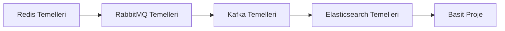
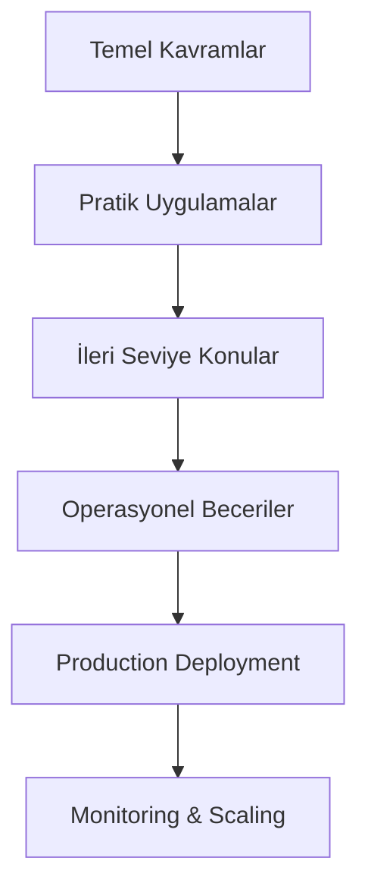
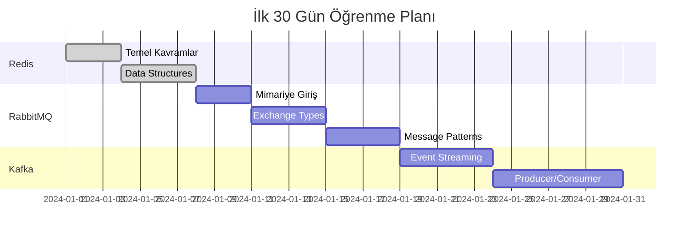

# 🗺️ Kafka, RabbitMQ, Redis ve Elasticsearch - Öğrenme Yol Haritası

Bu dokümanda, dört temel teknolojinin öğrenme yol haritasını ve zorluk seviyelerini bulacaksınız.

## 📊 Genel Öğrenme Matrisi

| Teknoloji     | Başlangıç | Orta Seviye | İleri Seviye | Tahmini Süre |
| ------------- | --------- | ----------- | ------------ | ------------ |
| RabbitMQ      | 2 hafta   | 4 hafta     | 8 hafta      | 14 hafta     |
| Redis         | 1 hafta   | 3 hafta     | 6 hafta      | 10 hafta     |
| Kafka         | 3 hafta   | 6 hafta     | 12 hafta     | 21 hafta     |
| Elasticsearch | 2 hafta   | 5 hafta     | 10 hafta     | 17 hafta     |

## 🎯 Öğrenme Stratejileri

### Senaryo 1: Hızlı Başlangıç (2-3 ay)

**Hedef**: Temel kullanım becerilerini kazanmak

**Sıralama**:

1. Redis (1 hafta) - En basit başlangıç
2. RabbitMQ (2 hafta) - Mesajlaşma kavramları
3. Kafka (3 hafta) - Event streaming
4. Elasticsearch (2 hafta) - Arama ve analitik

### Senaryo 2: Derinlemesine Öğrenme (6 ay)

**Hedef**: Production-ready uzmanlık

### Senaryo 3: Spesifik İhtiyaç Odaklı

**Hedef**: Belirli teknolojide uzmanlaşma

- **Event-Driven Architecture** → Kafka odaklı
- **Microservices Communication** → RabbitMQ odaklı
- **Caching & Session Management** → Redis odaklı
- **Search & Analytics** → Elasticsearch odaklı

## 📚 Teknoloji Bazlı Roadmap'ler

### 🔄 RabbitMQ Roadmap

#### Beginner (2 hafta)

**Zorluk**: ⭐⭐☆☆☆
**Hedefler**:

- Mesajlaşma sistemlerinin temellerini anlamak
- Exchange, queue, binding kavramlarını öğrenmek
- Basit producer/consumer yazmak

**Konular**:

- [ ] RabbitMQ mimarisi ve kavramları
- [ ] Docker ile kurulum
- [ ] Management UI kullanımı
- [ ] Direct, Topic, Fanout exchange'leri
- [ ] Basit mesaj gönderme/alma

**Çıktı**: Basit chat uygulaması

#### Intermediate (4 hafta)

**Zorluk**: ⭐⭐⭐☆☆
**Hedefler**:

- Farklı mesajlaşma pattern'lerini uygulamak
- Dayanıklılık ve güvenilirlik özelliklerini kullanmak
- Performance optimizasyonu yapmak

**Konular**:

- [ ] Work queues ve load balancing
- [ ] Publish/Subscribe pattern
- [ ] Request/Reply pattern
- [ ] Message durability ve persistence
- [ ] Acknowledgments ve QoS
- [ ] Dead letter exchanges

**Çıktı**: Mikroservis iletişim sistemi

#### Advanced (8 hafta)

**Zorluk**: ⭐⭐⭐⭐⭐
**Hedefler**:

- High availability cluster kurmak
- Federation ve shovel kullanmak
- Production deployment yapmak

**Konular**:

- [ ] Clustering ve HA
- [ ] Federation setup
- [ ] Shovel plugin
- [ ] Security (TLS, SASL)
- [ ] Monitoring ve alerting
- [ ] Kubernetes deployment

**Çıktı**: Production-ready HA cluster

---

### 🗄️ Redis Roadmap

#### Beginner (1 hafta)

**Zorluk**: ⭐☆☆☆☆
**Hedefler**:

- Redis data structures'ları anlamak
- Temel komutları öğrenmek
- Cache olarak kullanmak

**Konular**:

- [ ] Redis mimarisi
- [ ] Data types (String, Hash, List, Set, Sorted Set)
- [ ] Temel komutlar (GET, SET, HGET, LPUSH, etc.)
- [ ] Expiration ve TTL
- [ ] Redis CLI kullanımı

**Çıktı**: Basit cache implementasyonu

#### Intermediate (3 hafta)

**Zorluk**: ⭐⭐⭐☆☆
**Hedefler**:

- Pub/Sub sistemi kullanmak
- Transactions ve scripting öğrenmek
- Persistence stratejilerini anlamak

**Konular**:

- [ ] Pub/Sub messaging
- [ ] Transactions (MULTI/EXEC)
- [ ] Lua scripting
- [ ] Persistence (RDB, AOF)
- [ ] Replication
- [ ] Sentinel for HA

**Çıktı**: Real-time messaging uygulaması

#### Advanced (6 hafta)

**Zorluk**: ⭐⭐⭐⭐☆
**Hedefler**:

- Redis Streams kullanmak
- Cluster mode implement etmek
- Production deployment

**Konular**:

- [ ] Redis Streams
- [ ] Redis Modules
- [ ] Cluster mode ve sharding
- [ ] Memory optimization
- [ ] Security (ACL, TLS)
- [ ] Monitoring ve metrics

**Çıktı**: Scalable streaming platform

---

### 🌊 Kafka Roadmap

#### Beginner (3 hafta)

**Zorluk**: ⭐⭐⭐☆☆
**Hedefler**:

- Event streaming kavramlarını anlamak
- Topic, partition, consumer group'ları öğrenmek
- Basit producer/consumer yazmak

**Konular**:

- [ ] Event streaming vs traditional messaging
- [ ] Kafka architecture (broker, topic, partition)
- [ ] Docker ile Kafka cluster
- [ ] Producer API ve serialization
- [ ] Consumer API ve deserialization
- [ ] Consumer groups ve load balancing

**Çıktı**: Event logging sistemi

#### Intermediate (6 hafta)

**Zorluk**: ⭐⭐⭐⭐☆
**Hedefler**:

- Event sourcing pattern'i uygulamak
- Kafka Connect kullanmak
- Schema evolution yönetmek

**Konular**:

- [ ] Event sourcing ve CQRS
- [ ] Log compaction
- [ ] Kafka Connect framework
- [ ] Schema Registry ve Avro
- [ ] Exactly-once semantics
- [ ] Transactional producers

**Çıktı**: Event-driven mikroservis mimarisi

#### Advanced (12 hafta)

**Zorluk**: ⭐⭐⭐⭐⭐
**Hedefler**:

- Production cluster yönetmek
- Performance tuning yapmak
- Kafka Streams ile real-time processing

**Konular**:

- [ ] Kafka Streams API
- [ ] Custom partitioning strategies
- [ ] Multi-datacenter replication
- [ ] Security (SSL, SASL, ACL)
- [ ] Monitoring ve JMX metrics
- [ ] Capacity planning ve scaling
- [ ] Disaster recovery

**Çıktı**: Enterprise streaming platform

---

### 🔍 Elasticsearch Roadmap

#### Beginner (2 hafta)

**Zorluk**: ⭐⭐☆☆☆
**Hedefler**:

- Elasticsearch mimarisini anlamak
- CRUD operasyonları yapmak
- Basit search query'leri yazmak

**Konular**:

- [ ] Elasticsearch concepts (index, document, field)
- [ ] REST API kullanımı
- [ ] CRUD operations
- [ ] Basic search queries
- [ ] Query DSL temelleri
- [ ] Kibana ile visualization

**Çıktı**: Basit arama motoru

#### Intermediate (5 hafta)

**Zorluk**: ⭐⭐⭐☆☆
**Hedefler**:

- Complex query'ler yazmak
- Aggregations kullanmak
- Mapping ve analyzers öğrenmek

**Konular**:

- [ ] Complex queries (bool, nested, join)
- [ ] Aggregations (terms, date histogram, stats)
- [ ] Mapping ve field types
- [ ] Analyzers ve tokenizers
- [ ] Ingest pipelines
- [ ] Index templates

**Çıktı**: Analytics dashboard

#### Advanced (10 hafta)

**Zorluk**: ⭐⭐⭐⭐⭐
**Hedefler**:

- Production cluster yönetmek
- Performance optimization
- Security ve monitoring

**Konular**:

- [ ] Cluster topology ve node roles
- [ ] Index lifecycle management
- [ ] Performance tuning
- [ ] Security (RBAC, field-level security)
- [ ] Backup ve snapshot strategies
- [ ] Cross-cluster replication
- [ ] Machine learning features

**Çıktı**: Enterprise search platform

## 🚀 Hızlı Başlangıç Rotası

### İlk 30 Gün - Temel Kavramlar

### İkinci 30 Gün - Pratik Uygulamalar

- Her teknoloji için basit proje geliştirme
- Mikroservis mimarisi deneme
- Docker Compose ile çoklu servis yönetimi

### Üçüncü 30 Gün - Entegrasyon

- Teknolojileri birlikte kullanma
- Event-driven architecture kurma
- Performance testing

## 🎯 Öğrenme Hedefleri Matrisi

| Seviye           | RabbitMQ              | Redis              | Kafka               | Elasticsearch   |
| ---------------- | --------------------- | ------------------ | ------------------- | --------------- |
| **Beginner**     | Basit mesajlaşma      | Cache kullanımı    | Event logging       | Basit arama     |
| **Intermediate** | Mikroservis iletişimi | Pub/Sub sistemi    | Event sourcing      | Analytics       |
| **Advanced**     | HA Cluster            | Streaming platform | Enterprise platform | Search platform |

## 📋 Öğrenme Kontrol Listesi

### Genel Beceriler

- [ ] Docker ve containerization
- [ ] Kubernetes temel kavramları
- [ ] Monitoring ve observability
- [ ] Security best practices
- [ ] Performance testing ve optimization

### Teknoloji Spesifik

- [ ] Her teknoloji için production deployment
- [ ] Disaster recovery planları
- [ ] Capacity planning
- [ ] Cost optimization

## 🏁 Mezuniyet Kriterleri

Aşağıdaki projeyi başarıyla tamamladığınızda tüm teknolojilerde yetkin sayılabilirsiniz:

**Final Projesi**: E-ticaret Event-Driven Mimarisi

- Kafka: Order events, inventory updates
- RabbitMQ: Notification service, email queues
- Redis: Session management, product cache
- Elasticsearch: Product search, order analytics

**Değerlendirme Kriterleri**:

- [ ] Production-ready deployment
- [ ] Monitoring ve alerting
- [ ] Security implementation
- [ ] Performance benchmarks
- [ ] Disaster recovery planı
- [ ] Dokümantasyon ve runbook'lar

---

**Sonraki Adım**: [Kafka Temelleri](01-kafka/01-temeller.md) ile başlayın veya ihtiyacınıza göre bir teknoloji seçin!
