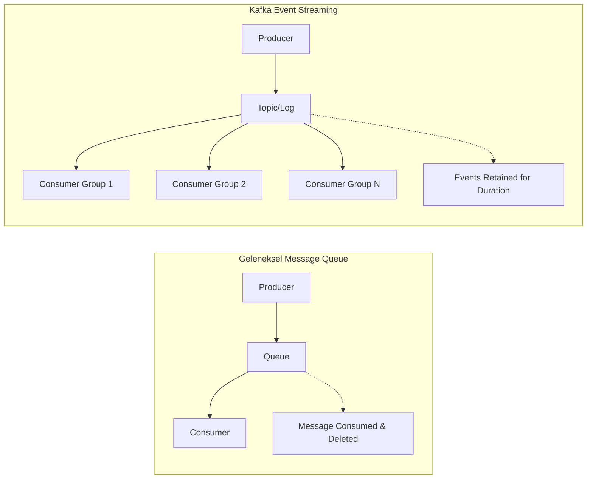
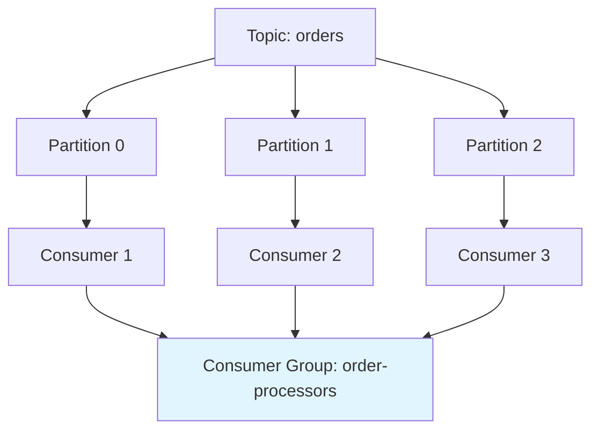

# 🌊 Kafka Temelleri - Mimari ve Temel Kavramlar

**Özet**: Bu bölümde Apache Kafka'nın temel mimarisini, core kavramlarını ve çalışma prensiplerini öğreneceksiniz. Distributed commit log, event streaming ve pub/sub sistemleri hakkında derinlemesine bilgi edinerek Kafka'nın neden bu kadar güçlü olduğunu anlayacaksınız.

## 🎯 Learning Objectives

Bu bölümü tamamladığınızda:
- [x] Kafka'nın mimari yapısını ve bileşenlerini anlayacaksınız
- [x] Topic, Partition, Broker, Consumer Group kavramlarını kavrayacaksınız  
- [x] Event streaming vs traditional messaging arasındaki farkları bileceksiniz
- [x] Kafka cluster'ı kurabilecek ve yönetebileceksiniz
- [x] Kafka CLI araçlarını kullanabileceksiniz

## 📋 Prerequisites

- [x] Docker ve Docker Compose bilgisi
- [x] Temel Linux komutları
- [x] JSON format bilgisi
- [x] Distributed systems temel kavramları (önerilen)

## 📖 Kafka Nedir?

Apache Kafka, **distributed event streaming platform** olarak tanımlanan, yüksek throughput ve low latency gereksinimleri için tasarlanmış bir sistemdir. 

### Geleneksel Mesajlaşma vs Event Streaming



**Temel Farklar**:
- **Message Queue**: Mesaj consume edildiğinde silinir
- **Event Streaming**: Events belirli süre boyunca saklanır ve birden çok consumer tarafından okunabilir

## 🏗️ Kafka Mimarisi

### Core Bileşenler

```
┌─────────────────────────────────────────────────────────────┐
│                        Kafka Cluster                        │
│  ┌─────────────┐  ┌─────────────┐  ┌─────────────┐         │
│  │   Broker 1  │  │   Broker 2  │  │   Broker 3  │         │
│  │             │  │             │  │             │         │
│  │  Topic A    │  │  Topic A    │  │  Topic B    │         │
│  │  Partition 0│  │  Partition 1│  │  Partition 0│         │
│  │             │  │             │  │             │         │
│  └─────────────┘  └─────────────┘  └─────────────┘         │
└─────────────────────────────────────────────────────────────┘
            ▲                              ▲
    ┌───────┴────────┐              ┌──────┴──────┐
    │   Producers    │              │  Consumers  │
    │                │              │             │
    │  ┌──────────┐  │              │ ┌─────────┐ │
    │  │ App 1    │  │              │ │ Group A │ │
    │  │ App 2    │  │              │ │ Group B │ │
    │  │ App 3    │  │              │ └─────────┘ │
    │  └──────────┘  │              └─────────────┘
    └────────────────┘
```

#### 1. **Broker**
- Kafka server'ı (process)
- Topic partition'larını saklar
- Producer ve consumer isteklerini handle eder
- Cluster içinde unique ID'ye sahiptir

#### 2. **Topic** 
- Event'lerin kategorize edildiği log'lar
- Database'deki tablo gibi düşünülebilir
- Immutable event sequence'ı

#### 3. **Partition**
- Topic'lerin alt bölümleri
- Paralel processing için kullanılır
- Her partition ordered event sequence'ı
- Leader/Follower replikasyon modeli

#### 4. **Producer**
- Topic'lere event gönderen uygulamalar
- Partitioning strategy belirler
- Ack policy ile delivery guarantee'i kontrol eder

#### 5. **Consumer**
- Topic'lerden event okuyan uygulamalar
- Consumer group içinde organize olur
- Offset ile position'ı track eder

## 🔧 Kafka Kurulumu - Docker Compose

### Yapılan İşlemler:
1. **Zookeeper kurulumu** - Kafka cluster coordination için
2. **Kafka broker kurulumu** - Event storage ve processing için  
3. **Kafka UI kurulumu** - Web-based yönetim arayüzü için

**Dosya**: `deployment/docker-compose/kafka-cluster.yml`

```yaml
version: '3.8'

services:
  # Zookeeper - Kafka cluster coordination için gerekli
  zookeeper:
    image: confluentinc/cp-zookeeper:7.4.0
    hostname: zookeeper
    container_name: zookeeper
    ports:
      - "2181:2181"  # Client connections için port
    environment:
      ZOOKEEPER_CLIENT_PORT: 2181
      ZOOKEEPER_TICK_TIME: 2000
      ZOOKEEPER_SYNC_LIMIT: 5
    volumes:
      - zookeeper-data:/var/lib/zookeeper/data
      - zookeeper-logs:/var/lib/zookeeper/log

  # Kafka Broker 1
  kafka1:
    image: confluentinc/cp-kafka:7.4.0
    hostname: kafka1
    container_name: kafka1
    depends_on:
      - zookeeper
    ports:
      - "9092:9092"   # External clients için
      - "9997:9997"   # JMX monitoring için
    environment:
      # Broker temel yapılandırması
      KAFKA_BROKER_ID: 1
      KAFKA_ZOOKEEPER_CONNECT: 'zookeeper:2181'
      
      # Network yapılandırması - İÇ ve DIŞ bağlantılar için
      KAFKA_LISTENER_SECURITY_PROTOCOL_MAP: PLAINTEXT:PLAINTEXT,PLAINTEXT_HOST:PLAINTEXT
      KAFKA_ADVERTISED_LISTENERS: PLAINTEXT://kafka1:29092,PLAINTEXT_HOST://localhost:9092
      KAFKA_LISTENERS: PLAINTEXT://0.0.0.0:29092,PLAINTEXT_HOST://0.0.0.0:9092
      KAFKA_INTER_BROKER_LISTENER_NAME: PLAINTEXT
      
      # Replication ve partition yapılandırması
      KAFKA_OFFSETS_TOPIC_REPLICATION_FACTOR: 1
      KAFKA_TRANSACTION_STATE_LOG_MIN_ISR: 1
      KAFKA_TRANSACTION_STATE_LOG_REPLICATION_FACTOR: 1
      KAFKA_GROUP_INITIAL_REBALANCE_DELAY_MS: 0
      
      # Performance tuning
      KAFKA_NUM_NETWORK_THREADS: 8
      KAFKA_NUM_IO_THREADS: 8
      KAFKA_SOCKET_SEND_BUFFER_BYTES: 102400
      KAFKA_SOCKET_RECEIVE_BUFFER_BYTES: 102400
      KAFKA_SOCKET_REQUEST_MAX_BYTES: 104857600
      
      # JMX Monitoring
      KAFKA_JMX_PORT: 9997
      KAFKA_JMX_HOSTNAME: localhost
    volumes:
      - kafka1-data:/var/lib/kafka/data

  # Kafka UI - Web tabanlı yönetim arayüzü
  kafka-ui:
    image: provectuslabs/kafka-ui:latest
    container_name: kafka-ui
    depends_on:
      - kafka1
    ports:
      - "8080:8080"   # Web UI port
    environment:
      KAFKA_CLUSTERS_0_NAME: local
      KAFKA_CLUSTERS_0_BOOTSTRAPSERVERS: kafka1:29092
      KAFKA_CLUSTERS_0_ZOOKEEPER: zookeeper:2181
      DYNAMIC_CONFIG_ENABLED: 'true'  # Runtime yapılandırma değişiklikleri için

volumes:
  zookeeper-data:
  zookeeper-logs: 
  kafka1-data:
```

### Mimari Açıklamalar:

#### **Network Yapılandırması**
```yaml
KAFKA_ADVERTISED_LISTENERS: PLAINTEXT://kafka1:29092,PLAINTEXT_HOST://localhost:9092
```
- **PLAINTEXT://kafka1:29092**: Container'lar arası iletişim
- **PLAINTEXT_HOST://localhost:9092**: Host makineden erişim
- Bu setup, hem internal hem external client'ların erişimini sağlar

#### **Replication Yapılandırması**
```yaml
KAFKA_OFFSETS_TOPIC_REPLICATION_FACTOR: 1
```
- Single node cluster için replication factor 1
- Production'da minimum 3 broker ve RF=3 önerilir

### Kurulum Adımları:

```bash
# 1. Docker Compose dosyasını deployment dizininde oluşturun
cd deployment/docker-compose

# 2. Kafka cluster'ı başlatın
docker-compose -f kafka-cluster.yml up -d

# 3. Servislerin durumunu kontrol edin
docker-compose -f kafka-cluster.yml ps

# 4. Kafka broker'ın log'larını kontrol edin
docker logs kafka1

# 5. Kafka UI'ya erişin
# http://localhost:8080
```

## 📚 Temel Kafka Kavramları - Detaylı

### 1. Topic ve Partition Yapısı

```
Topic: user-events
├── Partition 0: [msg0] [msg3] [msg6] [msg9] ...
├── Partition 1: [msg1] [msg4] [msg7] [msg10] ...
└── Partition 2: [msg2] [msg5] [msg8] [msg11] ...
                    ↑       ↑       ↑
                 oldest   ...    newest
```

**Yapılan İşlemler**:
- **Partitioning**: Yük dağılımı için mesajlar farklı partition'lara dağıtılır
- **Ordering**: Her partition içinde mesaj sırası korunur  
- **Parallelism**: Farklı partition'lar paralel olarak okunabilir

### 2. Consumer Group Mekanizması



**Yapılan İşlemler**:
- **Load Balancing**: Her partition yalnızca bir consumer tarafından okunur
- **Fault Tolerance**: Bir consumer fail olursa, partition başka consumer'a assign edilir
- **Scalability**: Consumer sayısı artırılarak throughput artırılabilir

### 3. Offset Management

```
Partition 0: [0][1][2][3][4][5][6][7][8][9]
                              ↑
                        Consumer Offset: 6
                        (Next read: 7)
```

**Yapılan İşlemler**:
- **Position Tracking**: Her consumer kendi offset'ini saklar
- **Replay Capability**: Eski offset'e reset yaparak mesajlar tekrar okunabilir
- **Commit Strategies**: Auto/manual commit ile offset management

## 🛠️ Kafka CLI Araçları - Pratik Kullanım

### Topic Yönetimi

```bash
# Yeni topic oluşturma
docker exec -it kafka1 kafka-topics.sh \
    --create \
    --bootstrap-server localhost:9092 \
    --topic user-events \
    --partitions 3 \
    --replication-factor 1

# Topic'leri listeleme  
docker exec -it kafka1 kafka-topics.sh \
    --list \
    --bootstrap-server localhost:9092

# Topic detaylarını görme
docker exec -it kafka1 kafka-topics.sh \
    --describe \
    --bootstrap-server localhost:9092 \
    --topic user-events
```

**Yapılan İşlemler**:
- **Topic Creation**: Belirtilen partition ve replication factor ile topic oluşturur
- **Metadata Retrieval**: Topic yapılandırması ve partition dağılımını gösterir

### Producer İşlemleri

```bash
# Console producer ile mesaj gönderme
docker exec -it kafka1 kafka-console-producer.sh \
    --bootstrap-server localhost:9092 \
    --topic user-events

# Key-value mesajları gönderme
docker exec -it kafka1 kafka-console-producer.sh \
    --bootstrap-server localhost:9092 \
    --topic user-events \
    --property "parse.key=true" \
    --property "key.separator=:"
```

**Yapılan İşlemler**:
- **Message Publishing**: Topic'e mesaj gönderir
- **Key-based Partitioning**: Key ile partition selection yapılır

### Consumer İşlemleri

```bash
# Console consumer ile mesaj okuma
docker exec -it kafka1 kafka-console-consumer.sh \
    --bootstrap-server localhost:9092 \
    --topic user-events \
    --from-beginning

# Consumer group ile okuma
docker exec -it kafka1 kafka-console-consumer.sh \
    --bootstrap-server localhost:9092 \
    --topic user-events \
    --group my-consumer-group

# Consumer group durumunu kontrol etme
docker exec -it kafka1 kafka-consumer-groups.sh \
    --bootstrap-server localhost:9092 \
    --describe \
    --group my-consumer-group
```

**Yapılan İşlemler**:
- **Message Consumption**: Topic'ten mesaj okur
- **Group Management**: Consumer group üyeliği ve offset tracking
- **Lag Monitoring**: Consumer group'un ne kadar geride olduğunu gösterir

## 🔍 Kafka Monitoring ve Health Check

### Broker Health Check

```bash
# Broker bilgilerini alma
docker exec -it kafka1 kafka-broker-api-versions.sh \
    --bootstrap-server localhost:9092

# Cluster metadata
docker exec -it kafka1 kafka-metadata-shell.sh \
    --snapshot /var/lib/kafka/data/__cluster_metadata-0/00000000000000000000.log \
    --print
```

### Topic Metrics

```bash
# Topic durumunu detaylı görme
docker exec -it kafka1 kafka-log-dirs.sh \
    --bootstrap-server localhost:9092 \
    --describe \
    --json

# Consumer lag kontrolü
docker exec -it kafka1 kafka-consumer-groups.sh \
    --bootstrap-server localhost:9092 \
    --describe \
    --all-groups
```

**Yapılan İşlemler**:
- **Health Monitoring**: Broker ve topic sağlık durumu kontrolü
- **Performance Metrics**: Throughput, latency ve lag metrikleri
- **Resource Usage**: Disk, memory ve network kullanımı

## 🎯 Hands-on Lab: İlk Kafka Uygulaması

### Lab Hedefi
Basit bir chat room sistemi oluşturacağız:
- Kullanıcılar mesaj gönderebilecek (Producer)
- Tüm kullanıcılar mesajları görebilecek (Consumer)

### Adım 1: Topic Oluşturma

```bash
# Chat room topic'i oluştur
docker exec -it kafka1 kafka-topics.sh \
    --create \
    --bootstrap-server localhost:9092 \
    --topic chat-room \
    --partitions 1 \
    --replication-factor 1
```

### Adım 2: Chat Consumer (Terminal 1)

```bash
# Chat mesajlarını takip et
docker exec -it kafka1 kafka-console-consumer.sh \
    --bootstrap-server localhost:9092 \
    --topic chat-room \
    --property print.key=true \
    --property key.separator=" > " \
    --from-beginning
```

### Adım 3: Chat Producer (Terminal 2)

```bash
# Mesaj gönder (kullanıcı_adı:mesaj formatında)
docker exec -it kafka1 kafka-console-producer.sh \
    --bootstrap-server localhost:9092 \
    --topic chat-room \
    --property "parse.key=true" \
    --property "key.separator=:"

# Örnek mesajlar:
# alice:Merhaba herkese!
# bob:Selam Alice, nasılsın?
# charlie:İyi günler!
```

### Beklenen Çıktı

```
alice > Merhaba herkese!
bob > Selam Alice, nasılsın?  
charlie > İyi günler!
```

**Yapılan İşlemler**:
- **Real-time Messaging**: Mesajlar gerçek zamanlı olarak iletilir
- **Message Ordering**: Tek partition kullandığımız için mesaj sırası korunur
- **Key-Value Structure**: Kullanıcı adı key, mesaj value olarak saklanır

## ✅ Checklist - Kafka Temelleri

### Kavramsal Anlayış
- [ ] Event streaming vs traditional messaging farkını anlıyorum
- [ ] Topic, Partition, Broker kavramlarını açıklayabiliyorum
- [ ] Consumer Group mekanizmasını anlıyorum
- [ ] Offset management nasıl çalışıyor biliyorum
- [ ] Replication ve fault tolerance mekanizmalarını kavradım

### Pratik Beceriler  
- [ ] Docker Compose ile Kafka cluster kurabiliyorum
- [ ] Kafka CLI araçlarını kullanabiliyorum
- [ ] Topic oluşturup yönetebiliyorum
- [ ] Producer/Consumer console uygulamalarını çalıştırabiliyorum
- [ ] Consumer group durumunu izleyebiliyorum

### Operasyonel Beceriler
- [ ] Kafka cluster'ın sağlık durumunu kontrol edebiliyorum
- [ ] Topic ve partition metriklerini okuyabiliyorum
- [ ] Consumer lag'i anlayabiliyorum
- [ ] Basic troubleshooting yapabiliyorum

## 🚫 Common Mistakes ve Çözümleri

### 1. **Port Çakışması**
```bash
# Hata: Port 9092 already in use
# Çözüm: Çalışan Kafka process'lerini kontrol et
docker ps | grep kafka
docker stop $(docker ps -q --filter "name=kafka")
```

### 2. **Yanlış Network Yapılandırması**
```yaml
# YANLIŞ: Sadece internal listener
KAFKA_ADVERTISED_LISTENERS: PLAINTEXT://kafka1:29092

# DOĞRU: Hem internal hem external
KAFKA_ADVERTISED_LISTENERS: PLAINTEXT://kafka1:29092,PLAINTEXT_HOST://localhost:9092
```

### 3. **Yetersiz Partition Sayısı**
```bash
# Partition sayısını artırma (azaltılamaz!)
docker exec -it kafka1 kafka-topics.sh \
    --alter \
    --bootstrap-server localhost:9092 \
    --topic user-events \
    --partitions 6
```

### 4. **Consumer Group Stuck**
```bash
# Consumer group reset etme
docker exec -it kafka1 kafka-consumer-groups.sh \
    --bootstrap-server localhost:9092 \
    --group my-group \
    --reset-offsets \
    --to-earliest \
    --topic user-events \
    --execute
```

## 🏆 Solutions / Hints

### Lab Çözümü İpuçları

1. **Chat mesajları gözükmüyor**:
   - Consumer'ı `--from-beginning` ile başlattığınızdan emin olun
   - Topic adının doğru olduğunu kontrol edin

2. **Key-value formatı çalışmıyor**:
   - Producer'da `parse.key=true` ve `key.separator=:` property'lerini kullanın
   - Consumer'da `print.key=true` property'sini kullanın

3. **Mesaj sırası karışıyor**:
   - Tek partition kullanın (sıralama garantisi için)
   - Aynı key ile gönderilen mesajlar aynı partition'a gider

## 🎓 Değerlendirme Soruları

1. **Kafka'da message ordering nasıl garanti edilir?**
   - Cevap: Partition seviyesinde, aynı partition içindeki mesajlar sıralıdır

2. **Neden Consumer Group kullanırız?**
   - Cevap: Load balancing, fault tolerance ve scalability için

3. **Offset commit edilmezse ne olur?**
   - Cevap: Consumer restart olduğunda mesajlar tekrar okunur

4. **Partition sayısı nasıl belirlenmeli?**
   - Cevap: Parallelism ihtiyacı ve consumer sayısına göre

## 🚀 Sonraki Adımlar

Bu bölümü tamamladıktan sonra:

1. **[Producer & Consumer](02-producer-consumer.md)** - Programmatic API kullanımı
2. **[Topic & Partition Management](03-topic-partition.md)** - İleri seviye topic yönetimi  
3. **Hands-on Practice** - Kendi producer/consumer uygulamanızı yazın

## 📚 Ek Kaynaklar

- [Apache Kafka Documentation](https://kafka.apache.org/documentation/)
- [Confluent Kafka Tutorials](https://kafka-tutorials.confluent.io/)
- [Kafka: The Definitive Guide (Book)](https://www.confluent.io/resources/kafka-the-definitive-guide/)

---

**Tebrikler! 🎉** Kafka temellerini başarıyla tamamladınız. Artık Kafka mimarisini anlıyor ve temel işlemleri yapabiliyorsunuz.