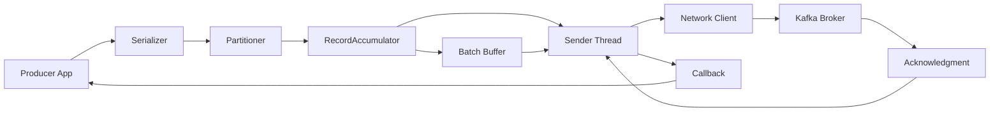
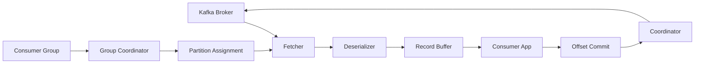

# 🚀 Kafka Producer & Consumer - Programmatic API Kullanımı

**Özet**: Bu bölümde Kafka Producer ve Consumer API'lerini kullanarak programmatic olarak mesaj gönderme ve alma işlemlerini öğreneceksiniz. Java, Python ve Node.js ile çalışan örnekler üzerinden serialization, partitioning, offset management ve error handling konularını derinlemesine inceleyeceğiz.

## 🎯 Learning Objectives

Bu bölümü tamamladığınızda:
- [x] Kafka Producer API'sini kullanarak mesaj gönderebileceksiniz
- [x] Kafka Consumer API'sini kullanarak mesaj alabileceksiniz
- [x] Serialization/Deserialization mekanizmalarını anlayacaksınız
- [x] Partitioning stratejilerini uygulayabileceksiniz
- [x] Error handling ve retry mekanizmalarını kullanabileceksiniz
- [x] Performance tuning parametrelerini ayarlayabileceksiniz

## 📋 Prerequisites

- [x] [Kafka Temelleri](01-temeller.md) bölümünün tamamlanması
- [x] Java 11+ veya Python 3.8+ veya Node.js 16+
- [x] Kafka cluster'ın çalışır durumda olması
- [x] IDE kurulumu (IntelliJ IDEA, VS Code, etc.)

## 🏗️ Producer Mimarisi

### Producer İç Yapısı



**Yapılan İşlemler**:
- **Serialization**: Object'ler byte array'e dönüştürülür
- **Partitioning**: Mesajın hangi partition'a gideceği belirlenir
- **Batching**: Performance için mesajlar batch'lenir
- **Network I/O**: Asenkron olarak broker'a gönderilir
- **Acknowledgment**: Delivery confirmation alınır

### Producer Configuration

```java
// examples/kafka/java/src/main/java/ProducerConfig.java
Properties props = new Properties();

// Bootstrap servers - Broker bağlantı bilgileri
props.put("bootstrap.servers", "localhost:9092");

// Serializers - Key ve value serialization
props.put("key.serializer", "org.apache.kafka.common.serialization.StringSerializer");
props.put("value.serializer", "org.apache.kafka.common.serialization.StringSerializer");

// Acknowledgment settings - Delivery guarantee
props.put("acks", "all");  // Tüm replica'lardan ack bekle
props.put("retries", 3);   // Retry count
props.put("retry.backoff.ms", 1000);  // Retry delay

// Batching configuration - Performance optimization
props.put("batch.size", 16384);      // 16KB batch size
props.put("linger.ms", 10);          // Batch bekleme süresi
props.put("buffer.memory", 33554432); // 32MB buffer

// Compression - Network efficiency
props.put("compression.type", "gzip");

// Idempotence - Duplicate prevention
props.put("enable.idempotence", true);
```

**Mimari Açıklamalar**:
- **acks=all**: Güvenlik maksimum, performance orta
- **batch.size**: Büyük batch = daha iyi throughput, daha yüksek latency
- **linger.ms**: Batch'i bekletme süresi, throughput vs latency trade-off
- **enable.idempotence**: Exactly-once delivery garantisi

## 💻 Java Producer Implementasyonu

### Basit Producer

```java
// examples/kafka/java/src/main/java/SimpleProducer.java
package com.example.kafka;

import org.apache.kafka.clients.producer.*;
import java.util.Properties;
import java.util.concurrent.Future;

public class SimpleProducer {
    
    private final Producer<String, String> producer;
    private final String topicName;
    
    public SimpleProducer(String topicName) {
        this.topicName = topicName;
        
        // Producer yapılandırması
        Properties props = new Properties();
        props.put(ProducerConfig.BOOTSTRAP_SERVERS_CONFIG, "localhost:9092");
        props.put(ProducerConfig.KEY_SERIALIZER_CLASS_CONFIG, 
                  "org.apache.kafka.common.serialization.StringSerializer");
        props.put(ProducerConfig.VALUE_SERIALIZER_CLASS_CONFIG, 
                  "org.apache.kafka.common.serialization.StringSerializer");
        
        // Delivery guarantee ayarları
        props.put(ProducerConfig.ACKS_CONFIG, "all");
        props.put(ProducerConfig.RETRIES_CONFIG, 3);
        props.put(ProducerConfig.ENABLE_IDEMPOTENCE_CONFIG, true);
        
        this.producer = new KafkaProducer<>(props);
    }
    
    /**
     * Senkron mesaj gönderme - Blocking operation
     */
    public void sendMessageSync(String key, String value) {
        try {
            ProducerRecord<String, String> record = 
                new ProducerRecord<>(topicName, key, value);
            
            // Send işlemi ve metadata'yı bekleme
            RecordMetadata metadata = producer.send(record).get();
            
            System.out.printf("Message sent successfully: " +
                "Topic=%s, Partition=%d, Offset=%d, Timestamp=%d%n",
                metadata.topic(), metadata.partition(), 
                metadata.offset(), metadata.timestamp());
                
        } catch (Exception e) {
            System.err.println("Error sending message: " + e.getMessage());
        }
    }
    
    /**
     * Asenkron mesaj gönderme - Non-blocking operation
     */
    public void sendMessageAsync(String key, String value) {
        ProducerRecord<String, String> record = 
            new ProducerRecord<>(topicName, key, value);
        
        // Callback ile asenkron handling
        producer.send(record, new Callback() {
            @Override
            public void onCompletion(RecordMetadata metadata, Exception exception) {
                if (exception != null) {
                    System.err.println("Failed to send message: " + exception.getMessage());
                } else {
                    System.out.printf("Message sent: Topic=%s, Partition=%d, Offset=%d%n",
                        metadata.topic(), metadata.partition(), metadata.offset());
                }
            }
        });
    }
    
    /**
     * Partition belirterek mesaj gönderme
     */
    public void sendToSpecificPartition(String key, String value, int partition) {
        ProducerRecord<String, String> record = 
            new ProducerRecord<>(topicName, partition, key, value);
        
        producer.send(record, (metadata, exception) -> {
            if (exception != null) {
                System.err.println("Send failed: " + exception.getMessage());
            } else {
                System.out.printf("Sent to partition %d with offset %d%n",
                    metadata.partition(), metadata.offset());
            }
        });
    }
    
    /**
     * Producer'ı güvenli şekilde kapatma
     */
    public void close() {
        producer.close();
    }
    
    public static void main(String[] args) {
        SimpleProducer producer = new SimpleProducer("user-events");
        
        try {
            // Test mesajları gönderme
            for (int i = 0; i < 10; i++) {
                String key = "user-" + i;
                String value = "User event data: " + i;
                
                if (i % 2 == 0) {
                    producer.sendMessageSync(key, value);
                } else {
                    producer.sendMessageAsync(key, value);
                }
                
                Thread.sleep(1000); // 1 saniye bekleme
            }
        } catch (InterruptedException e) {
            Thread.currentThread().interrupt();
        } finally {
            producer.close();
        }
    }
}
```

**Yapılan İşlemler**:
- **Senkron Send**: `producer.send().get()` ile blocking operation
- **Asenkron Send**: Callback function ile non-blocking operation
- **Partition Selection**: Explicit partition assignment
- **Error Handling**: Exception management ve retry logic

### Custom Partitioner

```java
// examples/kafka/java/src/main/java/CustomPartitioner.java
package com.example.kafka;

import org.apache.kafka.clients.producer.Partitioner;
import org.apache.kafka.common.Cluster;
import java.util.Map;

public class CustomPartitioner implements Partitioner {
    
    @Override
    public int partition(String topic, Object key, byte[] keyBytes, 
                        Object value, byte[] valueBytes, Cluster cluster) {
        
        int numPartitions = cluster.partitionCountForTopic(topic);
        
        if (key == null) {
            // Key yoksa round-robin dağılım
            return (int) (Math.random() * numPartitions);
        }
        
        String keyString = key.toString();
        
        // Business logic based partitioning
        if (keyString.startsWith("premium_")) {
            // Premium kullanıcılar partition 0'a gönderilir
            return 0;
        } else if (keyString.startsWith("vip_")) {
            // VIP kullanıcılar son partition'a gönderilir
            return numPartitions - 1;
        } else {
            // Diğer kullanıcılar hash-based dağılım
            return Math.abs(keyString.hashCode()) % numPartitions;
        }
    }
    
    @Override
    public void close() {
        // Cleanup resources if needed
    }
    
    @Override
    public void configure(Map<String, ?> configs) {
        // Configuration initialization
    }
}
```

**Mimari Açıklamalar**:
- **Business Logic Partitioning**: Kullanıcı tipine göre partition assignment
- **Load Distribution**: Farklı partition'lara yük dağılımı
- **Custom Logic**: Uygulamaya özel partitioning stratejisi

## 🔍 Consumer Mimarisi

### Consumer İç Yapısı



**Yapılan İşlemler**:
- **Fetching**: Broker'dan message batch'leri çekilir
- **Deserialization**: Byte array'ler object'lere dönüştürülür
- **Offset Management**: Consumer position tracking
- **Group Coordination**: Partition assignment ve rebalancing

### Consumer Configuration

```java
// Consumer yapılandırması
Properties props = new Properties();

// Bootstrap servers
props.put("bootstrap.servers", "localhost:9092");

// Consumer group ayarları
props.put("group.id", "user-event-processors");
props.put("group.instance.id", "consumer-1"); // Static membership

// Deserializers
props.put("key.deserializer", "org.apache.kafka.common.serialization.StringDeserializer");
props.put("value.deserializer", "org.apache.kafka.common.serialization.StringDeserializer");

// Offset management
props.put("auto.offset.reset", "earliest"); // latest, earliest, none
props.put("enable.auto.commit", false);     // Manuel commit control

// Session management
props.put("session.timeout.ms", 30000);     // 30 saniye
props.put("heartbeat.interval.ms", 3000);   // 3 saniye

// Fetch configuration
props.put("fetch.min.bytes", 1024);         // Minimum fetch size
props.put("fetch.max.wait.ms", 500);        // Maximum wait time
props.put("max.poll.records", 100);         // Records per poll
```

**Mimari Açıklamalar**:
- **auto.offset.reset**: Consumer ilk defa başladığında hangi offset'ten başlayacağı
- **enable.auto.commit**: Otomatik vs manuel offset commit kontrolü
- **session.timeout.ms**: Consumer group membership timeout'u

## 💻 Java Consumer Implementasyonu

### Basit Consumer

```java
// examples/kafka/java/src/main/java/SimpleConsumer.java
package com.example.kafka;

import org.apache.kafka.clients.consumer.*;
import org.apache.kafka.common.TopicPartition;
import java.time.Duration;
import java.util.*;

public class SimpleConsumer {
    
    private final Consumer<String, String> consumer;
    private final String topicName;
    
    public SimpleConsumer(String groupId, String topicName) {
        this.topicName = topicName;
        
        // Consumer yapılandırması
        Properties props = new Properties();
        props.put(ConsumerConfig.BOOTSTRAP_SERVERS_CONFIG, "localhost:9092");
        props.put(ConsumerConfig.GROUP_ID_CONFIG, groupId);
        props.put(ConsumerConfig.KEY_DESERIALIZER_CLASS_CONFIG, 
                  "org.apache.kafka.common.serialization.StringDeserializer");
        props.put(ConsumerConfig.VALUE_DESERIALIZER_CLASS_CONFIG, 
                  "org.apache.kafka.common.serialization.StringDeserializer");
        
        // Offset management
        props.put(ConsumerConfig.AUTO_OFFSET_RESET_CONFIG, "earliest");
        props.put(ConsumerConfig.ENABLE_AUTO_COMMIT_CONFIG, false);
        
        // Performance tuning
        props.put(ConsumerConfig.FETCH_MIN_BYTES_CONFIG, 1024);
        props.put(ConsumerConfig.MAX_POLL_RECORDS_CONFIG, 100);
        
        this.consumer = new KafkaConsumer<>(props);
    }
    
    /**
     * Otomatik commit ile mesaj tüketme
     */
    public void consumeWithAutoCommit() {
        consumer.subscribe(Arrays.asList(topicName));
        
        try {
            while (true) {
                // Polling - Broker'dan mesaj çekme
                ConsumerRecords<String, String> records = 
                    consumer.poll(Duration.ofMillis(1000));
                
                // Her record'u işleme
                for (ConsumerRecord<String, String> record : records) {
                    processMessage(record);
                }
                
                // Auto commit enabled ise otomatik commit olur
            }
        } catch (Exception e) {
            System.err.println("Error in consumer: " + e.getMessage());
        } finally {
            consumer.close();
        }
    }
    
    /**
     * Manuel commit ile mesaj tüketme - Daha güvenli
     */
    public void consumeWithManualCommit() {
        consumer.subscribe(Arrays.asList(topicName));
        
        try {
            while (true) {
                ConsumerRecords<String, String> records = 
                    consumer.poll(Duration.ofMillis(1000));
                
                for (ConsumerRecord<String, String> record : records) {
                    try {
                        // Mesajı işle
                        processMessage(record);
                        
                        // Başarılı işlem sonrası manuel commit
                        Map<TopicPartition, OffsetAndMetadata> offsets = new HashMap<>();
                        offsets.put(
                            new TopicPartition(record.topic(), record.partition()),
                            new OffsetAndMetadata(record.offset() + 1)
                        );
                        consumer.commitSync(offsets);
                        
                    } catch (Exception e) {
                        System.err.println("Error processing message: " + e.getMessage());
                        // Hata durumunda commit yapılmaz, mesaj tekrar işlenir
                    }
                }
            }
        } catch (Exception e) {
            System.err.println("Error in consumer: " + e.getMessage());
        } finally {
            consumer.close();
        }
    }
    
    /**
     * Batch commit ile mesaj tüketme - Performance optimized
     */
    public void consumeWithBatchCommit() {
        consumer.subscribe(Arrays.asList(topicName));
        
        try {
            while (true) {
                ConsumerRecords<String, String> records = 
                    consumer.poll(Duration.ofMillis(1000));
                
                boolean allProcessedSuccessfully = true;
                
                // Tüm mesajları işle
                for (ConsumerRecord<String, String> record : records) {
                    try {
                        processMessage(record);
                    } catch (Exception e) {
                        System.err.println("Error processing message: " + e.getMessage());
                        allProcessedSuccessfully = false;
                        break; // Hata durumunda batch'i durdur
                    }
                }
                
                // Tüm mesajlar başarılı ise batch commit
                if (allProcessedSuccessfully && !records.isEmpty()) {
                    try {
                        consumer.commitSync(); // Tüm partition'lar için commit
                        System.out.println("Batch committed successfully: " + records.count() + " records");
                    } catch (CommitFailedException e) {
                        System.err.println("Commit failed: " + e.getMessage());
                    }
                }
            }
        } catch (Exception e) {
            System.err.println("Error in consumer: " + e.getMessage());
        } finally {
            consumer.close();
        }
    }
    
    /**
     * Belirli partition'dan mesaj tüketme
     */
    public void consumeFromSpecificPartition(int partition) {
        TopicPartition topicPartition = new TopicPartition(topicName, partition);
        consumer.assign(Arrays.asList(topicPartition));
        
        // Belirli offset'ten başlatma (opsiyonel)
        consumer.seekToBeginning(Arrays.asList(topicPartition));
        
        try {
            while (true) {
                ConsumerRecords<String, String> records = 
                    consumer.poll(Duration.ofMillis(1000));
                
                for (ConsumerRecord<String, String> record : records) {
                    System.out.printf("Partition %d, Offset %d: %s = %s%n",
                        record.partition(), record.offset(), record.key(), record.value());
                }
            }
        } finally {
            consumer.close();
        }
    }
    
    /**
     * Mesaj işleme business logic'i
     */
    private void processMessage(ConsumerRecord<String, String> record) {
        // Business logic implementation
        System.out.printf("Processing message: Key=%s, Value=%s, " +
            "Partition=%d, Offset=%d, Timestamp=%d%n",
            record.key(), record.value(), record.partition(), 
            record.offset(), record.timestamp());
        
        // Simulate processing time
        try {
            Thread.sleep(100);
        } catch (InterruptedException e) {
            Thread.currentThread().interrupt();
        }
    }
    
    public static void main(String[] args) {
        SimpleConsumer consumer = new SimpleConsumer("test-group", "user-events");
        
        // Farklı commit stratejilerini test edebilirsiniz
        consumer.consumeWithManualCommit();
    }
}
```

**Yapılan İşlemler**:
- **Auto Commit**: Otomatik offset commit, basit ama risk
- **Manual Commit**: Her mesaj sonrası commit, güvenli ama yavaş
- **Batch Commit**: Batch sonrası commit, performance optimized
- **Specific Partition**: Belirli partition'dan okuma

## 🐍 Python Producer & Consumer

### Python Producer

```python
# examples/kafka/python/simple_producer.py
from kafka import KafkaProducer
import json
import time
from typing import Dict, Any, Optional

class SimpleProducer:
    """
    Kafka Producer wrapper class
    """
    
    def __init__(self, bootstrap_servers: str = 'localhost:9092'):
        """
        Producer initialization
        """
        self.producer = KafkaProducer(
            # Bootstrap servers
            bootstrap_servers=[bootstrap_servers],
            
            # Serialization - JSON kullanarak
            key_serializer=lambda x: x.encode('utf-8') if x else None,
            value_serializer=lambda x: json.dumps(x).encode('utf-8'),
            
            # Delivery guarantee
            acks='all',  # Tüm replica'lardan ack bekle
            retries=3,   # Retry sayısı
            retry_backoff_ms=1000,  # Retry delay
            
            # Performance tuning
            batch_size=16384,      # 16KB batch size
            linger_ms=10,          # Batch bekleme süresi
            buffer_memory=33554432,  # 32MB buffer
            
            # Compression
            compression_type='gzip',
            
            # Idempotence
            enable_idempotence=True
        )
    
    def send_message_sync(self, topic: str, key: str, value: Dict[str, Any]) -> bool:
        """
        Senkron mesaj gönderme - Blocking operation
        """
        try:
            # Send ve result'ı bekle
            future = self.producer.send(topic, key=key, value=value)
            record_metadata = future.get(timeout=10)
            
            print(f"Message sent successfully:")
            print(f"  Topic: {record_metadata.topic}")
            print(f"  Partition: {record_metadata.partition}")
            print(f"  Offset: {record_metadata.offset}")
            print(f"  Timestamp: {record_metadata.timestamp}")
            
            return True
            
        except Exception as e:
            print(f"Error sending message: {e}")
            return False
    
    def send_message_async(self, topic: str, key: str, value: Dict[str, Any]) -> None:
        """
        Asenkron mesaj gönderme - Non-blocking operation
        """
        def on_send_success(record_metadata):
            print(f"Message sent to {record_metadata.topic}[{record_metadata.partition}] "
                  f"at offset {record_metadata.offset}")
        
        def on_send_error(excp):
            print(f"Failed to send message: {excp}")
        
        # Asenkron send
        future = self.producer.send(topic, key=key, value=value)
        future.add_callback(on_send_success)
        future.add_errback(on_send_error)
    
    def send_to_partition(self, topic: str, partition: int, 
                         key: str, value: Dict[str, Any]) -> bool:
        """
        Belirli partition'a mesaj gönderme
        """
        try:
            future = self.producer.send(topic, key=key, value=value, partition=partition)
            record_metadata = future.get(timeout=10)
            
            print(f"Message sent to partition {record_metadata.partition} "
                  f"with offset {record_metadata.offset}")
            
            return True
            
        except Exception as e:
            print(f"Error sending to partition: {e}")
            return False
    
    def close(self):
        """
        Producer'ı güvenli şekilde kapatma
        """
        self.producer.close()

# Test usage
if __name__ == "__main__":
    producer = SimpleProducer()
    
    try:
        # Test mesajları gönderme
        for i in range(10):
            message = {
                'user_id': f'user_{i}',
                'event_type': 'page_view',
                'timestamp': int(time.time()),
                'data': {
                    'page': f'/page_{i}',
                    'duration': i * 100
                }
            }
            
            key = f"user_{i}"
            
            # Senkron ve asenkron gönderim test
            if i % 2 == 0:
                producer.send_message_sync('user-events', key, message)
            else:
                producer.send_message_async('user-events', key, message)
            
            time.sleep(1)
            
    except KeyboardInterrupt:
        print("Stopping producer...")
    finally:
        producer.close()
```

### Python Consumer

```python
# examples/kafka/python/simple_consumer.py
from kafka import KafkaConsumer, TopicPartition
import json
from typing import Dict, Any, List, Optional

class SimpleConsumer:
    """
    Kafka Consumer wrapper class
    """
    
    def __init__(self, group_id: str, bootstrap_servers: str = 'localhost:9092'):
        """
        Consumer initialization
        """
        self.consumer = KafkaConsumer(
            # Bootstrap servers
            bootstrap_servers=[bootstrap_servers],
            
            # Consumer group
            group_id=group_id,
            
            # Deserialization
            key_deserializer=lambda x: x.decode('utf-8') if x else None,
            value_deserializer=lambda x: json.loads(x.decode('utf-8')),
            
            # Offset management
            auto_offset_reset='earliest',  # earliest, latest, none
            enable_auto_commit=False,      # Manuel commit control
            
            # Session management
            session_timeout_ms=30000,      # 30 saniye
            heartbeat_interval_ms=3000,    # 3 saniye
            
            # Fetch configuration
            fetch_min_bytes=1024,          # Minimum fetch size
            fetch_max_wait_ms=500,         # Maximum wait time
            max_poll_records=100           # Records per poll
        )
    
    def consume_with_auto_commit(self, topics: List[str]) -> None:
        """
        Otomatik commit ile mesaj tüketme
        """
        # Auto commit'i enable et
        self.consumer._config['enable_auto_commit'] = True
        
        # Topic'lere subscribe ol
        self.consumer.subscribe(topics)
        
        try:
            for message in self.consumer:
                self.process_message(message)
                # Auto commit enabled olduğu için otomatik commit
                
        except KeyboardInterrupt:
            print("Stopping consumer...")
        finally:
            self.consumer.close()
    
    def consume_with_manual_commit(self, topics: List[str]) -> None:
        """
        Manuel commit ile mesaj tüketme - Daha güvenli
        """
        self.consumer.subscribe(topics)
        
        try:
            while True:
                # Poll messages
                message_batch = self.consumer.poll(timeout_ms=1000)
                
                for topic_partition, messages in message_batch.items():
                    for message in messages:
                        try:
                            # Mesajı işle
                            self.process_message(message)
                            
                            # Başarılı işlem sonrası manuel commit
                            self.consumer.commit({
                                topic_partition: message.offset + 1
                            })
                            
                        except Exception as e:
                            print(f"Error processing message: {e}")
                            # Hata durumunda commit yapılmaz
                            
        except KeyboardInterrupt:
            print("Stopping consumer...")
        finally:
            self.consumer.close()
    
    def consume_with_batch_commit(self, topics: List[str]) -> None:
        """
        Batch commit ile mesaj tüketme - Performance optimized
        """
        self.consumer.subscribe(topics)
        
        try:
            while True:
                # Poll messages
                message_batch = self.consumer.poll(timeout_ms=1000)
                
                if not message_batch:
                    continue
                
                all_processed_successfully = True
                processed_count = 0
                
                # Tüm mesajları işle
                for topic_partition, messages in message_batch.items():
                    for message in messages:
                        try:
                            self.process_message(message)
                            processed_count += 1
                        except Exception as e:
                            print(f"Error processing message: {e}")
                            all_processed_successfully = False
                            break
                    
                    if not all_processed_successfully:
                        break
                
                # Tüm mesajlar başarılı ise batch commit
                if all_processed_successfully and processed_count > 0:
                    try:
                        self.consumer.commit()
                        print(f"Batch committed successfully: {processed_count} records")
                    except Exception as e:
                        print(f"Commit failed: {e}")
                        
        except KeyboardInterrupt:
            print("Stopping consumer...")
        finally:
            self.consumer.close()
    
    def consume_from_specific_partition(self, topic: str, partition: int) -> None:
        """
        Belirli partition'dan mesaj tüketme
        """
        topic_partition = TopicPartition(topic, partition)
        self.consumer.assign([topic_partition])
        
        # Belirli offset'ten başlatma (opsiyonel)
        self.consumer.seek_to_beginning(topic_partition)
        
        try:
            for message in self.consumer:
                print(f"Partition {message.partition}, Offset {message.offset}: "
                      f"{message.key} = {message.value}")
        except KeyboardInterrupt:
            print("Stopping consumer...")
        finally:
            self.consumer.close()
    
    def process_message(self, message) -> None:
        """
        Mesaj işleme business logic'i
        """
        print(f"Processing message:")
        print(f"  Key: {message.key}")
        print(f"  Value: {message.value}")
        print(f"  Partition: {message.partition}")
        print(f"  Offset: {message.offset}")
        print(f"  Timestamp: {message.timestamp}")
        print("-" * 50)
        
        # Simulate processing time
        import time
        time.sleep(0.1)

# Test usage
if __name__ == "__main__":
    consumer = SimpleConsumer("python-test-group")
    
    # Farklı commit stratejilerini test edebilirsiniz
    consumer.consume_with_manual_commit(['user-events'])
```

**Yapılan İşlemler**:
- **JSON Serialization**: Python dict'leri JSON olarak serialize edilir
- **Error Handling**: Try-catch blokları ile hata yönetimi
- **Flexible Commit**: Farklı commit stratejileri
- **Type Hints**: Code readability için type annotations

## 🎯 Hands-on Lab: E-commerce Event System

### Lab Hedefi
Gerçek zamanlı bir e-commerce event sistemi oluşturacağız:
- **Order Events**: Sipariş oluşturma, güncelleme, iptal
- **User Events**: Kullanıcı aktiviteleri, profil değişiklikleri
- **Inventory Events**: Stok güncellemeleri

### Adım 1: Topic'leri Oluşturalım

```bash
# Order events topic
docker exec -it kafka1 kafka-topics.sh \
    --create --bootstrap-server localhost:9092 \
    --topic order-events --partitions 3 --replication-factor 1

# User events topic  
docker exec -it kafka1 kafka-topics.sh \
    --create --bootstrap-server localhost:9092 \
    --topic user-events --partitions 2 --replication-factor 1

# Inventory events topic
docker exec -it kafka1 kafka-topics.sh \
    --create --bootstrap-server localhost:9092 \
    --topic inventory-events --partitions 2 --replication-factor 1
```

### Adım 2: Order Service Producer

```java
// examples/kafka/java/src/main/java/OrderService.java
public class OrderService {
    private final Producer<String, String> producer;
    
    public void createOrder(String userId, String productId, int quantity) {
        // Order event oluştur
        OrderEvent orderEvent = new OrderEvent(
            UUID.randomUUID().toString(),
            userId, 
            productId, 
            quantity, 
            "CREATED",
            System.currentTimeMillis()
        );
        
        // User ID key olarak kullan (same user same partition)
        producer.send(new ProducerRecord<>("order-events", userId, 
            orderEvent.toJson()));
    }
}
```

### Adım 3: Inventory Service Consumer

```python
# examples/kafka/python/inventory_service.py
class InventoryService:
    def __init__(self):
        self.consumer = SimpleConsumer("inventory-service")
        
    def process_order_events(self):
        self.consumer.subscribe(['order-events'])
        
        for message in self.consumer:
            order_event = json.loads(message.value)
            
            if order_event['status'] == 'CREATED':
                self.reserve_inventory(order_event)
            elif order_event['status'] == 'CANCELLED':
                self.release_inventory(order_event)
```

## ✅ Checklist - Producer & Consumer

### Producer Beceriler
- [ ] Synchronous vs asynchronous sending arasındaki farkı anlıyorum
- [ ] Serialization/deserialization mekanizmalarını kullanabiliyorum
- [ ] Custom partitioner yazabiliyorum
- [ ] Producer configuration parametrelerini ayarlayabiliyorum
- [ ] Error handling ve retry mekanizmalarını uygulayabiliyorum

### Consumer Beceriler
- [ ] Different commit strategies arasındaki farkları anlıyorum
- [ ] Consumer group rebalancing mekanizmasını kavradım
- [ ] Offset management'ı manuel olarak yapabiliyorum
- [ ] Specific partition'dan okuma yapabiliyorum
- [ ] Consumer lag'i monitör edebiliyorum

### Performance Tuning
- [ ] Batch size ve linger.ms parametrelerini optimize edebiliyorum
- [ ] Compression algoritmaları kullanabiliyorum
- [ ] Memory ve network ayarlarını yapabiliyorum
- [ ] Throughput vs latency trade-off'unu anlıyorum

## 🚫 Common Mistakes ve Çözümleri

### 1. **Auto Commit Kullanımında At-Least-Once Garanti Kaybı**
```java
// YANLIŞ: Auto commit enabled, processing exception sonrası mesaj kaybolur
props.put("enable.auto.commit", true);

// DOĞRU: Manuel commit, processing sonrası commit
props.put("enable.auto.commit", false);
consumer.commitSync(); // Her başarılı processing sonrası
```

### 2. **Producer Buffer Overflow**
```java
// YANLIŞ: Buffer dolduğunda blocking
props.put("buffer.memory", 1024); // Çok küçük

// DOĞRU: Yeterli buffer space
props.put("buffer.memory", 33554432); // 32MB
props.put("max.block.ms", 5000); // Timeout protection
```

### 3. **Consumer Poll Timeout**
```java
// YANLIŞ: Çok kısa timeout
ConsumerRecords<String, String> records = consumer.poll(Duration.ofMillis(100));

// DOĞRU: Reasonable timeout
ConsumerRecords<String, String> records = consumer.poll(Duration.ofMillis(1000));
```

## 🏆 Solutions / Hints

### Lab Çözümü İpuçları

1. **Order Events Görünmüyor**:
   - Topic'in doğru oluşturulduğunu kontrol edin
   - Producer ve consumer'ın aynı topic'i kullandığından emin olun
   - Kafka UI'da mesajları kontrol edin

2. **Consumer Lag Artıyor**:
   - Processing time'ı optimize edin
   - Consumer sayısını artırın
   - Batch size'ı ayarlayın

3. **Duplicate Messages**:
   - Enable idempotence kullanın
   - Manuel commit stratejisi uygulayın
   - Unique message ID'leri kullanın

## 🚀 Sonraki Adımlar

Bu bölümü tamamladıktan sonra:

1. **[Topic & Partition Management](03-topic-partition.md)** - İleri seviye topic yönetimi
2. **[Event Sourcing](04-event-sourcing.md)** - Event-driven architecture
3. **[Kafka Connect](05-kafka-connect.md)** - Veri entegrasyonu

## 📚 Ek Kaynaklar

- [Kafka Producer API Docs](https://kafka.apache.org/documentation/#producerapi)
- [Kafka Consumer API Docs](https://kafka.apache.org/documentation/#consumerapi)
- [Kafka Client Performance Tuning](https://kafka.apache.org/documentation/#producerconfigs)

---

**Tebrikler! 🎉** Producer ve Consumer API'lerini başarıyla öğrendiniz. Artık programmatic olarak Kafka ile mesajlaşma yapabiliyorsunuz.