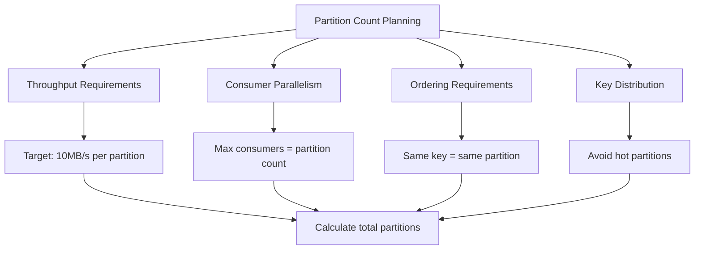

# 🗂️ Kafka Topic & Partition Management - İleri Seviye Yönetim

**Özet**: Bu bölümde Kafka topic'lerinin ve partition'larının ileri seviye yönetimini öğreneceksiniz. Topic oluşturma stratejileri, partition sayısı belirleme, replication factor ayarlama, retention policy'leri ve topic yapılandırma optimizasyonları konularını derinlemesine inceleyeceğiz.

## 🎯 Learning Objectives

Bu bölümü tamamladığınızda:

- [x] Topic ve partition tasarım prensiplerini anlayacaksınız
- [x] Optimal partition sayısını belirleyebileceksiniz
- [x] Replication ve fault tolerance stratejilerini uygulayabileceksiniz
- [x] Retention policy'leri ve cleanup stratejilerini yönetebileceksiniz
- [x] Topic configuration'ları optimize edebileceksiniz
- [x] Dynamic configuration changes yapabileceksiniz

## 📋 Prerequisites

- [x] [Kafka Temelleri](01-temeller.md) bölümünün tamamlanması
- [x] [Producer & Consumer](02-producer-consumer.md) bölümünün tamamlanması
- [x] Kafka cluster'ın çalışır durumda olması
- [x] Kafka CLI araçları bilgisi

## 🏗️ Topic Design Principles

### 1. Topic Naming Conventions

```
📁 Recommended Topic Naming Structure:
├── <environment>.<domain>.<entity>.<version>
├── prod.ecommerce.orders.v1
├── dev.user.events.v2
├── staging.inventory.updates.v1
└── prod.payment.transactions.v3

🚫 Avoid:
├── MyTopic (CamelCase)
├── user_events_2023 (dates in names)
├── temp-topic (temporary names)
└── test123 (non-descriptive)
```

**Yapılan İşlemler**:

- **Environment Separation**: Environment prefix ile ayrım
- **Domain Classification**: Business domain grouping
- **Entity Identification**: Clear entity naming
- **Version Management**: Schema evolution support

### 2. Partition Strategy Planning



**Partition Sayısı Belirleme Formülü**:

```
Partition Count = max(
    Target Throughput / Partition Throughput,
    Max Consumer Count,
    Business Parallelism Requirement
)
```

## 🛠️ Topic Management CLI Commands

### Topic Oluşturma ve Yapılandırma

```bash
# Temel topic oluşturma
docker exec -it kafka1 kafka-topics.sh \
    --create \
    --bootstrap-server localhost:9092 \
    --topic ecommerce-orders \
    --partitions 6 \
    --replication-factor 1

# İleri seviye yapılandırma ile topic oluşturma
docker exec -it kafka1 kafka-topics.sh \
    --create \
    --bootstrap-server localhost:9092 \
    --topic user-activity-events \
    --partitions 12 \
    --replication-factor 1 \
    --config retention.ms=604800000 \
    --config segment.ms=86400000 \
    --config compression.type=gzip \
    --config cleanup.policy=delete
```

**Yapılan İşlemler**:

- **Partition Count**: Parallelism ve throughput gereksinimlerine göre
- **Replication Factor**: Fault tolerance seviyesi
- **Retention**: Data retention süresi (7 gün = 604800000 ms)
- **Segment Size**: Log segment boyutu (1 gün = 86400000 ms)
- **Compression**: Storage efficiency için
- **Cleanup Policy**: Delete vs compact stratejisi

### Topic Listeleme ve İnceleme

```bash
# Tüm topic'leri listeleme
docker exec -it kafka1 kafka-topics.sh \
    --list \
    --bootstrap-server localhost:9092

# Topic detaylarını görme
docker exec -it kafka1 kafka-topics.sh \
    --describe \
    --bootstrap-server localhost:9092 \
    --topic ecommerce-orders

# Sadece partition bilgilerini görme
docker exec -it kafka1 kafka-topics.sh \
    --describe \
    --bootstrap-server localhost:9092 \
    --topic ecommerce-orders \
    --exclude-internal
```

### Topic Yapılandırması Değiştirme

```bash
# Partition sayısını artırma (azaltılamaz!)
docker exec -it kafka1 kafka-topics.sh \
    --alter \
    --bootstrap-server localhost:9092 \
    --topic ecommerce-orders \
    --partitions 12

# Topic configuration'ı değiştirme
docker exec -it kafka1 kafka-configs.sh \
    --bootstrap-server localhost:9092 \
    --entity-type topics \
    --entity-name ecommerce-orders \
    --alter \
    --add-config retention.ms=1209600000,segment.ms=172800000

# Configuration'ı silme
docker exec -it kafka1 kafka-configs.sh \
    --bootstrap-server localhost:9092 \
    --entity-type topics \
    --entity-name ecommerce-orders \
    --alter \
    --delete-config segment.ms
```

**Yapılan İşlemler**:

- **Partition Scaling**: Sadece artırma mümkün
- **Dynamic Config**: Runtime configuration changes
- **Config Removal**: Default değerlere dönme

## 📊 Partition Design Patterns

### 1. Key-based Partitioning

```java
// examples/kafka/java/src/main/java/PartitioningStrategies.java

/**
 * Key-based partitioning - Aynı key aynı partition'a gider
 * Kullanım: User events, order processing, session management
 */
public class KeyBasedPartitioning {

    public void sendUserEvent(String userId, UserEvent event) {
        // User ID key olarak kullanılır - aynı user aynı partition'a gider
        ProducerRecord<String, UserEvent> record =
            new ProducerRecord<>("user-events", userId, event);

        producer.send(record);

        // Garantiler:
        // - Aynı user'ın event'leri sıralı işlenir
        // - Session consistency sağlanır
        // - User-specific consumer assignment mümkün
    }
}
```

### 2. Round-robin Partitioning

```java
/**
 * Round-robin partitioning - Load balancing için
 * Kullanım: Key'i olmayan mesajlar, log aggregation
 */
public class RoundRobinPartitioning {

    public void sendLogEntry(LogEntry logEntry) {
        // Key null olduğu için round-robin dağılım
        ProducerRecord<String, LogEntry> record =
            new ProducerRecord<>("application-logs", null, logEntry);

        producer.send(record);

        // Avantajlar:
        // - Equal distribution across partitions
        // - Maximum throughput
        // - No hot partition risk
    }
}
```

### 3. Custom Partitioning

```java
/**
 * Custom partitioner - Business logic based routing
 */
public class BusinessLogicPartitioner implements Partitioner {

    @Override
    public int partition(String topic, Object key, byte[] keyBytes,
                        Object value, byte[] valueBytes, Cluster cluster) {

        int numPartitions = cluster.partitionCountForTopic(topic);

        if (key != null) {
            String keyString = key.toString();

            // Priority-based partitioning
            if (keyString.startsWith("priority_high_")) {
                // High priority messages to first 25% of partitions
                return Math.abs(keyString.hashCode()) % (numPartitions / 4);
            } else if (keyString.startsWith("priority_low_")) {
                // Low priority to last 25% of partitions
                int startPartition = (numPartitions * 3) / 4;
                return startPartition + (Math.abs(keyString.hashCode()) % (numPartitions / 4));
            } else {
                // Normal priority to middle 50%
                int startPartition = numPartitions / 4;
                return startPartition + (Math.abs(keyString.hashCode()) % (numPartitions / 2));
            }
        }

        return (int) (Math.random() * numPartitions);
    }

    @Override
    public void close() {}

    @Override
    public void configure(Map<String, ?> configs) {}
}
```

**Yapılan İşlemler**:

- **Priority Routing**: İş önceliğine göre partition assignment
- **Load Segregation**: Farklı workload'ları ayrı partition'lara
- **Resource Allocation**: Consumer resource'larını optimize etme

## ⚙️ Topic Configuration Deep Dive

### Retention Policies

```bash
# Time-based retention (7 gün)
docker exec -it kafka1 kafka-configs.sh \
    --bootstrap-server localhost:9092 \
    --entity-type topics \
    --entity-name user-events \
    --alter \
    --add-config retention.ms=604800000

# Size-based retention (1 GB)
docker exec -it kafka1 kafka-configs.sh \
    --bootstrap-server localhost:9092 \
    --entity-type topics \
    --entity-name application-logs \
    --alter \
    --add-config retention.bytes=1073741824

# Combination retention (whichever comes first)
docker exec -it kafka1 kafka-configs.sh \
    --bootstrap-server localhost:9092 \
    --entity-type topics \
    --entity-name metrics \
    --alter \
    --add-config retention.ms=259200000,retention.bytes=536870912
```

### Cleanup Policies

```bash
# Delete policy - Eski mesajları sil
docker exec -it kafka1 kafka-configs.sh \
    --bootstrap-server localhost:9092 \
    --entity-type topics \
    --entity-name event-stream \
    --alter \
    --add-config cleanup.policy=delete

# Compact policy - Key-based deduplication
docker exec -it kafka1 kafka-configs.sh \
    --bootstrap-server localhost:9092 \
    --entity-type topics \
    --entity-name user-profiles \
    --alter \
    --add-config cleanup.policy=compact

# Compact + Delete - Both policies
docker exec -it kafka1 kafka-configs.sh \
    --bootstrap-server localhost:9092 \
    --entity-type topics \
    --entity-name user-sessions \
    --alter \
    --add-config cleanup.policy=compact,delete \
    --add-config min.cleanable.dirty.ratio=0.1 \
    --add-config delete.retention.ms=86400000
```

**Yapılan İşlemler**:

- **Delete Policy**: Time/size-based deletion
- **Compact Policy**: Key-based latest value retention
- **Hybrid Policy**: Both strategies combined

### Performance Tuning

```bash
# Segment configuration for better performance
docker exec -it kafka1 kafka-configs.sh \
    --bootstrap-server localhost:9092 \
    --entity-type topics \
    --entity-name high-throughput-topic \
    --alter \
    --add-config segment.ms=3600000 \
    --add-config segment.bytes=134217728 \
    --add-config index.interval.bytes=4096

# Compression settings
docker exec -it kafka1 kafka-configs.sh \
    --bootstrap-server localhost:9092 \
    --entity-type topics \
    --entity-name compressed-events \
    --alter \
    --add-config compression.type=lz4 \
    --add-config unclean.leader.election.enable=false

# Replication settings
docker exec -it kafka1 kafka-configs.sh \
    --bootstrap-server localhost:9092 \
    --entity-type topics \
    --entity-name critical-data \
    --alter \
    --add-config min.insync.replicas=2 \
    --add-config unclean.leader.election.enable=false
```

**Mimari Açıklamalar**:

- **Segment Size**: Büyük segment = daha az file handle, daha uzun failover
- **Compression**: CPU vs storage/network trade-off
- **Min ISR**: Availability vs consistency trade-off

## 🔍 Topic Monitoring ve Health Check

### Topic Metrics Script

```python
# examples/kafka/python/topic_monitor.py
"""
Topic monitoring ve health check script
"""

import json
import subprocess
from typing import Dict, List, Any
from datetime import datetime

class TopicMonitor:
    """
    Kafka topic monitoring ve health check utility
    """

    def __init__(self, bootstrap_servers: str = "localhost:9092"):
        self.bootstrap_servers = bootstrap_servers

    def get_topic_list(self) -> List[str]:
        """Tüm topic'leri listele"""
        try:
            cmd = [
                "docker", "exec", "-it", "kafka1", "kafka-topics.sh",
                "--list", "--bootstrap-server", self.bootstrap_servers
            ]

            result = subprocess.run(cmd, capture_output=True, text=True)
            topics = [topic.strip() for topic in result.stdout.split('\n') if topic.strip()]

            return topics
        except Exception as e:
            print(f"❌ Error getting topic list: {e}")
            return []

    def get_topic_details(self, topic: str) -> Dict[str, Any]:
        """Topic detaylarını al"""
        try:
            cmd = [
                "docker", "exec", "-it", "kafka1", "kafka-topics.sh",
                "--describe", "--bootstrap-server", self.bootstrap_servers,
                "--topic", topic
            ]

            result = subprocess.run(cmd, capture_output=True, text=True)

            # Parse output to extract topic information
            lines = result.stdout.strip().split('\n')
            topic_info = {"name": topic, "partitions": [], "configs": {}}

            for line in lines:
                if line.startswith(f"Topic: {topic}"):
                    # Extract partition count and replication factor
                    parts = line.split()
                    for i, part in enumerate(parts):
                        if part == "PartitionCount:":
                            topic_info["partition_count"] = int(parts[i+1])
                        elif part == "ReplicationFactor:":
                            topic_info["replication_factor"] = int(parts[i+1])
                elif line.startswith("\tPartition:"):
                    # Parse partition details
                    partition_info = {}
                    parts = line.split()
                    for i, part in enumerate(parts):
                        if part == "Partition:":
                            partition_info["id"] = int(parts[i+1])
                        elif part == "Leader:":
                            partition_info["leader"] = int(parts[i+1])
                        elif part == "Replicas:":
                            replicas_str = parts[i+1]
                            partition_info["replicas"] = [int(r) for r in replicas_str.split(',')]
                        elif part == "Isr:":
                            isr_str = parts[i+1]
                            partition_info["isr"] = [int(r) for r in isr_str.split(',')]

                    topic_info["partitions"].append(partition_info)

            return topic_info

        except Exception as e:
            print(f"❌ Error getting topic details for {topic}: {e}")
            return {}

    def get_topic_configs(self, topic: str) -> Dict[str, str]:
        """Topic configuration'larını al"""
        try:
            cmd = [
                "docker", "exec", "-it", "kafka1", "kafka-configs.sh",
                "--bootstrap-server", self.bootstrap_servers,
                "--entity-type", "topics",
                "--entity-name", topic,
                "--describe"
            ]

            result = subprocess.run(cmd, capture_output=True, text=True)
            configs = {}

            # Parse configurations
            lines = result.stdout.strip().split('\n')
            for line in lines:
                if '=' in line and not line.startswith('Dynamic configs'):
                    # Extract key=value pairs
                    parts = line.split('=', 1)
                    if len(parts) == 2:
                        key = parts[0].strip()
                        value = parts[1].strip()
                        configs[key] = value

            return configs

        except Exception as e:
            print(f"❌ Error getting topic configs for {topic}: {e}")
            return {}

    def check_topic_health(self, topic: str) -> Dict[str, Any]:
        """Topic health check"""
        health = {
            "topic": topic,
            "healthy": True,
            "issues": [],
            "recommendations": []
        }

        try:
            # Get topic details
            details = self.get_topic_details(topic)
            configs = self.get_topic_configs(topic)

            if not details:
                health["healthy"] = False
                health["issues"].append("Topic details could not be retrieved")
                return health

            # Check replication factor
            rf = details.get("replication_factor", 0)
            if rf < 3:
                health["issues"].append(f"Low replication factor: {rf}")
                health["recommendations"].append("Consider increasing replication factor to 3 for production")

            # Check partition count
            partition_count = details.get("partition_count", 0)
            if partition_count == 1:
                health["issues"].append("Single partition - no parallelism")
                health["recommendations"].append("Consider increasing partition count for better throughput")

            # Check for under-replicated partitions
            under_replicated = []
            for partition in details.get("partitions", []):
                replicas = partition.get("replicas", [])
                isr = partition.get("isr", [])
                if len(isr) < len(replicas):
                    under_replicated.append(partition["id"])

            if under_replicated:
                health["healthy"] = False
                health["issues"].append(f"Under-replicated partitions: {under_replicated}")
                health["recommendations"].append("Check broker health and network connectivity")

            # Check retention settings
            retention_ms = configs.get("retention.ms", "604800000")  # Default 7 days
            retention_days = int(retention_ms) / (1000 * 60 * 60 * 24)

            if retention_days > 30:
                health["issues"].append(f"Long retention period: {retention_days:.1f} days")
                health["recommendations"].append("Consider reducing retention period to save storage")

            # Update overall health
            if health["issues"]:
                health["healthy"] = len([issue for issue in health["issues"]
                                      if "Under-replicated" in issue]) == 0

            health["summary"] = {
                "partition_count": partition_count,
                "replication_factor": rf,
                "under_replicated_partitions": len(under_replicated),
                "retention_days": retention_days
            }

            return health

        except Exception as e:
            health["healthy"] = False
            health["issues"].append(f"Health check failed: {e}")
            return health

    def generate_health_report(self) -> Dict[str, Any]:
        """Tüm topic'ler için health report oluştur"""
        report = {
            "timestamp": datetime.now().isoformat(),
            "topics": {},
            "summary": {
                "total_topics": 0,
                "healthy_topics": 0,
                "topics_with_issues": 0,
                "critical_issues": 0
            }
        }

        topics = self.get_topic_list()

        for topic in topics:
            if topic.startswith('_'):  # Skip internal topics
                continue

            health = self.check_topic_health(topic)
            report["topics"][topic] = health

            report["summary"]["total_topics"] += 1

            if health["healthy"]:
                report["summary"]["healthy_topics"] += 1
            else:
                report["summary"]["topics_with_issues"] += 1

                # Count critical issues
                critical_keywords = ["Under-replicated", "could not be retrieved"]
                for issue in health["issues"]:
                    if any(keyword in issue for keyword in critical_keywords):
                        report["summary"]["critical_issues"] += 1
                        break

        return report

    def print_health_report(self):
        """Health report'u console'a yazdır"""
        report = self.generate_health_report()

        print("📊 Kafka Topic Health Report")
        print("=" * 50)
        print(f"🕐 Timestamp: {report['timestamp']}")
        print(f"📁 Total Topics: {report['summary']['total_topics']}")
        print(f"✅ Healthy Topics: {report['summary']['healthy_topics']}")
        print(f"⚠️ Topics with Issues: {report['summary']['topics_with_issues']}")
        print(f"❌ Critical Issues: {report['summary']['critical_issues']}")
        print()

        for topic_name, health in report["topics"].items():
            status_icon = "✅" if health["healthy"] else "❌"
            print(f"{status_icon} Topic: {topic_name}")

            if health.get("summary"):
                summary = health["summary"]
                print(f"   📊 Partitions: {summary['partition_count']}")
                print(f"   🔄 Replication Factor: {summary['replication_factor']}")
                print(f"   📅 Retention: {summary['retention_days']:.1f} days")

            if health["issues"]:
                print(f"   ⚠️ Issues:")
                for issue in health["issues"]:
                    print(f"      - {issue}")

            if health["recommendations"]:
                print(f"   💡 Recommendations:")
                for rec in health["recommendations"]:
                    print(f"      - {rec}")

            print()

# Test usage
if __name__ == "__main__":
    monitor = TopicMonitor()
    monitor.print_health_report()
```

### Topic Management Script

```bash
# examples/kafka/scripts/topic_management.sh
#!/bin/bash

# Kafka Topic Management Helper Script

KAFKA_CONTAINER="kafka1"
BOOTSTRAP_SERVERS="localhost:9092"

# Colors for output
RED='\033[0;31m'
GREEN='\033[0;32m'
YELLOW='\033[1;33m'
BLUE='\033[0;34m'
NC='\033[0m' # No Color

# Function to print colored output
print_info() {
    echo -e "${BLUE}ℹ️ $1${NC}"
}

print_success() {
    echo -e "${GREEN}✅ $1${NC}"
}

print_warning() {
    echo -e "${YELLOW}⚠️ $1${NC}"
}

print_error() {
    echo -e "${RED}❌ $1${NC}"
}

# Create topic with best practices
create_topic() {
    local topic_name=$1
    local partitions=${2:-6}
    local replication_factor=${3:-1}
    local retention_days=${4:-7}

    print_info "Creating topic: $topic_name"
    print_info "Partitions: $partitions, Replication: $replication_factor, Retention: $retention_days days"

    local retention_ms=$((retention_days * 24 * 60 * 60 * 1000))

    docker exec -it $KAFKA_CONTAINER kafka-topics.sh \
        --create \
        --bootstrap-server $BOOTSTRAP_SERVERS \
        --topic $topic_name \
        --partitions $partitions \
        --replication-factor $replication_factor \
        --config retention.ms=$retention_ms \
        --config segment.ms=86400000 \
        --config compression.type=gzip \
        --config cleanup.policy=delete

    if [ $? -eq 0 ]; then
        print_success "Topic $topic_name created successfully"
    else
        print_error "Failed to create topic $topic_name"
    fi
}

# Delete topic
delete_topic() {
    local topic_name=$1

    print_warning "Deleting topic: $topic_name"
    read -p "Are you sure? (y/N): " confirm

    if [[ $confirm == [yY] ]]; then
        docker exec -it $KAFKA_CONTAINER kafka-topics.sh \
            --delete \
            --bootstrap-server $BOOTSTRAP_SERVERS \
            --topic $topic_name

        if [ $? -eq 0 ]; then
            print_success "Topic $topic_name deleted successfully"
        else
            print_error "Failed to delete topic $topic_name"
        fi
    else
        print_info "Topic deletion cancelled"
    fi
}

# Scale topic partitions
scale_topic() {
    local topic_name=$1
    local new_partition_count=$2

    print_info "Scaling topic $topic_name to $new_partition_count partitions"

    docker exec -it $KAFKA_CONTAINER kafka-topics.sh \
        --alter \
        --bootstrap-server $BOOTSTRAP_SERVERS \
        --topic $topic_name \
        --partitions $new_partition_count

    if [ $? -eq 0 ]; then
        print_success "Topic $topic_name scaled to $new_partition_count partitions"
    else
        print_error "Failed to scale topic $topic_name"
    fi
}

# Show topic details
describe_topic() {
    local topic_name=$1

    print_info "Topic details for: $topic_name"

    docker exec -it $KAFKA_CONTAINER kafka-topics.sh \
        --describe \
        --bootstrap-server $BOOTSTRAP_SERVERS \
        --topic $topic_name

    print_info "Topic configurations:"
    docker exec -it $KAFKA_CONTAINER kafka-configs.sh \
        --bootstrap-server $BOOTSTRAP_SERVERS \
        --entity-type topics \
        --entity-name $topic_name \
        --describe
}

# List all topics
list_topics() {
    print_info "Listing all topics:"

    docker exec -it $KAFKA_CONTAINER kafka-topics.sh \
        --list \
        --bootstrap-server $BOOTSTRAP_SERVERS
}

# Optimize topic for high throughput
optimize_for_throughput() {
    local topic_name=$1

    print_info "Optimizing topic $topic_name for high throughput"

    docker exec -it $KAFKA_CONTAINER kafka-configs.sh \
        --bootstrap-server $BOOTSTRAP_SERVERS \
        --entity-type topics \
        --entity-name $topic_name \
        --alter \
        --add-config segment.ms=3600000,segment.bytes=134217728,compression.type=lz4

    print_success "Topic $topic_name optimized for throughput"
}

# Optimize topic for low latency
optimize_for_latency() {
    local topic_name=$1

    print_info "Optimizing topic $topic_name for low latency"

    docker exec -it $KAFKA_CONTAINER kafka-configs.sh \
        --bootstrap-server $BOOTSTRAP_SERVERS \
        --entity-type topics \
        --entity-name $topic_name \
        --alter \
        --add-config segment.ms=600000,compression.type=uncompressed,flush.ms=100

    print_success "Topic $topic_name optimized for latency"
}

# Main script logic
case "$1" in
    create)
        create_topic "$2" "$3" "$4" "$5"
        ;;
    delete)
        delete_topic "$2"
        ;;
    scale)
        scale_topic "$2" "$3"
        ;;
    describe)
        describe_topic "$2"
        ;;
    list)
        list_topics
        ;;
    optimize-throughput)
        optimize_for_throughput "$2"
        ;;
    optimize-latency)
        optimize_for_latency "$2"
        ;;
    *)
        echo "Usage: $0 {create|delete|scale|describe|list|optimize-throughput|optimize-latency}"
        echo ""
        echo "Examples:"
        echo "  $0 create my-topic 12 1 7"
        echo "  $0 delete my-topic"
        echo "  $0 scale my-topic 24"
        echo "  $0 describe my-topic"
        echo "  $0 list"
        echo "  $0 optimize-throughput my-topic"
        echo "  $0 optimize-latency my-topic"
        exit 1
        ;;
esac
```

## 🎯 Hands-on Lab: E-commerce Topic Design

### Lab Hedefi

Bir e-commerce platformu için optimal topic design'ı oluşturacağız:

- **Order Processing Pipeline**: Sipariş akışı topic'leri
- **User Activity Tracking**: Kullanıcı davranış analizi
- **Inventory Management**: Stok takip sistemi
- **Notification System**: Bildirim delivery

### Adım 1: Topic Hierarchy Design

```bash
# Order processing pipeline
./topic_management.sh create ecommerce.orders.created 12 1 30
./topic_management.sh create ecommerce.orders.updated 6 1 30
./topic_management.sh create ecommerce.orders.cancelled 3 1 30
./topic_management.sh create ecommerce.orders.fulfilled 6 1 90

# User activity tracking
./topic_management.sh create ecommerce.user.page-views 24 1 7
./topic_management.sh create ecommerce.user.clicks 12 1 3
./topic_management.sh create ecommerce.user.searches 6 1 14

# Inventory management
./topic_management.sh create ecommerce.inventory.updates 8 1 7
./topic_management.sh create ecommerce.inventory.alerts 2 1 30

# Notification system
./topic_management.sh create ecommerce.notifications.email 4 1 3
./topic_management.sh create ecommerce.notifications.sms 2 1 1
./topic_management.sh create ecommerce.notifications.push 6 1 1
```

### Adım 2: Performance Optimization

```bash
# High-throughput topics (page views, clicks)
./topic_management.sh optimize-throughput ecommerce.user.page-views
./topic_management.sh optimize-throughput ecommerce.user.clicks

# Low-latency topics (notifications)
./topic_management.sh optimize-latency ecommerce.notifications.email
./topic_management.sh optimize-latency ecommerce.notifications.sms
./topic_management.sh optimize-latency ecommerce.notifications.push
```

### Adım 3: Monitoring Setup

```python
# examples/kafka/python/ecommerce_monitor.py
"""
E-commerce topic monitoring
"""

from topic_monitor import TopicMonitor
import time

def monitor_ecommerce_topics():
    monitor = TopicMonitor()

    ecommerce_topics = [
        'ecommerce.orders.created',
        'ecommerce.orders.updated',
        'ecommerce.user.page-views',
        'ecommerce.inventory.updates',
        'ecommerce.notifications.email'
    ]

    while True:
        print("\n" + "="*60)
        print("🛒 E-commerce Topic Health Monitor")
        print("="*60)

        for topic in ecommerce_topics:
            health = monitor.check_topic_health(topic)
            status = "✅" if health["healthy"] else "❌"
            print(f"{status} {topic}")

            if health.get("summary"):
                summary = health["summary"]
                print(f"   Partitions: {summary['partition_count']}")
                print(f"   Retention: {summary['retention_days']:.1f} days")

            if health["issues"]:
                for issue in health["issues"][:2]:  # Show first 2 issues
                    print(f"   ⚠️ {issue}")

        time.sleep(30)  # Check every 30 seconds

if __name__ == "__main__":
    monitor_ecommerce_topics()
```

## ✅ Checklist - Topic & Partition Management

### Design Beceriler

- [ ] Topic naming convention'larını uygulayabiliyorum
- [ ] Optimal partition sayısını hesaplayabiliyorum
- [ ] Replication factor'ı business requirement'lara göre belirleyebiliyorum
- [ ] Retention policy'leri tasarlayabiliyorum
- [ ] Custom partitioning stratejileri yazabiliyorum

### Operational Beceriler

- [ ] Topic oluşturma, güncelleme ve silme işlemlerini yapabiliyorum
- [ ] Dynamic configuration changes uygulayabiliyorum
- [ ] Topic health monitoring yapabiliyorum
- [ ] Performance optimization tekniklerini kullanabiliyorum
- [ ] Capacity planning yapabiliyorum

### Troubleshooting Beceriler

- [ ] Under-replicated partition'ları tespit edebiliyorum
- [ ] Hot partition problemlerini çözebiliyorum
- [ ] Storage ve retention problemlerini analiz edebiliyorum
- [ ] Topic configuration conflict'lerini çözebiliyorum

## 🚫 Common Mistakes ve Çözümleri

### 1. **Partition Count Too Low**

```bash
# Problem: Single partition bottleneck
# Solution: Scale partitions based on throughput

# Calculate required partitions
target_throughput=100MB/s
partition_throughput=10MB/s
required_partitions=$((target_throughput / partition_throughput))

./topic_management.sh scale my-topic $required_partitions
```

### 2. **Inappropriate Retention**

```bash
# Problem: Too long retention causing storage issues
# Solution: Adjust retention based on business needs

docker exec -it kafka1 kafka-configs.sh \
    --bootstrap-server localhost:9092 \
    --entity-type topics \
    --entity-name logs \
    --alter \
    --add-config retention.ms=259200000  # 3 days instead of default 7
```

### 3. **Wrong Cleanup Policy**

```bash
# Problem: Using delete policy for user profiles
# Solution: Use compact policy for state data

docker exec -it kafka1 kafka-configs.sh \
    --bootstrap-server localhost:9092 \
    --entity-type topics \
    --entity-name user-profiles \
    --alter \
    --add-config cleanup.policy=compact
```

### 4. **Missing Compression**

```bash
# Problem: High network and storage usage
# Solution: Enable appropriate compression

docker exec -it kafka1 kafka-configs.sh \
    --bootstrap-server localhost:9092 \
    --entity-type topics \
    --entity-name large-events \
    --alter \
    --add-config compression.type=gzip
```

## 🏆 Solutions / Hints

### Lab Çözümü İpuçları

1. **Topic Not Created**:

   - Bootstrap server adresini kontrol edin
   - Kafka container'ın çalıştığından emin olun
   - Topic adında özel karakterler kullanmayın

2. **Partition Count Error**:

   - Partition sayısı sadece artırılabilir, azaltılamaz
   - Consumer count'tan fazla partition kullanın

3. **Configuration Not Applied**:
   - Topic'in mevcut olduğundan emin olun
   - Syntax'ı kontrol edin (key=value format)
   - Kafka UI'dan değişiklikleri doğrulayın

## 🚀 Sonraki Adımlar

Bu bölümü tamamladıktan sonra:

1. **[Event Sourcing](04-event-sourcing.md)** - Event-driven architecture
2. **[Kafka Connect](05-kafka-connect.md)** - Veri entegrasyonu
3. **[Schema Registry](06-schema-registry.md)** - Veri şema yönetimi

## 📚 Ek Kaynaklar

- [Kafka Topic Configuration Reference](https://kafka.apache.org/documentation/#topicconfigs)
- [Partition Assignment Strategies](https://kafka.apache.org/documentation/#consumerconfigs_partition.assignment.strategy)
- [Topic Compaction](https://kafka.apache.org/documentation/#compaction)

---

**Tebrikler! 🎉** Topic ve Partition yönetimini başarıyla öğrendiniz. Artık production-ready topic'ler tasarlayabiliyorsunuz.
