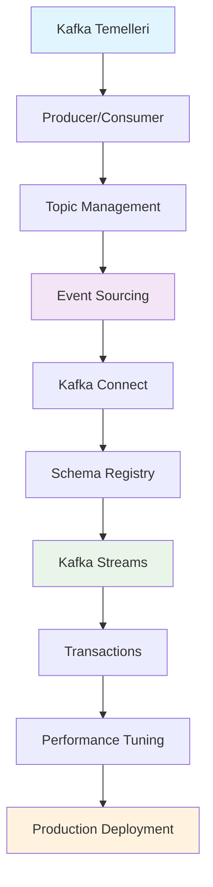

# 🌊 Apache Kafka - Kapsamlı Eğitim Bölümü

**Özet**: Bu bölümde Apache Kafka'nın temelden ileri seviyeye kadar tüm aspektlerini öğreneceksiniz. Event streaming, distributed commit log, pub/sub sistemi olarak Kafka'nın nasıl çalıştığını, production ortamında nasıl deploy edileceğini ve optimize edileceğini kapsamlı olarak göreceğiz.

## 📚 Bölüm İçeriği

### Temel Seviye

1. **[Kafka Temelleri](01-temeller.md)** - Mimari, kavramlar, kurulum
2. **[Producer & Consumer](02-producer-consumer.md)** - Mesaj üretme ve tüketme
3. **[Topic & Partition Yönetimi](03-topic-partition.md)** - Veri organizasyonu

### Orta Seviye

4. **[Event Sourcing ile Kafka](04-event-sourcing.md)** - Event-driven architecture
5. **[Kafka Connect](05-kafka-connect.md)** - Veri entegrasyonu
6. **[Schema Registry](06-schema-registry.md)** - Veri şema yönetimi

### İleri Seviye

7. **[Kafka Streams](07-kafka-streams.md)** - Stream processing
8. **[Transactional Kafka](08-transactions.md)** - ACID properties
9. **[Performance Tuning](09-performance.md)** - Optimizasyon teknikleri

### Operasyonel Konular

10. **[Monitoring & Observability](10-monitoring.md)** - İzleme ve metrikler
11. **[Security](11-security.md)** - Güvenlik yapılandırması
12. **[Production Deployment](12-deployment.md)** - Kubernetes deployment

## 🎯 Öğrenme Hedefleri

Bu bölümü tamamladığınızda:

✅ **Temel Beceriler**

- Kafka mimarisini ve terminolojisini anlayacaksınız
- Producer/Consumer uygulamaları geliştirebileceksiniz
- Topic ve partition stratejilerini belirleyebileceksiniz

✅ **Orta Seviye Beceriler**

- Event sourcing pattern'i uygulayabileceksiniz
- Kafka Connect ile veri pipeline'ları kurabileceksiniz
- Schema evolution yönetebileceksiniz

✅ **İleri Seviye Beceriler**

- Kafka Streams ile real-time processing yapabileceksiniz
- Transactional semantics kullanabileceksiniz
- Production cluster'ı optimize edebileceksiniz

## 🛠️ Ön Gereksinimler

### Zorunlu

- [ ] Java 11+ bilgisi (temel seviye)
- [ ] JSON format bilgisi
- [ ] Docker ve Docker Compose kullanımı
- [ ] Linux terminal komutları

### Önerilen

- [ ] Distributed systems temel kavramları
- [ ] Mikroservis mimarisi deneyimi
- [ ] Message-driven architecture bilgisi

## 🚀 Hızlı Başlangıç

1. **Development Environment Kurulumu**:

```bash
# Repository klonlama
git clone <repo-url>
cd KAFKA-RABBITMQ-REDIS-ELASTICHSEARCH

# Kafka cluster başlatma
cd deployment/docker-compose
docker-compose up -d kafka-cluster
```

2. **İlk Kafka Deneyimi**:

```bash
# Kafka CLI ile topic oluşturma
docker exec -it kafka1 kafka-topics.sh --create \
  --bootstrap-server localhost:9092 \
  --topic quickstart-topic \
  --partitions 3 \
  --replication-factor 1
```

3. **İlk Mesaj Gönderme**:

```bash
# Producer ile mesaj gönderme
echo "Hello Kafka!" | docker exec -i kafka1 kafka-console-producer.sh \
  --bootstrap-server localhost:9092 \
  --topic quickstart-topic
```

## 📊 Öğrenme Süreci



## 🎪 Hands-on Laboratuvarlar

Her bölümde pratik uygulamalar bulacaksınız:

1. **Chat Application** - Basit mesajlaşma sistemi
2. **Order Processing System** - Event sourcing example
3. **Log Aggregation Pipeline** - Kafka Connect kullanımı
4. **Real-time Analytics** - Kafka Streams ile stream processing
5. **E-commerce Event Bus** - Kapsamlı final projesi

## 📈 İlerleme Takibi

| Bölüm             | Zorluk     | Tahmini Süre | Durum |
| ----------------- | ---------- | ------------ | ----- |
| Temeller          | ⭐⭐☆☆☆    | 3 gün        | ⏳    |
| Producer/Consumer | ⭐⭐☆☆☆    | 2 gün        | ⏳    |
| Topic Management  | ⭐⭐⭐☆☆   | 2 gün        | ⏳    |
| Event Sourcing    | ⭐⭐⭐☆☆   | 4 gün        | ⏳    |
| Kafka Connect     | ⭐⭐⭐☆☆   | 3 gün        | ⏳    |
| Schema Registry   | ⭐⭐⭐⭐☆  | 3 gün        | ⏳    |
| Kafka Streams     | ⭐⭐⭐⭐☆  | 5 gün        | ⏳    |
| Transactions      | ⭐⭐⭐⭐⭐ | 4 gün        | ⏳    |
| Performance       | ⭐⭐⭐⭐⭐ | 4 gün        | ⏳    |
| Deployment        | ⭐⭐⭐⭐⭐ | 5 gün        | ⏳    |

## 🎯 Başlangıç Noktaları

**Kafka'ya yeniyim**: [Kafka Temelleri](01-temeller.md) ile başlayın

**Event-driven architecture öğrenmek istiyorum**: [Event Sourcing](04-event-sourcing.md) bölümüne geçin

**Real-time processing yapacağım**: [Kafka Streams](07-kafka-streams.md) bölümünü inceleyin

**Production deployment planlıyorum**: [Deployment](12-deployment.md) bölümünden başlayın

---

**Sonraki Adım**: [Kafka Temelleri](01-temeller.md) bölümü ile öğrenme yolculuğunuza başlayın! 🚀
