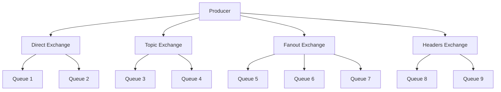

# RabbitMQ Exchange Patterns ve Routing

## 📋 İçindekiler

1. [Exchange Types Genel Bakış](#exchange-types-genel-bakış)
2. [Direct Exchange](#direct-exchange)
3. [Topic Exchange](#topic-exchange)
4. [Fanout Exchange](#fanout-exchange)
5. [Headers Exchange](#headers-exchange)
6. [Default Exchange](#default-exchange)
7. [Routing Patterns](#routing-patterns)
8. [Hands-on Lab](#hands-on-lab)

## 🔀 Exchange Types Genel Bakış

RabbitMQ'da **Exchange**, mesajları queue'lara yönlendiren router görevi görür. Her exchange type'ı farklı routing algoritması kullanır:



### Exchange Types Karşılaştırması

| Exchange Type | Routing Kriteri                | Kullanım Alanı  | Performans |
| ------------- | ------------------------------ | --------------- | ---------- |
| **Direct**    | Exact routing key match        | Simple routing  | Yüksek     |
| **Topic**     | Pattern-based routing          | Complex routing | Orta       |
| **Fanout**    | Broadcast (ignore routing key) | Broadcasting    | En yüksek  |
| **Headers**   | Message headers                | Custom routing  | Düşük      |

## 📍 Direct Exchange

**Direct Exchange**, routing key'i **tam olarak** eşleşen queue'lara mesaj gönderir.

### Çalışma Prensibi

```
Producer --[routing_key: "error"]--> Direct Exchange
                                           |
                    binding: "error" ------+---> Error Queue
                    binding: "warning" ----+---> Warning Queue
                    binding: "info" -------+---> Info Queue
```

### Python Örneği - Log Sistemi

```python
# examples/rabbitmq/python/direct_exchange_producer.py
import pika
import json
import sys
from datetime import datetime

class LogProducer:
    def __init__(self):
        self.connection = pika.BlockingConnection(
            pika.ConnectionParameters(
                host='localhost',
                credentials=pika.PlainCredentials('admin', 'admin123')
            )
        )
        self.channel = self.connection.channel()

        # Direct exchange declare
        self.channel.exchange_declare(
            exchange='direct_logs',
            exchange_type='direct',
            durable=True
        )

    def send_log(self, severity, message):
        """Log mesajı gönder"""
        log_data = {
            'severity': severity,
            'message': message,
            'timestamp': datetime.now().isoformat(),
            'source': 'direct_producer'
        }

        # Direct exchange'e routing key ile gönder
        self.channel.basic_publish(
            exchange='direct_logs',
            routing_key=severity,  # routing key = severity level
            body=json.dumps(log_data),
            properties=pika.BasicProperties(
                delivery_mode=2,  # Persistent
                content_type='application/json'
            )
        )

        print(f"📝 [{severity.upper()}] {message}")

    def close(self):
        self.connection.close()

# Kullanım
if __name__ == '__main__':
    producer = LogProducer()

    # Test log mesajları
    producer.send_log('info', 'Application started successfully')
    producer.send_log('warning', 'High memory usage detected')
    producer.send_log('error', 'Database connection failed')
    producer.send_log('error', 'Critical system error')

    producer.close()
```

```python
# examples/rabbitmq/python/direct_exchange_consumer.py
import pika
import json
import sys

class LogConsumer:
    def __init__(self, severity_levels):
        self.severity_levels = severity_levels
        self.connection = pika.BlockingConnection(
            pika.ConnectionParameters(
                host='localhost',
                credentials=pika.PlainCredentials('admin', 'admin123')
            )
        )
        self.channel = self.connection.channel()

        # Exchange declare
        self.channel.exchange_declare(
            exchange='direct_logs',
            exchange_type='direct',
            durable=True
        )

        # Exclusive queue oluştur
        result = self.channel.queue_declare(queue='', exclusive=True)
        self.queue_name = result.method.queue

        # Her severity için binding
        for severity in severity_levels:
            self.channel.queue_bind(
                exchange='direct_logs',
                queue=self.queue_name,
                routing_key=severity
            )

    def callback(self, ch, method, properties, body):
        """Log mesajını işle"""
        try:
            log_data = json.loads(body)
            severity_emoji = {
                'info': '💙',
                'warning': '⚠️',
                'error': '❌',
                'critical': '🔥'
            }.get(log_data['severity'], '📝')

            print(f"{severity_emoji} [{log_data['severity'].upper()}] "
                  f"{log_data['timestamp']}: {log_data['message']}")

        except Exception as e:
            print(f"❌ Parse error: {e}")

    def start_consuming(self):
        """Log dinlemeye başla"""
        self.channel.basic_consume(
            queue=self.queue_name,
            on_message_callback=self.callback,
            auto_ack=True
        )

        print(f"👂 Listening for {', '.join(self.severity_levels)} logs...")
        print("🔴 Press CTRL+C to exit")

        try:
            self.channel.start_consuming()
        except KeyboardInterrupt:
            self.channel.stop_consuming()
            self.connection.close()

# Kullanım: python direct_exchange_consumer.py error warning
if __name__ == '__main__':
    if len(sys.argv) < 2:
        print("Usage: python direct_exchange_consumer.py [info] [warning] [error]")
        sys.exit(1)

    severity_levels = sys.argv[1:]
    consumer = LogConsumer(severity_levels)
    consumer.start_consuming()
```

## 🔄 Topic Exchange

**Topic Exchange**, routing key'leri **pattern'lere** göre eşleştirir. Wildcard karakterler kullanır:

- `*` (yıldız): Tek kelime
- `#` (diyez): Sıfır veya daha fazla kelime

### Pattern Örnekleri

```
Routing Key Pattern: "stock.*.price"
✅ Matches: stock.AAPL.price, stock.GOOGL.price
❌ No Match: stock.AAPL.volume, crypto.BTC.price

Routing Key Pattern: "news.#"
✅ Matches: news.tech, news.tech.ai, news.finance.stock
❌ No Match: weather.today

Routing Key Pattern: "*.error"
✅ Matches: app.error, db.error, cache.error
❌ No Match: app.warning, system.error.critical
```

### Python Örneği - Haber Sistemi

```python
# examples/rabbitmq/python/topic_exchange_producer.py
import pika
import json
from datetime import datetime

class NewsProducer:
    def __init__(self):
        self.connection = pika.BlockingConnection(
            pika.ConnectionParameters(
                host='localhost',
                credentials=pika.PlainCredentials('admin', 'admin123')
            )
        )
        self.channel = self.connection.channel()

        # Topic exchange declare
        self.channel.exchange_declare(
            exchange='news_exchange',
            exchange_type='topic',
            durable=True
        )

    def publish_news(self, category, subcategory, urgency, title, content):
        """Haber yayınla"""
        # Routing key format: category.subcategory.urgency
        routing_key = f"{category}.{subcategory}.{urgency}"

        news_data = {
            'category': category,
            'subcategory': subcategory,
            'urgency': urgency,
            'title': title,
            'content': content,
            'timestamp': datetime.now().isoformat(),
            'routing_key': routing_key
        }

        self.channel.basic_publish(
            exchange='news_exchange',
            routing_key=routing_key,
            body=json.dumps(news_data),
            properties=pika.BasicProperties(
                delivery_mode=2,
                content_type='application/json'
            )
        )

        print(f"📰 Published: {routing_key} - {title}")

    def close(self):
        self.connection.close()

# Test haberleri
if __name__ == '__main__':
    producer = NewsProducer()

    # Çeşitli kategorilerde haberler
    producer.publish_news('tech', 'ai', 'high',
                         'New AI Breakthrough',
                         'Revolutionary AI model released...')

    producer.publish_news('tech', 'mobile', 'medium',
                         'New Smartphone Released',
                         'Latest smartphone features...')

    producer.publish_news('finance', 'crypto', 'high',
                         'Bitcoin Reaches New High',
                         'Bitcoin price surges to...')

    producer.publish_news('sports', 'football', 'low',
                         'Match Results',
                         'Yesterday match results...')

    producer.publish_news('weather', 'storm', 'critical',
                         'Storm Warning',
                         'Severe storm approaching...')

    producer.close()
```

```python
# examples/rabbitmq/python/topic_exchange_consumer.py
import pika
import json
import sys

class NewsConsumer:
    def __init__(self, routing_patterns):
        self.routing_patterns = routing_patterns
        self.connection = pika.BlockingConnection(
            pika.ConnectionParameters(
                host='localhost',
                credentials=pika.PlainCredentials('admin', 'admin123')
            )
        )
        self.channel = self.connection.channel()

        # Exchange declare
        self.channel.exchange_declare(
            exchange='news_exchange',
            exchange_type='topic',
            durable=True
        )

        # Exclusive queue
        result = self.channel.queue_declare(queue='', exclusive=True)
        self.queue_name = result.method.queue

        # Pattern'lere göre binding
        for pattern in routing_patterns:
            self.channel.queue_bind(
                exchange='news_exchange',
                queue=self.queue_name,
                routing_key=pattern
            )
            print(f"🔗 Bound to pattern: {pattern}")

    def callback(self, ch, method, properties, body):
        """Haber mesajını işle"""
        try:
            news = json.loads(body)

            urgency_emoji = {
                'low': '🟢',
                'medium': '🟡',
                'high': '🟠',
                'critical': '🔴'
            }.get(news['urgency'], '📰')

            print(f"\n{urgency_emoji} [{news['routing_key']}]")
            print(f"📰 {news['title']}")
            print(f"💬 {news['content']}")
            print(f"⏰ {news['timestamp']}")

        except Exception as e:
            print(f"❌ Parse error: {e}")

    def start_consuming(self):
        """Haber dinlemeye başla"""
        self.channel.basic_consume(
            queue=self.queue_name,
            on_message_callback=self.callback,
            auto_ack=True
        )

        print(f"👂 Listening for patterns: {', '.join(self.routing_patterns)}")
        print("🔴 Press CTRL+C to exit\n")

        try:
            self.channel.start_consuming()
        except KeyboardInterrupt:
            self.channel.stop_consuming()
            self.connection.close()

# Örnek kullanımlar:
# python topic_exchange_consumer.py "tech.*.*"        # Tüm tech haberleri
# python topic_exchange_consumer.py "*.*.high"        # Tüm yüksek öncelikli
# python topic_exchange_consumer.py "tech.#" "finance.#"  # Tech ve finance tümü
if __name__ == '__main__':
    if len(sys.argv) < 2:
        print("Usage: python topic_exchange_consumer.py <pattern1> [pattern2] [pattern3]...")
        print("Examples:")
        print("  tech.*.*          # All tech news")
        print("  *.*.high          # All high priority")
        print("  tech.# finance.#  # All tech and finance")
        sys.exit(1)

    patterns = sys.argv[1:]
    consumer = NewsConsumer(patterns)
    consumer.start_consuming()
```

## 📢 Fanout Exchange

**Fanout Exchange**, routing key'i görmezden gelir ve mesajı **tüm bağlı queue'lara** gönderir.

### Kullanım Alanları

- Broadcasting notifications
- Cache invalidation
- Real-time updates
- Event sourcing

### Python Örneği - Bildirim Sistemi

```python
# examples/rabbitmq/python/fanout_exchange_producer.py
import pika
import json
from datetime import datetime

class NotificationProducer:
    def __init__(self):
        self.connection = pika.BlockingConnection(
            pika.ConnectionParameters(
                host='localhost',
                credentials=pika.PlainCredentials('admin', 'admin123')
            )
        )
        self.channel = self.connection.channel()

        # Fanout exchange declare
        self.channel.exchange_declare(
            exchange='notifications',
            exchange_type='fanout',
            durable=True
        )

    def broadcast_notification(self, notification_type, title, message, data=None):
        """Bildirim yayınla"""
        notification = {
            'type': notification_type,
            'title': title,
            'message': message,
            'timestamp': datetime.now().isoformat(),
            'data': data or {}
        }

        # Fanout exchange - routing key önemli değil
        self.channel.basic_publish(
            exchange='notifications',
            routing_key='',  # Fanout'ta routing key görmezden gelinir
            body=json.dumps(notification),
            properties=pika.BasicProperties(
                delivery_mode=2,
                content_type='application/json'
            )
        )

        print(f"📢 Broadcast: [{notification_type.upper()}] {title}")

    def close(self):
        self.connection.close()

# Test bildirimleri
if __name__ == '__main__':
    producer = NotificationProducer()

    # Sistem bildirimleri
    producer.broadcast_notification(
        'system',
        'Maintenance Warning',
        'System maintenance will start in 30 minutes',
        {'maintenance_duration': '2 hours', 'affected_services': ['api', 'web']}
    )

    producer.broadcast_notification(
        'security',
        'Security Alert',
        'Suspicious login attempt detected',
        {'ip': '192.168.1.100', 'location': 'Unknown'}
    )

    producer.broadcast_notification(
        'promotion',
        'Flash Sale Started',
        '50% discount on all items for next 2 hours!',
        {'discount': 50, 'duration': 120}
    )

    producer.close()
```

```python
# examples/rabbitmq/python/fanout_exchange_consumer.py
import pika
import json
import sys

class NotificationConsumer:
    def __init__(self, consumer_name, notification_types=None):
        self.consumer_name = consumer_name
        self.notification_types = notification_types or []

        self.connection = pika.BlockingConnection(
            pika.ConnectionParameters(
                host='localhost',
                credentials=pika.PlainCredentials('admin', 'admin123')
            )
        )
        self.channel = self.connection.channel()

        # Exchange declare
        self.channel.exchange_declare(
            exchange='notifications',
            exchange_type='fanout',
            durable=True
        )

        # Exclusive queue (her consumer'ın kendi queue'su)
        result = self.channel.queue_declare(queue='', exclusive=True)
        self.queue_name = result.method.queue

        # Fanout exchange'e bind et
        self.channel.queue_bind(
            exchange='notifications',
            queue=self.queue_name
        )

    def callback(self, ch, method, properties, body):
        """Bildirim işle"""
        try:
            notification = json.loads(body)

            # Type filtering (eğer belirtilmişse)
            if (self.notification_types and
                notification['type'] not in self.notification_types):
                return

            type_emoji = {
                'system': '⚙️',
                'security': '🔒',
                'promotion': '🎉',
                'alert': '🚨',
                'info': 'ℹ️'
            }.get(notification['type'], '📢')

            print(f"\n{type_emoji} [{self.consumer_name}] {notification['title']}")
            print(f"💬 {notification['message']}")
            print(f"⏰ {notification['timestamp']}")

            if notification.get('data'):
                print(f"📋 Data: {notification['data']}")

        except Exception as e:
            print(f"❌ Parse error: {e}")

    def start_consuming(self):
        """Bildirim dinlemeye başla"""
        self.channel.basic_consume(
            queue=self.queue_name,
            on_message_callback=self.callback,
            auto_ack=True
        )

        filter_msg = f" (filtering: {', '.join(self.notification_types)})" if self.notification_types else ""
        print(f"👂 [{self.consumer_name}] Listening for notifications{filter_msg}")
        print("🔴 Press CTRL+C to exit\n")

        try:
            self.channel.start_consuming()
        except KeyboardInterrupt:
            self.channel.stop_consuming()
            self.connection.close()

# Kullanım:
# python fanout_exchange_consumer.py mobile_app
# python fanout_exchange_consumer.py web_app system security
if __name__ == '__main__':
    if len(sys.argv) < 2:
        print("Usage: python fanout_exchange_consumer.py <consumer_name> [type1] [type2]...")
        print("Examples:")
        print("  mobile_app                    # All notifications")
        print("  web_app system security       # Only system and security")
        sys.exit(1)

    consumer_name = sys.argv[1]
    notification_types = sys.argv[2:] if len(sys.argv) > 2 else None

    consumer = NotificationConsumer(consumer_name, notification_types)
    consumer.start_consuming()
```

## 🏷️ Headers Exchange

**Headers Exchange**, mesaj header'larını kullanarak routing yapar. En esnek ama en yavaş exchange type'ıdır.

### Binding Arguments

- `x-match: all` - Tüm header'lar eşleşmeli
- `x-match: any` - Herhangi bir header eşleşmeli

### Python Örneği - E-ticaret Sistemi

```python
# examples/rabbitmq/python/headers_exchange_producer.py
import pika
import json
from datetime import datetime

class OrderProducer:
    def __init__(self):
        self.connection = pika.BlockingConnection(
            pika.ConnectionParameters(
                host='localhost',
                credentials=pika.PlainCredentials('admin', 'admin123')
            )
        )
        self.channel = self.connection.channel()

        # Headers exchange declare
        self.channel.exchange_declare(
            exchange='order_processing',
            exchange_type='headers',
            durable=True
        )

    def send_order(self, order_data, headers):
        """Sipariş gönder"""
        order = {
            'order_id': order_data['order_id'],
            'customer_id': order_data['customer_id'],
            'items': order_data['items'],
            'total_amount': order_data['total_amount'],
            'timestamp': datetime.now().isoformat()
        }

        # Headers exchange - routing key önemli değil
        self.channel.basic_publish(
            exchange='order_processing',
            routing_key='',  # Headers exchange'te kullanılmaz
            body=json.dumps(order),
            properties=pika.BasicProperties(
                delivery_mode=2,
                content_type='application/json',
                headers=headers  # Routing header'ları
            )
        )

        print(f"🛒 Order sent: {order_data['order_id']} - Headers: {headers}")

    def close(self):
        self.connection.close()

# Test siparişleri
if __name__ == '__main__':
    producer = OrderProducer()

    # Farklı header kombinasyonları ile siparişler

    # Premium müşteri, express kargo
    producer.send_order({
        'order_id': 'ORD-001',
        'customer_id': 'CUST-PREMIUM-123',
        'items': ['laptop', 'mouse'],
        'total_amount': 1500.00
    }, {
        'customer_type': 'premium',
        'shipping_type': 'express',
        'payment_method': 'credit_card',
        'amount_range': 'high'
    })

    # Standard müşteri, normal kargo
    producer.send_order({
        'order_id': 'ORD-002',
        'customer_id': 'CUST-STD-456',
        'items': ['book'],
        'total_amount': 25.99
    }, {
        'customer_type': 'standard',
        'shipping_type': 'standard',
        'payment_method': 'paypal',
        'amount_range': 'low'
    })

    # VIP müşteri, same-day delivery
    producer.send_order({
        'order_id': 'ORD-003',
        'customer_id': 'CUST-VIP-789',
        'items': ['phone', 'case', 'charger'],
        'total_amount': 899.99
    }, {
        'customer_type': 'vip',
        'shipping_type': 'same_day',
        'payment_method': 'credit_card',
        'amount_range': 'medium'
    })

    producer.close()
```

```python
# examples/rabbitmq/python/headers_exchange_consumer.py
import pika
import json
import sys

class OrderProcessor:
    def __init__(self, processor_name, header_match, match_headers):
        self.processor_name = processor_name
        self.header_match = header_match  # 'all' or 'any'
        self.match_headers = match_headers

        self.connection = pika.BlockingConnection(
            pika.ConnectionParameters(
                host='localhost',
                credentials=pika.PlainCredentials('admin', 'admin123')
            )
        )
        self.channel = self.connection.channel()

        # Exchange declare
        self.channel.exchange_declare(
            exchange='order_processing',
            exchange_type='headers',
            durable=True
        )

        # Exclusive queue
        result = self.channel.queue_declare(queue='', exclusive=True)
        self.queue_name = result.method.queue

        # Headers binding arguments
        binding_args = {'x-match': header_match}
        binding_args.update(match_headers)

        # Headers exchange'e bind et
        self.channel.queue_bind(
            exchange='order_processing',
            queue=self.queue_name,
            arguments=binding_args
        )

        print(f"🔗 [{processor_name}] Bound with x-match: {header_match}")
        print(f"📋 Match headers: {match_headers}")

    def callback(self, ch, method, properties, body):
        """Sipariş işle"""
        try:
            order = json.loads(body)
            headers = properties.headers or {}

            print(f"\n🛒 [{self.processor_name}] Processing Order: {order['order_id']}")
            print(f"👤 Customer: {order['customer_id']}")
            print(f"🏷️ Headers: {headers}")
            print(f"💰 Amount: ${order['total_amount']}")
            print(f"📦 Items: {', '.join(order['items'])}")

            # İşlem simulasyonu
            self.process_order(order, headers)

        except Exception as e:
            print(f"❌ Processing error: {e}")

    def process_order(self, order, headers):
        """Sipariş işleme logic'i"""
        customer_type = headers.get('customer_type', 'unknown')
        shipping_type = headers.get('shipping_type', 'standard')

        if customer_type == 'vip':
            print("⭐ VIP customer - Priority processing")
        elif customer_type == 'premium':
            print("💎 Premium customer - Enhanced service")

        if shipping_type == 'express':
            print("⚡ Express shipping - 1-2 days")
        elif shipping_type == 'same_day':
            print("🚀 Same day delivery - Within 24 hours")
        else:
            print("📮 Standard shipping - 3-5 days")

    def start_consuming(self):
        """Sipariş dinlemeye başla"""
        self.channel.basic_consume(
            queue=self.queue_name,
            on_message_callback=self.callback,
            auto_ack=True
        )

        print(f"👂 [{self.processor_name}] Listening for orders...")
        print("🔴 Press CTRL+C to exit\n")

        try:
            self.channel.start_consuming()
        except KeyboardInterrupt:
            self.channel.stop_consuming()
            self.connection.close()

# Predefined processors
def create_premium_processor():
    """Premium müşteri siparişleri"""
    return OrderProcessor(
        'Premium Processor',
        'any',  # Herhangi biri eşleşsin
        {'customer_type': 'premium', 'customer_type': 'vip'}
    )

def create_express_processor():
    """Express kargo siparişleri"""
    return OrderProcessor(
        'Express Processor',
        'all',  # Hepsi eşleşmeli
        {'shipping_type': 'express', 'payment_method': 'credit_card'}
    )

def create_high_value_processor():
    """Yüksek tutarlı siparişler"""
    return OrderProcessor(
        'High Value Processor',
        'any',
        {'amount_range': 'high', 'amount_range': 'medium'}
    )

if __name__ == '__main__':
    if len(sys.argv) < 2:
        print("Usage: python headers_exchange_consumer.py <processor_type>")
        print("Available processors:")
        print("  premium    # Premium/VIP customers")
        print("  express    # Express shipping orders")
        print("  high_value # High/Medium value orders")
        sys.exit(1)

    processor_type = sys.argv[1]

    if processor_type == 'premium':
        processor = create_premium_processor()
    elif processor_type == 'express':
        processor = create_express_processor()
    elif processor_type == 'high_value':
        processor = create_high_value_processor()
    else:
        print(f"❌ Unknown processor type: {processor_type}")
        sys.exit(1)

    processor.start_consuming()
```

## 🔄 Routing Patterns Best Practices

### 1. Direct Exchange Best Practices

- **Kullanım**: Basit, exact match routing
- **Naming**: Kısa, açık routing key'ler (`error`, `warning`, `info`)
- **Performance**: En yüksek performans
- **Örnek**: Log levels, task priorities

### 2. Topic Exchange Best Practices

- **Naming Convention**: `category.subcategory.attribute`
- **Pattern Design**:
  - `#` sonuna: `stock.#` (tüm stock mesajları)
  - `*` ortaya: `*.error` (tüm error'lar)
  - Specificity: `stock.AAPL.price` → `stock.*.price` → `stock.#`

### 3. Fanout Exchange Best Practices

- **Kullanım**: Broadcasting, caching, notifications
- **Queue Strategy**: Her consumer için ayrı queue
- **Performance**: En hızlı broadcast
- **Durability**: Notification'lar için genelde non-durable

### 4. Headers Exchange Best Practices

- **Kullanım**: Complex routing logic
- **Header Design**: Key-value pairs ile metadata
- **Match Strategy**:
  - `all`: Strict filtering
  - `any`: Flexible filtering
- **Performance**: En yavaş, complex logic için

## 🧪 Hands-on Lab: Multi-Exchange Messaging System

Real-world scenario: **E-ticaret platformu** için messaging system tasarlayacağız.

### Lab Senaryosu

**Sistem Gereksinimleri:**

1. **Order Processing** - Headers exchange ile complex routing
2. **Inventory Updates** - Topic exchange ile category-based routing
3. **System Notifications** - Fanout exchange ile broadcasting
4. **Error Logging** - Direct exchange ile severity-based routing

### Lab Kurulumu

```bash
# Lab scriptini çalıştır
chmod +x examples/rabbitmq/scripts/setup_multi_exchange_lab.sh
./examples/rabbitmq/scripts/setup_multi_exchange_lab.sh
```

### Test Senaryosu

```bash
# Terminal 1: Error logs dinle
python examples/rabbitmq/python/direct_exchange_consumer.py error warning

# Terminal 2: Tech haberleri dinle
python examples/rabbitmq/python/topic_exchange_consumer.py "tech.*.*"

# Terminal 3: Mobile app notifications dinle
python examples/rabbitmq/python/fanout_exchange_consumer.py mobile_app

# Terminal 4: Premium siparişleri dinle
python examples/rabbitmq/python/headers_exchange_consumer.py premium

# Terminal 5: Test mesajları gönder
python examples/rabbitmq/python/direct_exchange_producer.py
python examples/rabbitmq/python/topic_exchange_producer.py
python examples/rabbitmq/python/fanout_exchange_producer.py
python examples/rabbitmq/python/headers_exchange_producer.py
```

## ✅ Öğrendiklerimiz

Bu bölümde şunları öğrendik:

1. **Exchange Types**

   - Direct: Exact routing key match
   - Topic: Pattern-based routing
   - Fanout: Broadcasting
   - Headers: Metadata-based routing

2. **Routing Strategies**

   - Simple vs Complex routing
   - Performance considerations
   - Best practices

3. **Real-world Patterns**

   - Log aggregation (Direct)
   - News distribution (Topic)
   - Notifications (Fanout)
   - Order processing (Headers)

4. **Design Decisions**
   - Exchange type selection
   - Routing key design
   - Queue binding strategies

## 📚 Sonraki Adım

Bir sonraki bölümde **RabbitMQ Advanced Features** konusunu işleyeceğiz:

- Dead Letter Queues (DLQ)
- Message TTL (Time To Live)
- Queue and Message priorities
- Publisher Confirms
- Consumer Acknowledgments
- Clustering and High Availability

---

**🎯 Pratik Görev:** Multi-exchange lab'ı çalıştırın ve farklı exchange pattern'lerini test edin. Management UI'da message flow'ları gözlemleyin.
