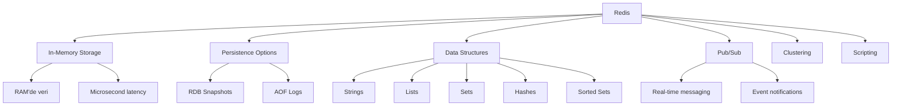
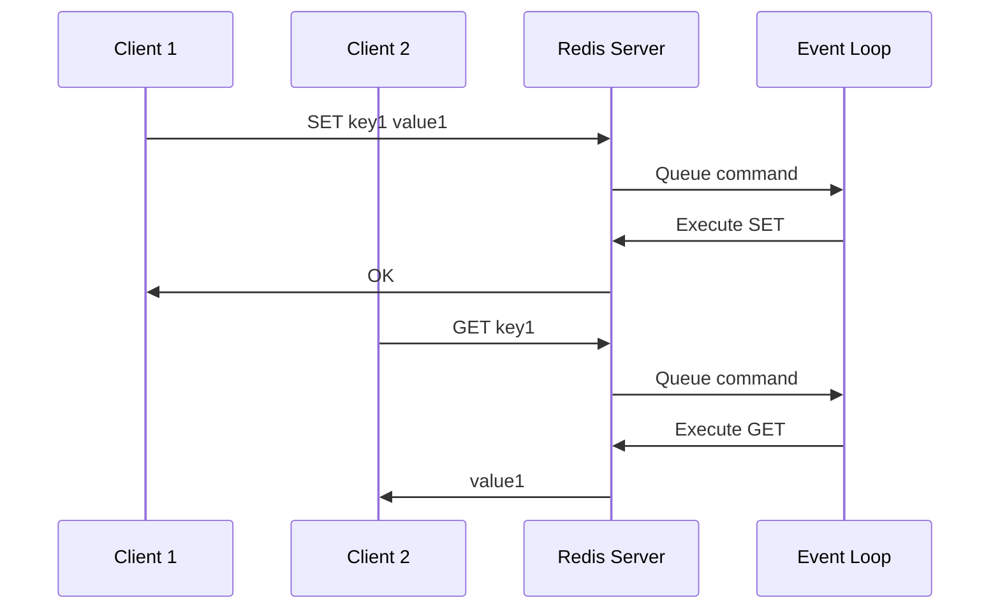

# Redis Temelleri

## 📖 Özet

Bu bölümde Redis'in temel kavramlarını, mimarisini ve kurulum sürecini öğreneceksiniz. Redis'in ne olduğunu, hangi veri yapılarını desteklediğini ve temel kullanım senaryolarını anlayacaksınız.

## 🎯 Learning Objectives

Bu bölümü tamamladığınızda:

- ✅ Redis'in ne olduğunu ve ne için kullanıldığını anlayacaksınız
- ✅ Redis mimarisini ve çalışma prensiplerini öğreneceksiniz
- ✅ Redis data types'larını ve kullanım alanlarını kavrayacaksınız
- ✅ Docker ile Redis kurulumunu yapabileceksiniz
- ✅ Redis CLI ile temel komutları çalıştırabileceksiniz

## 📋 Prerequisites

- Temel programlama bilgisi
- Docker temel kullanımı
- Key-value store kavramlarının temel bilgisi

---

## 🚀 Redis Nedir?

**Redis** (Remote Dictionary Server), açık kaynaklı, in-memory veri yapısı deposudur. **NoSQL** kategorisinde yer alan Redis, **key-value** store olarak çalışır ve **çok yüksek performans** sunar.

### Ana Özellikler



### Redis vs Diğer Veritabanları

| Özellik         | Redis        | MySQL      | MongoDB    | Memcached   |
| --------------- | ------------ | ---------- | ---------- | ----------- |
| **Tip**         | Key-Value    | Relational | Document   | Key-Value   |
| **Storage**     | In-Memory    | Disk       | Disk       | In-Memory   |
| **Persistence** | Opsiyonel    | Varsayılan | Varsayılan | Yok         |
| **Data Types**  | Rich         | SQL Types  | BSON       | String only |
| **Performance** | Çok Yüksek   | Yüksek     | Yüksek     | Çok Yüksek  |
| **Use Cases**   | Cache, Queue | OLTP       | Documents  | Cache only  |

---

## 🏗️ Redis Mimarisi

### Single Instance Architecture

```
┌─────────────────────────────────────┐
│            Redis Server             │
├─────────────────────────────────────┤
│  ┌─────────────┐ ┌─────────────────┐ │
│  │   Memory    │ │   Event Loop    │ │
│  │    (RAM)    │ │  (Single Thread)│ │
│  └─────────────┘ └─────────────────┘ │
├─────────────────────────────────────┤
│  ┌─────────────┐ ┌─────────────────┐ │
│  │ Persistence │ │   Networking    │ │
│  │ (RDB + AOF) │ │   (TCP/Unix)    │ │
│  └─────────────┘ └─────────────────┘ │
└─────────────────────────────────────┘
```

### 🧠 Memory Management

Redis, tüm veriyi **RAM'de** tutar:

```
RAM Usage:
├── Key-Value Data (80-90%)
├── Redis Overhead (5-10%)
├── Replication Buffer (0-5%)
└── Client Buffers (1-5%)
```

### ⚡ Single-Threaded Model



**Avantajlar:**

- No locks, no race conditions
- Predictable performance
- Simple debugging

**Dezavantajlar:**

- CPU-intensive operations block
- Single core limitation

---

## 📊 Redis Data Types

Redis, 5 temel veri tipi destekler:

### 1. 🔤 String (Binary-safe strings)

```
Key: "user:1001:name"
Value: "Ahmet Yılmaz"

Max size: 512 MB
Use cases: Cache, counters, flags
```

### 2. 📝 List (Linked lists of strings)

```
Key: "user:1001:orders"
Value: ["order:1", "order:5", "order:12"]

Implementation: Doubly linked list
Use cases: Queues, stacks, timelines
```

### 3. 🎯 Set (Unordered sets)

```
Key: "user:1001:tags"
Value: {"developer", "golang", "redis"}

Implementation: Hash table
Use cases: Tags, unique items, relationships
```

### 4. 🗃️ Hash (Hash tables)

```
Key: "user:1001"
Value: {
  "name": "Ahmet",
  "email": "ahmet@example.com",
  "age": "25"
}

Use cases: Objects, structured data
```

### 5. 📈 Sorted Set (Sets with scores)

```
Key: "leaderboard"
Value: [
  ("player1", 1500),
  ("player2", 1200),
  ("player3", 1100)
]

Implementation: Skip list + Hash table
Use cases: Leaderboards, rankings, time series
```

### Data Types Karşılaştırması

| Data Type  | Memory Usage | Performance | Use Cases                |
| ---------- | ------------ | ----------- | ------------------------ |
| String     | Düşük        | En hızlı    | Cache, flags, counters   |
| List       | Orta         | Hızlı       | Queues, feeds, logs      |
| Set        | Orta         | Hızlı       | Tags, unique collections |
| Hash       | Düşük        | Hızlı       | Objects, configurations  |
| Sorted Set | Yüksek       | Orta        | Rankings, time series    |

---

## 🐳 Redis Kurulumu (Docker)

### Docker Compose Konfigürasyonu

```yaml
# deployment/docker-compose/redis.yml
version: "3.8"

services:
  redis:
    image: redis:7-alpine
    container_name: redis-server
    restart: unless-stopped

    # Komut satırı konfigürasyonu
    command: redis-server --appendonly yes --maxmemory 256mb --maxmemory-policy allkeys-lru

    ports:
      - "6379:6379"

    volumes:
      - redis_data:/data
      - ./redis.conf:/usr/local/etc/redis/redis.conf

    environment:
      - REDIS_PASSWORD=redis123

    # Resource limits
    deploy:
      resources:
        limits:
          memory: 512M
          cpus: "0.5"

    # Health check
    healthcheck:
      test: ["CMD", "redis-cli", "ping"]
      interval: 30s
      timeout: 3s
      retries: 3
      start_period: 10s

  # Redis Commander - Web UI
  redis-commander:
    image: rediscommander/redis-commander:latest
    container_name: redis-commander
    restart: unless-stopped

    ports:
      - "8081:8081"

    environment:
      - REDIS_HOSTS=local:redis-server:6379
      - REDIS_PASSWORD=redis123

    depends_on:
      - redis

volumes:
  redis_data:
    driver: local
```

### Redis Konfigürasyon Dosyası

```bash
# deployment/docker-compose/redis.conf

# Temel Ayarlar
bind 127.0.0.1                # Local bağlantılar
port 6379                     # Default port
timeout 0                     # Client timeout (0 = hiç timeout olmasın)

# Memory Yönetimi
maxmemory 256mb              # Maksimum RAM kullanımı
maxmemory-policy allkeys-lru # Eviction policy (LRU = Least Recently Used)

# Persistence Ayarları
save 900 1                   # 900 saniyede 1 değişiklik varsa snapshot al
save 300 10                  # 300 saniyede 10 değişiklik varsa snapshot al
save 60 10000               # 60 saniyede 10000 değişiklik varsa snapshot al

appendonly yes              # AOF (Append Only File) aktif
appendfsync everysec        # AOF sync policy (her saniye)

# Güvenlik
requirepass redis123        # Password koruması

# Logging
loglevel notice             # Log seviyesi
logfile ""                  # Log file (boş = stdout)

# Network
tcp-keepalive 300          # TCP keepalive

# Performance
tcp-backlog 511            # TCP listen backlog
databases 16               # Veritabanı sayısı (0-15)
```

### Kurulum Scripti

```bash
#!/bin/bash
# scripts/setup_redis.sh

echo "🚀 Redis kurulumu başlıyor..."

# Docker Compose ile Redis başlat
echo "📦 Redis containers başlatılıyor..."
docker-compose -f deployment/docker-compose/redis.yml up -d

# Servislerin başlamasını bekle
echo "⏳ Servislerin başlamasını bekleniyor..."
sleep 10

# Health check
echo "🏥 Health check yapılıyor..."
if docker exec redis-server redis-cli ping > /dev/null 2>&1; then
    echo "✅ Redis server hazır!"
else
    echo "❌ Redis server başlatılamadı!"
    exit 1
fi

# Test bağlantısı
echo "🔗 Test bağlantısı yapılıyor..."
docker exec redis-server redis-cli -a redis123 set test "Hello Redis" > /dev/null
if [ "$(docker exec redis-server redis-cli -a redis123 get test)" = "Hello Redis" ]; then
    echo "✅ Redis test başarılı!"
    docker exec redis-server redis-cli -a redis123 del test > /dev/null
else
    echo "❌ Redis test başarısız!"
    exit 1
fi

echo ""
echo "🎉 Redis kurulumu tamamlandı!"
echo ""
echo "📋 Bağlantı Bilgileri:"
echo "   Redis Server: localhost:6379"
echo "   Password: redis123"
echo "   Redis Commander UI: http://localhost:8081"
echo ""
echo "🔧 Test komutları:"
echo "   docker exec -it redis-server redis-cli -a redis123"
echo "   docker exec redis-server redis-cli -a redis123 info"
```

---

## 🖥️ Redis CLI Kullanımı

### Temel Bağlantı

```bash
# Docker container içinden
docker exec -it redis-server redis-cli -a redis123

# Local kurulum için
redis-cli -h localhost -p 6379 -a redis123

# URL ile bağlantı
redis-cli -u redis://:redis123@localhost:6379
```

### Temel Komutlar

```bash
# Redis CLI'da çalıştırın

# 1. Bağlantı testi
127.0.0.1:6379> PING
PONG

# 2. Temel bilgi
127.0.0.1:6379> INFO server
# Server version, uptime, etc.

# 3. Database seçimi (0-15)
127.0.0.1:6379> SELECT 0
OK

# 4. Database temizleme
127.0.0.1:6379> FLUSHDB
OK

# 5. Tüm databases temizleme
127.0.0.1:6379> FLUSHALL
OK

# 6. Mevcut key'leri listele
127.0.0.1:6379> KEYS *

# 7. Database boyutunu öğren
127.0.0.1:6379> DBSIZE
(integer) 0

# 8. Memory kullanımı
127.0.0.1:6379> MEMORY USAGE key_name

# 9. Konfigürasyon görüntüle
127.0.0.1:6379> CONFIG GET maxmemory

# 10. Çıkış
127.0.0.1:6379> EXIT
```

---

## 💻 Python ile Redis Kullanımı

### Redis Client Kurulumu

```bash
# requirements.txt
redis==4.5.4
python-dotenv==1.0.0
```

### Temel Bağlantı ve Operasyonlar

```python
# examples/redis/python/basic_operations.py
import redis
import json
import time
from datetime import datetime, timedelta

class RedisBasics:
    def __init__(self):
        # Redis bağlantısı
        self.redis_client = redis.Redis(
            host='localhost',
            port=6379,
            password='redis123',
            db=0,  # Database 0 kullan
            decode_responses=True  # String response'ları otomatik decode et
        )

        # Bağlantı testi
        try:
            self.redis_client.ping()
            print("✅ Redis bağlantısı başarılı!")
        except redis.ConnectionError:
            print("❌ Redis bağlantısı başarısız!")
            raise

    def demo_string_operations(self):
        """String operasyonları demo"""
        print("\n🔤 STRING OPERATIONS DEMO")
        print("=" * 40)

        # 1. Basit SET/GET
        key = "user:1001:name"
        value = "Ahmet Yılmaz"

        self.redis_client.set(key, value)
        retrieved = self.redis_client.get(key)
        print(f"SET/GET: {key} = {retrieved}")

        # 2. TTL (Time To Live) ile SET
        temp_key = "temp:session:abc123"
        self.redis_client.setex(temp_key, 30, "temporary_data")  # 30 saniye TTL
        ttl = self.redis_client.ttl(temp_key)
        print(f"TTL Example: {temp_key} expires in {ttl} seconds")

        # 3. Counter operations
        counter_key = "page:views:homepage"

        # Counter'ı artır
        views = self.redis_client.incr(counter_key)
        print(f"Page views: {views}")

        # Belirli miktarda artır
        views = self.redis_client.incrby(counter_key, 5)
        print(f"Page views after +5: {views}")

        # 4. Multiple operations
        user_data = {
            "user:1001:email": "ahmet@example.com",
            "user:1001:age": "25",
            "user:1001:city": "Istanbul"
        }

        # Multiple SET
        self.redis_client.mset(user_data)

        # Multiple GET
        keys = list(user_data.keys())
        values = self.redis_client.mget(keys)

        print("Multiple GET:")
        for key, value in zip(keys, values):
            print(f"  {key}: {value}")

    def demo_hash_operations(self):
        """Hash operasyonları demo"""
        print("\n🗃️ HASH OPERATIONS DEMO")
        print("=" * 40)

        hash_key = "user:1001"

        # 1. Hash field'ları set et
        user_hash = {
            "name": "Ahmet Yılmaz",
            "email": "ahmet@example.com",
            "age": "25",
            "city": "Istanbul",
            "joined": datetime.now().isoformat()
        }

        self.redis_client.hset(hash_key, mapping=user_hash)
        print(f"Hash oluşturuldu: {hash_key}")

        # 2. Tek field al
        name = self.redis_client.hget(hash_key, "name")
        print(f"Name: {name}")

        # 3. Tüm hash'i al
        all_data = self.redis_client.hgetall(hash_key)
        print("Tüm user data:")
        for field, value in all_data.items():
            print(f"  {field}: {value}")

        # 4. Field'ların varlığını kontrol et
        exists = self.redis_client.hexists(hash_key, "email")
        print(f"Email field exists: {exists}")

        # 5. Field sayısını al
        field_count = self.redis_client.hlen(hash_key)
        print(f"Field count: {field_count}")

        # 6. Sadece field'ları al
        fields = self.redis_client.hkeys(hash_key)
        print(f"Fields: {fields}")

        # 7. Numeric field operations
        self.redis_client.hincrby(hash_key, "login_count", 1)
        login_count = self.redis_client.hget(hash_key, "login_count")
        print(f"Login count: {login_count}")

    def demo_list_operations(self):
        """List operasyonları demo"""
        print("\n📝 LIST OPERATIONS DEMO")
        print("=" * 40)

        list_key = "user:1001:activity"

        # 1. Liste başına ekle (LPUSH)
        activities = [
            "Logged in",
            "Viewed profile",
            "Updated settings",
            "Logged out"
        ]

        for activity in activities:
            timestamp = datetime.now().isoformat()
            activity_data = f"{timestamp}: {activity}"
            self.redis_client.lpush(list_key, activity_data)

        print(f"Activities added to list: {list_key}")

        # 2. Liste uzunluğu
        length = self.redis_client.llen(list_key)
        print(f"List length: {length}")

        # 3. Liste elemanlarını al (son 5)
        recent_activities = self.redis_client.lrange(list_key, 0, 4)
        print("Recent activities:")
        for i, activity in enumerate(recent_activities, 1):
            print(f"  {i}. {activity}")

        # 4. Liste sonundan eleman çıkar (RPOP)
        oldest = self.redis_client.rpop(list_key)
        print(f"Removed oldest activity: {oldest}")

        # 5. Queue simulation (LPUSH + RPOP)
        queue_key = "task:queue"

        # Task'ları queue'ya ekle
        tasks = ["send_email", "process_payment", "generate_report"]
        for task in tasks:
            self.redis_client.lpush(queue_key, task)

        # Task'ları işle
        print("Processing tasks from queue:")
        while True:
            task = self.redis_client.rpop(queue_key)
            if not task:
                break
            print(f"  Processing: {task}")

    def demo_set_operations(self):
        """Set operasyonları demo"""
        print("\n🎯 SET OPERATIONS DEMO")
        print("=" * 40)

        # 1. User tags
        user_tags_key = "user:1001:tags"
        tags = ["developer", "golang", "redis", "docker", "microservices"]

        # Set'e elemanları ekle
        self.redis_client.sadd(user_tags_key, *tags)
        print(f"Tags added to set: {user_tags_key}")

        # 2. Set elemanlarını al
        all_tags = self.redis_client.smembers(user_tags_key)
        print(f"All tags: {all_tags}")

        # 3. Set boyutu
        tag_count = self.redis_client.scard(user_tags_key)
        print(f"Tag count: {tag_count}")

        # 4. Eleman varlığını kontrol et
        has_golang = self.redis_client.sismember(user_tags_key, "golang")
        has_python = self.redis_client.sismember(user_tags_key, "python")
        print(f"Has golang: {has_golang}, Has python: {has_python}")

        # 5. Random eleman al
        random_tag = self.redis_client.srandmember(user_tags_key)
        print(f"Random tag: {random_tag}")

        # 6. Set operations (union, intersection, difference)
        user2_tags_key = "user:1002:tags"
        user2_tags = ["python", "redis", "mongodb", "kubernetes"]
        self.redis_client.sadd(user2_tags_key, *user2_tags)

        # Intersection (ortak taglar)
        common_tags = self.redis_client.sinter(user_tags_key, user2_tags_key)
        print(f"Common tags: {common_tags}")

        # Union (tüm taglar)
        all_unique_tags = self.redis_client.sunion(user_tags_key, user2_tags_key)
        print(f"All unique tags: {all_unique_tags}")

        # Difference (farklı taglar)
        unique_to_user1 = self.redis_client.sdiff(user_tags_key, user2_tags_key)
        print(f"Tags unique to user1: {unique_to_user1}")

    def demo_sorted_set_operations(self):
        """Sorted Set operasyonları demo"""
        print("\n📈 SORTED SET OPERATIONS DEMO")
        print("=" * 40)

        leaderboard_key = "game:leaderboard"

        # 1. Skorları ekle
        players = {
            "player1": 1500,
            "player2": 1200,
            "player3": 1800,
            "player4": 1100,
            "player5": 1600
        }

        for player, score in players.items():
            self.redis_client.zadd(leaderboard_key, {player: score})

        print("Leaderboard created with players and scores")

        # 2. En yüksek skorları al (descending order)
        top_players = self.redis_client.zrevrange(leaderboard_key, 0, 2, withscores=True)
        print("Top 3 players:")
        for i, (player, score) in enumerate(top_players, 1):
            print(f"  {i}. {player}: {int(score)} points")

        # 3. Player'ın sırasını bul
        rank = self.redis_client.zrevrank(leaderboard_key, "player1")
        score = self.redis_client.zscore(leaderboard_key, "player1")
        print(f"player1 rank: {rank + 1}, score: {int(score)}")

        # 4. Skor aralığında oyuncular
        mid_range_players = self.redis_client.zrangebyscore(
            leaderboard_key, 1200, 1600, withscores=True
        )
        print("Players with scores between 1200-1600:")
        for player, score in mid_range_players:
            print(f"  {player}: {int(score)}")

        # 5. Skor artırma
        new_score = self.redis_client.zincrby(leaderboard_key, 100, "player4")
        print(f"player4 new score after +100: {int(new_score)}")

        # 6. Sorted set boyutu
        total_players = self.redis_client.zcard(leaderboard_key)
        print(f"Total players in leaderboard: {total_players}")

    def demo_expiration_and_ttl(self):
        """Expiration ve TTL demo"""
        print("\n⏰ EXPIRATION & TTL DEMO")
        print("=" * 40)

        # 1. TTL ile key oluştur
        session_key = "session:user1001:abc123"
        session_data = json.dumps({
            "user_id": 1001,
            "login_time": datetime.now().isoformat(),
            "ip": "192.168.1.100"
        })

        # 60 saniye TTL
        self.redis_client.setex(session_key, 60, session_data)
        print(f"Session created with 60s TTL: {session_key}")

        # 2. TTL kontrolü
        ttl = self.redis_client.ttl(session_key)
        print(f"Session TTL: {ttl} seconds")

        # 3. TTL uzatma
        self.redis_client.expire(session_key, 120)  # 120 saniyeye uzat
        new_ttl = self.redis_client.ttl(session_key)
        print(f"Session TTL extended to: {new_ttl} seconds")

        # 4. Cache pattern example
        cache_key = "cache:user:1001:profile"

        # Cache'de var mı kontrol et
        cached_data = self.redis_client.get(cache_key)

        if cached_data:
            print("Data found in cache")
            profile = json.loads(cached_data)
        else:
            print("Data not in cache, simulating database fetch...")
            # Simulated database fetch
            time.sleep(0.1)  # Simulate DB delay

            profile = {
                "user_id": 1001,
                "name": "Ahmet Yılmaz",
                "email": "ahmet@example.com",
                "last_updated": datetime.now().isoformat()
            }

            # Cache'e kaydet (5 dakika TTL)
            self.redis_client.setex(
                cache_key,
                300,  # 5 minutes
                json.dumps(profile)
            )
            print("Data cached for 5 minutes")

        print(f"Profile data: {profile}")

    def cleanup_demo_data(self):
        """Demo verilerini temizle"""
        print("\n🧹 CLEANUP DEMO DATA")
        print("=" * 40)

        # Demo'da kullanılan key pattern'leri
        patterns = [
            "user:*",
            "temp:*",
            "page:*",
            "game:*",
            "task:*",
            "session:*",
            "cache:*"
        ]

        total_deleted = 0
        for pattern in patterns:
            keys = self.redis_client.keys(pattern)
            if keys:
                deleted = self.redis_client.delete(*keys)
                total_deleted += deleted
                print(f"Deleted {deleted} keys matching pattern: {pattern}")

        print(f"Total keys deleted: {total_deleted}")

    def run_all_demos(self):
        """Tüm demo'ları çalıştır"""
        print("🚀 Redis Basics Demo başlıyor...\n")

        try:
            self.demo_string_operations()
            self.demo_hash_operations()
            self.demo_list_operations()
            self.demo_set_operations()
            self.demo_sorted_set_operations()
            self.demo_expiration_and_ttl()

            print("\n✅ Tüm demo'lar başarıyla tamamlandı!")

            # Cleanup seçeneği
            cleanup = input("\n🧹 Demo verilerini temizlemek ister misiniz? (y/N): ")
            if cleanup.lower() == 'y':
                self.cleanup_demo_data()

        except Exception as e:
            print(f"❌ Demo sırasında hata: {str(e)}")
            raise

if __name__ == "__main__":
    redis_demo = RedisBasics()
    redis_demo.run_all_demos()
```

---

## 🛠️ Hands-on Lab: Redis Temelleri

### Lab Senaryosu: User Profile Management System

Bu lab'da Redis'i kullanarak bir kullanıcı profil yönetim sistemi oluşturacağız.

```python
# examples/redis/python/user_profile_lab.py
import redis
import json
import uuid
from datetime import datetime, timedelta
from typing import Dict, List, Optional

class UserProfileManager:
    def __init__(self):
        self.redis = redis.Redis(
            host='localhost',
            port=6379,
            password='redis123',
            db=0,
            decode_responses=True
        )

        print("🚀 User Profile Manager başlatıldı")

    def create_user(self, name: str, email: str, age: int, city: str) -> str:
        """Yeni kullanıcı oluştur"""
        user_id = str(uuid.uuid4())[:8]  # Short UUID

        # 1. User hash'i oluştur
        user_key = f"user:{user_id}"
        user_data = {
            "id": user_id,
            "name": name,
            "email": email,
            "age": age,
            "city": city,
            "created_at": datetime.now().isoformat(),
            "last_login": "",
            "login_count": 0,
            "is_active": 1
        }

        self.redis.hset(user_key, mapping=user_data)

        # 2. Email index oluştur (unique email kontrolü için)
        email_key = f"email:{email}"
        self.redis.set(email_key, user_id)

        # 3. City index'e ekle
        city_key = f"city:{city}:users"
        self.redis.sadd(city_key, user_id)

        # 4. User counter artır
        total_users = self.redis.incr("stats:total_users")

        print(f"✅ User created: {name} (ID: {user_id}) - Total users: {total_users}")
        return user_id

    def get_user(self, user_id: str) -> Optional[Dict]:
        """Kullanıcı bilgilerini al"""
        user_key = f"user:{user_id}"
        user_data = self.redis.hgetall(user_key)

        if not user_data:
            return None

        # Type conversions
        user_data['age'] = int(user_data['age'])
        user_data['login_count'] = int(user_data['login_count'])
        user_data['is_active'] = bool(int(user_data['is_active']))

        return user_data

    def update_user(self, user_id: str, **updates) -> bool:
        """Kullanıcı bilgilerini güncelle"""
        user_key = f"user:{user_id}"

        # User var mı kontrol et
        if not self.redis.exists(user_key):
            print(f"❌ User not found: {user_id}")
            return False

        # Updates uygula
        for field, value in updates.items():
            self.redis.hset(user_key, field, value)

        # Last updated zamanını güncelle
        self.redis.hset(user_key, "updated_at", datetime.now().isoformat())

        print(f"✅ User updated: {user_id}")
        return True

    def user_login(self, email: str) -> Optional[str]:
        """Kullanıcı girişi"""
        # Email ile user_id bul
        email_key = f"email:{email}"
        user_id = self.redis.get(email_key)

        if not user_id:
            print(f"❌ User not found with email: {email}")
            return None

        user_key = f"user:{user_id}"

        # Login count artır
        login_count = self.redis.hincrby(user_key, "login_count", 1)

        # Last login güncelle
        self.redis.hset(user_key, "last_login", datetime.now().isoformat())

        # Session oluştur
        session_id = str(uuid.uuid4())
        session_key = f"session:{session_id}"
        session_data = {
            "user_id": user_id,
            "login_time": datetime.now().isoformat(),
            "ip": "127.0.0.1"  # Simulated
        }

        # Session 1 saat geçerli
        self.redis.setex(session_key, 3600, json.dumps(session_data))

        print(f"✅ User logged in: {email} (Login count: {login_count})")
        return session_id

    def add_user_activity(self, user_id: str, activity: str):
        """Kullanıcı aktivitesi ekle"""
        activity_key = f"user:{user_id}:activity"
        timestamp = datetime.now().isoformat()
        activity_data = f"{timestamp}: {activity}"

        # Son 100 aktiviteyi tut
        self.redis.lpush(activity_key, activity_data)
        self.redis.ltrim(activity_key, 0, 99)

        print(f"📝 Activity added for {user_id}: {activity}")

    def get_user_activity(self, user_id: str, limit: int = 10) -> List[str]:
        """Kullanıcı aktivitelerini al"""
        activity_key = f"user:{user_id}:activity"
        activities = self.redis.lrange(activity_key, 0, limit - 1)
        return activities

    def add_user_tags(self, user_id: str, *tags):
        """Kullanıcıya tag ekle"""
        tags_key = f"user:{user_id}:tags"
        self.redis.sadd(tags_key, *tags)

        # Global tag counter'ları güncelle
        for tag in tags:
            tag_counter_key = f"tag:{tag}:count"
            self.redis.incr(tag_counter_key)

        print(f"🏷️ Tags added to {user_id}: {', '.join(tags)}")

    def get_users_by_city(self, city: str) -> List[str]:
        """Şehre göre kullanıcıları al"""
        city_key = f"city:{city}:users"
        user_ids = self.redis.smembers(city_key)
        return list(user_ids)

    def get_user_score(self, user_id: str) -> int:
        """Kullanıcı skoru al"""
        score_key = "leaderboard:user_score"
        score = self.redis.zscore(score_key, user_id)
        return int(score) if score else 0

    def update_user_score(self, user_id: str, points: int):
        """Kullanıcı skorunu güncelle"""
        score_key = "leaderboard:user_score"
        new_score = self.redis.zincrby(score_key, points, user_id)

        print(f"🎯 Score updated for {user_id}: +{points} (Total: {int(new_score)})")
        return int(new_score)

    def get_leaderboard(self, limit: int = 10) -> List[tuple]:
        """Leaderboard'u al"""
        score_key = "leaderboard:user_score"
        return self.redis.zrevrange(score_key, 0, limit - 1, withscores=True)

    def get_stats(self) -> Dict:
        """Sistem istatistikleri"""
        stats = {}

        # Total users
        stats['total_users'] = self.redis.get("stats:total_users") or "0"

        # Active sessions
        session_keys = self.redis.keys("session:*")
        stats['active_sessions'] = len(session_keys)

        # Cities
        city_keys = self.redis.keys("city:*:users")
        stats['cities'] = len(city_keys)

        # Memory usage
        info = self.redis.info('memory')
        stats['memory_used'] = info['used_memory_human']

        return stats

    def run_demo(self):
        """Demo senaryosu çalıştır"""
        print("\n🎬 User Profile Management Demo başlıyor...")
        print("=" * 50)

        # 1. Kullanıcılar oluştur
        print("\n👥 Kullanıcılar oluşturuluyor...")
        users = [
            ("Ahmet Yılmaz", "ahmet@example.com", 25, "Istanbul"),
            ("Fatma Kaya", "fatma@example.com", 30, "Ankara"),
            ("Mehmet Demir", "mehmet@example.com", 28, "Izmir"),
            ("Ayşe Şahin", "ayse@example.com", 22, "Istanbul"),
            ("Can Öztürk", "can@example.com", 35, "Bursa")
        ]

        user_ids = []
        for name, email, age, city in users:
            user_id = self.create_user(name, email, age, city)
            user_ids.append(user_id)

        # 2. Kullanıcı girişleri simüle et
        print("\n🔐 Kullanıcı girişleri...")
        sessions = []
        for name, email, _, _ in users[:3]:  # İlk 3 kullanıcı
            session_id = self.user_login(email)
            sessions.append(session_id)

        # 3. Aktiviteler ekle
        print("\n📝 Aktiviteler ekleniyor...")
        activities = [
            "Profile viewed",
            "Settings updated",
            "Friend added",
            "Post created",
            "Comment added"
        ]

        for i, user_id in enumerate(user_ids):
            for j, activity in enumerate(activities[:i+2]):
                self.add_user_activity(user_id, activity)

        # 4. Tag'lar ekle
        print("\n🏷️ Tag'lar ekleniyor...")
        tag_sets = [
            ["developer", "python", "redis"],
            ["designer", "ui", "ux"],
            ["manager", "agile", "scrum"],
            ["student", "computer-science"],
            ["entrepreneur", "startup", "tech"]
        ]

        for user_id, tags in zip(user_ids, tag_sets):
            self.add_user_tags(user_id, *tags)

        # 5. Skorlar ekle
        print("\n🎯 Skorlar ekleniyor...")
        import random
        for user_id in user_ids:
            points = random.randint(100, 1000)
            self.update_user_score(user_id, points)

        # 6. Sonuçları göster
        print("\n📊 DEMO SONUÇLARI")
        print("=" * 50)

        # İstatistikler
        stats = self.get_stats()
        print("\n📈 Sistem İstatistikleri:")
        for key, value in stats.items():
            print(f"  {key}: {value}")

        # Istanbul kullanıcıları
        istanbul_users = self.get_users_by_city("Istanbul")
        print(f"\n🏙️ Istanbul'daki kullanıcılar: {len(istanbul_users)}")
        for user_id in istanbul_users:
            user = self.get_user(user_id)
            if user:
                print(f"  - {user['name']} (ID: {user_id})")

        # Leaderboard
        print("\n🏆 Leaderboard (Top 5):")
        leaderboard = self.get_leaderboard(5)
        for i, (user_id, score) in enumerate(leaderboard, 1):
            user = self.get_user(user_id)
            name = user['name'] if user else 'Unknown'
            print(f"  {i}. {name}: {int(score)} points")

        # Bir kullanıcının detayları
        if user_ids:
            sample_user_id = user_ids[0]
            user = self.get_user(sample_user_id)
            print(f"\n👤 Örnek Kullanıcı Detayları ({user['name']}):")
            print(f"  Email: {user['email']}")
            print(f"  Age: {user['age']}")
            print(f"  City: {user['city']}")
            print(f"  Login Count: {user['login_count']}")
            print(f"  Score: {self.get_user_score(sample_user_id)}")

            # Son aktiviteler
            activities = self.get_user_activity(sample_user_id, 3)
            print(f"  Recent Activities:")
            for activity in activities:
                print(f"    - {activity}")

if __name__ == "__main__":
    manager = UserProfileManager()
    manager.run_demo()
```

---

## ✅ Checklist: Redis Temelleri

### Kavramsal Anlayış

- [ ] Redis'in ne olduğunu ve temel özelliklerini anlıyorum
- [ ] In-memory storage'ın avantaj/dezavantajlarını biliyorum
- [ ] Single-threaded model'in çalışma prensibini kavradım
- [ ] 5 temel data type'ını ve kullanım alanlarını öğrendim

### Teknik Beceriler

- [ ] Docker ile Redis kurabiliyorum
- [ ] Redis CLI ile temel komutları çalıştırabiliyorum
- [ ] Python redis client'ı kullanabiliyorum
- [ ] Her data type için temel operasyonları yapabiliyorum

### Pratik Uygulamalar

- [ ] String operations (SET, GET, INCR, TTL)
- [ ] Hash operations (HSET, HGET, HGETALL)
- [ ] List operations (LPUSH, RPOP, LRANGE)
- [ ] Set operations (SADD, SMEMBERS, set operations)
- [ ] Sorted Set operations (ZADD, ZRANGE, ZSCORE)

### Lab Tamamlama

- [ ] Basic operations demo'sunu çalıştırdım
- [ ] User Profile Management lab'ını tamamladım
- [ ] Redis CLI ile manual testler yaptım
- [ ] Memory usage ve performance'ı gözlemledim

---

## 🚨 Common Mistakes ve Çözümleri

### 1. ❌ Memory Overflow

```python
# YANLIŞ: Sınırsız data ekleme
redis.lpush("unlimited_list", data)  # Memory dolabilir

# DOĞRU: Liste boyutunu sınırla
redis.lpush("limited_list", data)
redis.ltrim("limited_list", 0, 999)  # Son 1000 item tut
```

### 2. ❌ TTL Kullanmama

```python
# YANLIŞ: Cache'de TTL yok
redis.set("cache:data", json.dumps(data))

# DOĞRU: TTL ile cache
redis.setex("cache:data", 300, json.dumps(data))  # 5 dakika
```

### 3. ❌ Blocking Operations

```python
# YANLIŞ: Büyük collection'ları tek seferde al
all_items = redis.lrange("big_list", 0, -1)  # Memory problem

# DOĞRU: Pagination kullan
page_size = 100
start = 0
while True:
    items = redis.lrange("big_list", start, start + page_size - 1)
    if not items:
        break
    process_items(items)
    start += page_size
```

### 4. ❌ Connection Pool Kullanmama

```python
# YANLIŞ: Her operation için yeni connection
def get_data(key):
    r = redis.Redis(host='localhost')
    return r.get(key)

# DOĞRU: Connection pool kullan
redis_pool = redis.ConnectionPool(host='localhost', port=6379)

def get_data(key):
    r = redis.Redis(connection_pool=redis_pool)
    return r.get(key)
```

---

## 🎯 Hands-on Tasks

### Task 1: Cache Implementation

Redis'i kullanarak bir cache sistemi implement edin:

- Database query sonuçlarını cache'leyin
- TTL ile auto-expiration ekleyin
- Cache hit/miss istatistikleri tutun

### Task 2: Session Management

Web uygulama session management sistemi:

- User session'larını Redis'de saklayın
- Session timeout mekanizması
- Active session monitoring

### Task 3: Real-time Analytics

Real-time analytics dashboard:

- Page view counter'ları
- User activity tracking
- Hourly/daily statistics

---

## 📚 Sonraki Adım

Redis temelleri tamamlandı! Şimdi [Temel Operasyonlar](02-temel-operasyonlar.md) bölümüne geçerek daha detaylı Redis kullanımını öğrenebilirsiniz.

**Öğrendikleriniz:**

- ✅ Redis nedir ve nasıl çalışır
- ✅ 5 temel data type ve kullanımları
- ✅ Docker ile kurulum ve konfigürasyon
- ✅ Python ile Redis client kullanımı
- ✅ Temel cache patterns

**Sonraki bölümde:**

- Detaylı CRUD operasyonları
- Advanced query patterns
- Performance optimization
- Memory management

---

💡 **Pro Tip:** Redis'i öğrenirken sürekli `redis-cli` ile deneyim yapın. Visual feedback Redis'i anlamanızı kolaylaştırır!
