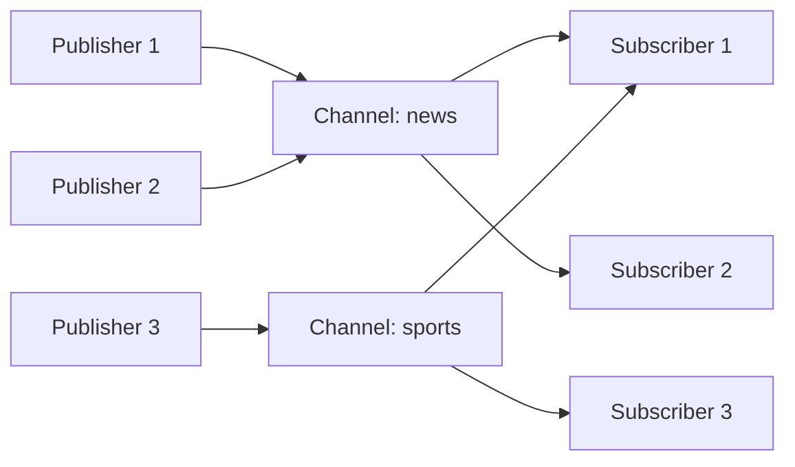

# Redis Pub/Sub Sistemi

## 📋 Özet

Redis Publish/Subscribe (Pub/Sub) modeli, real-time messaging uygulamaları için güçlü bir çözümdür. Mesaj göndericiler (publishers) belirli kanallara (channels) mesaj gönderir, mesaj alıcılar (subscribers) ise bu kanallara abone olarak mesajları alır.

## 🎯 Learning Objectives

Bu bölümü tamamladığında:

- ✅ Redis Pub/Sub mimarisini anlayacaksın
- ✅ Channel-based messaging implementasyonu yapabileceksin
- ✅ Pattern-based subscriptions kullanabileceksin
- ✅ Real-time chat uygulaması geliştirebileceksin
- ✅ Broadcasting ve multicasting sistemleri kurabileceğiniz

## 📋 Prerequisites

- Redis temelleri bilgisi
- Python veya başka bir Redis client library
- Event-driven programming kavramları

## 🏗️ Redis Pub/Sub Mimarisi

### Temel Kavramlar



**Önemli Özellikler:**

- **Fire-and-forget**: Mesajlar kalıcı değil, sadece o anda dinleyen subscribers'a gönderilir
- **Asynchronous**: Publishers ve subscribers birbirinden bağımsız çalışır
- **Many-to-many**: Bir channel'a birden fazla publisher ve subscriber olabilir
- **Pattern matching**: Wildcard ile pattern-based subscription mümkün

### Channel Types

1. **Exact Channel**: `SUBSCRIBE news`
2. **Pattern Channel**: `PSUBSCRIBE news.*` (news.tech, news.sports gibi)

## 🔧 Temel Pub/Sub Komutları

### Publisher Komutları

```bash
# Belirli bir channel'a mesaj gönder
PUBLISH channel_name "message content"

# Örnek: haber kanalına mesaj gönder
PUBLISH news "Breaking: New technology released!"

# Return: Kaç subscriber'a ulaştığını gösterir
```

### Subscriber Komutları

```bash
# Belirli channel'lara abone ol
SUBSCRIBE channel1 channel2 channel3

# Pattern-based subscription
PSUBSCRIBE news.* sports.*

# Abonelikten çık
UNSUBSCRIBE channel1
PUNSUBSCRIBE news.*

# Tüm aboneliklerden çık
UNSUBSCRIBE
PUNSUBSCRIBE
```

### Bilgi Komutları

```bash
# Aktif channels listesi
PUBSUB CHANNELS

# Pattern'e uyan channels
PUBSUB CHANNELS news.*

# Channel'daki subscriber sayısı
PUBSUB NUMSUB channel_name

# Pattern subscription sayısı
PUBSUB NUMPAT
```

## 💻 Python ile Pub/Sub Implementation

### 1. Basit Publisher

```python
import redis
import time
import json
from datetime import datetime

class NewsPublisher:
    def __init__(self, host='localhost', port=6379, db=0):
        """
        Haber yayını yapan publisher sınıfı

        Args:
            host: Redis sunucu adresi
            port: Redis port numarası
            db: Redis database numarası
        """
        self.redis_client = redis.Redis(host=host, port=port, db=db, decode_responses=True)

    def publish_news(self, category, title, content):
        """
        Belirli kategoride haber yayınla

        Args:
            category: Haber kategorisi (tech, sports, politics)
            title: Haber başlığı
            content: Haber içeriği
        """
        news_data = {
            'timestamp': datetime.now().isoformat(),
            'category': category,
            'title': title,
            'content': content,
            'publisher': 'NewsCenter'
        }

        # JSON formatında serialize et
        message = json.dumps(news_data, ensure_ascii=False)

        # İki farklı channel'a yayınla
        channel1 = f"news.{category}"  # Kategoriye özel
        channel2 = "news.all"         # Tüm haberler

        # Mesajları yayınla
        subscribers1 = self.redis_client.publish(channel1, message)
        subscribers2 = self.redis_client.publish(channel2, message)

        print(f"📰 Haber yayınlandı:")
        print(f"   Kategori: {category}")
        print(f"   Başlık: {title}")
        print(f"   {channel1}: {subscribers1} subscriber")
        print(f"   {channel2}: {subscribers2} subscriber")
        print("─" * 50)

        return subscribers1 + subscribers2

    def start_live_news(self):
        """
        Canlı haber yayını simülasyonu
        """
        sample_news = [
            ("tech", "AI Breakthrough", "New AI model achieves human-level performance"),
            ("sports", "Championship Finals", "Final match scheduled for this weekend"),
            ("tech", "New Framework Release", "Revolutionary web framework launched"),
            ("politics", "Policy Update", "New policies announced by government"),
            ("sports", "Transfer News", "Star player moves to new team"),
        ]

        print("🚀 Canlı haber yayını başlıyor...")
        print("Press Ctrl+C to stop")

        try:
            for i, (category, title, content) in enumerate(sample_news):
                self.publish_news(category, title, content)
                time.sleep(3)  # 3 saniye bekle

            print("✅ Tüm haberler yayınlandı!")

        except KeyboardInterrupt:
            print("\n🛑 Haber yayını durduruldu")

# Kullanım örneği
if __name__ == "__main__":
    publisher = NewsPublisher()
    publisher.start_live_news()
```

### 2. Advanced Subscriber

```python
import redis
import json
import threading
from datetime import datetime

class NewsSubscriber:
    def __init__(self, subscriber_name, host='localhost', port=6379, db=0):
        """
        Haber abonesi sınıfı

        Args:
            subscriber_name: Abone adı
            host: Redis sunucu adresi
            port: Redis port numarası
            db: Redis database numarası
        """
        self.subscriber_name = subscriber_name
        self.redis_client = redis.Redis(host=host, port=port, db=db, decode_responses=True)
        self.pubsub = self.redis_client.pubsub()
        self.is_listening = False

    def subscribe_to_categories(self, categories):
        """
        Belirli kategorilere abone ol

        Args:
            categories: Abone olunacak kategori listesi
        """
        channels = [f"news.{cat}" for cat in categories]
        channels.append("news.all")  # Tüm haberlere de abone ol

        self.pubsub.subscribe(*channels)
        print(f"👤 {self.subscriber_name} abone oldu:")
        for channel in channels:
            print(f"   📡 {channel}")
        print("─" * 50)

    def subscribe_with_patterns(self, patterns):
        """
        Pattern ile abone ol

        Args:
            patterns: Pattern listesi (örn: ['news.*', 'alerts.*'])
        """
        self.pubsub.psubscribe(*patterns)
        print(f"👤 {self.subscriber_name} pattern abone oldu:")
        for pattern in patterns:
            print(f"   🔍 {pattern}")
        print("─" * 50)

    def handle_message(self, message):
        """
        Gelen mesajı işle

        Args:
            message: Redis'ten gelen mesaj
        """
        if message['type'] == 'message':
            try:
                # JSON parse et
                news_data = json.loads(message['data'])

                print(f"📨 {self.subscriber_name} - Yeni Haber Alındı:")
                print(f"   🏷️  Kategori: {news_data['category']}")
                print(f"   📰 Başlık: {news_data['title']}")
                print(f"   📝 İçerik: {news_data['content']}")
                print(f"   🕐 Zaman: {news_data['timestamp']}")
                print(f"   📡 Kanal: {message['channel']}")
                print("─" * 50)

            except json.JSONDecodeError:
                print(f"❌ {self.subscriber_name}: JSON parse hatası")

        elif message['type'] == 'pmessage':
            # Pattern-based mesaj
            try:
                news_data = json.loads(message['data'])
                print(f"🔍 {self.subscriber_name} - Pattern Mesajı:")
                print(f"   📡 Pattern: {message['pattern']}")
                print(f"   📡 Kanal: {message['channel']}")
                print(f"   📰 Başlık: {news_data['title']}")
                print("─" * 50)

            except json.JSONDecodeError:
                print(f"❌ {self.subscriber_name}: Pattern mesaj parse hatası")

    def listen(self):
        """
        Mesajları dinlemeye başla
        """
        self.is_listening = True
        print(f"👂 {self.subscriber_name} dinlemeye başladı...")

        try:
            for message in self.pubsub.listen():
                if not self.is_listening:
                    break

                self.handle_message(message)

        except KeyboardInterrupt:
            print(f"\n🛑 {self.subscriber_name} dinlemeyi durdurdu")
        finally:
            self.stop_listening()

    def listen_async(self):
        """
        Asenkron dinleme başlat
        """
        def listen_thread():
            self.listen()

        thread = threading.Thread(target=listen_thread)
        thread.daemon = True
        thread.start()
        return thread

    def stop_listening(self):
        """
        Dinlemeyi durdur
        """
        self.is_listening = False
        self.pubsub.close()
        print(f"✋ {self.subscriber_name} bağlantısı kapatıldı")

# Çoklu subscriber örneği
def demo_multiple_subscribers():
    """
    Birden fazla subscriber ile demo
    """
    # Farklı türde subscribers oluştur
    tech_subscriber = NewsSubscriber("TechEnthusiast")
    sports_subscriber = NewsSubscriber("SportsLover")
    all_news_subscriber = NewsSubscriber("NewsJunkie")

    # Farklı abonelik türleri
    tech_subscriber.subscribe_to_categories(["tech"])
    sports_subscriber.subscribe_to_categories(["sports"])
    all_news_subscriber.subscribe_with_patterns(["news.*"])

    # Asenkron dinleme başlat
    tech_thread = tech_subscriber.listen_async()
    sports_thread = sports_subscriber.listen_async()
    all_thread = all_news_subscriber.listen_async()

    try:
        print("🎯 Tüm subscribers hazır! Publisher'ı başlatabilirsiniz.")
        print("Press Ctrl+C to stop all subscribers")

        # Ana thread'i canlı tut
        tech_thread.join()
        sports_thread.join()
        all_thread.join()

    except KeyboardInterrupt:
        print("\n🛑 Tüm subscribers durduruluyor...")
        tech_subscriber.stop_listening()
        sports_subscriber.stop_listening()
        all_news_subscriber.stop_listening()

if __name__ == "__main__":
    demo_multiple_subscribers()
```

## 🚀 Real-Time Chat Application

### Chat Room Implementation

```python
import redis
import json
import threading
import uuid
from datetime import datetime

class ChatRoom:
    def __init__(self, room_name, host='localhost', port=6379, db=0):
        """
        Redis Pub/Sub tabanlı chat odası

        Args:
            room_name: Chat odası adı
            host: Redis sunucu adresi
            port: Redis port numarası
            db: Redis database numarası
        """
        self.room_name = room_name
        self.redis_client = redis.Redis(host=host, port=port, db=db, decode_responses=True)
        self.pubsub = self.redis_client.pubsub()
        self.channel = f"chat.{room_name}"
        self.user_id = str(uuid.uuid4())[:8]
        self.username = None
        self.is_active = False

    def join_room(self, username):
        """
        Chat odasına katıl

        Args:
            username: Kullanıcı adı
        """
        self.username = username
        self.pubsub.subscribe(self.channel)

        # Katılım mesajı gönder
        join_message = {
            'type': 'join',
            'user_id': self.user_id,
            'username': username,
            'timestamp': datetime.now().isoformat(),
            'content': f"{username} chat odasına katıldı"
        }

        self.redis_client.publish(self.channel, json.dumps(join_message, ensure_ascii=False))
        print(f"🚪 {username} '{self.room_name}' odasına katıldı")
        print(f"💡 Mesaj göndermek için yazın, çıkmak için 'exit' yazın")
        print("─" * 50)

    def send_message(self, content):
        """
        Chat mesajı gönder

        Args:
            content: Mesaj içeriği
        """
        message = {
            'type': 'message',
            'user_id': self.user_id,
            'username': self.username,
            'timestamp': datetime.now().isoformat(),
            'content': content
        }

        result = self.redis_client.publish(self.channel, json.dumps(message, ensure_ascii=False))
        return result

    def send_private_message(self, target_user, content):
        """
        Özel mesaj gönder

        Args:
            target_user: Hedef kullanıcı adı
            content: Mesaj içeriği
        """
        private_channel = f"chat.private.{target_user}"

        message = {
            'type': 'private',
            'user_id': self.user_id,
            'username': self.username,
            'target': target_user,
            'timestamp': datetime.now().isoformat(),
            'content': content
        }

        result = self.redis_client.publish(private_channel, json.dumps(message, ensure_ascii=False))
        print(f"📨 Özel mesaj gönderildi: @{target_user}")
        return result

    def handle_message(self, message):
        """
        Gelen mesajı işle ve göster

        Args:
            message: Redis'ten gelen mesaj
        """
        if message['type'] == 'message':
            try:
                msg_data = json.loads(message['data'])
                msg_type = msg_data.get('type', 'message')
                username = msg_data.get('username', 'Unknown')
                content = msg_data.get('content', '')
                timestamp = msg_data.get('timestamp', '')

                # Kendi mesajımızı farklı göster
                if msg_data.get('user_id') == self.user_id:
                    return  # Kendi mesajımızı tekrar gösterme

                if msg_type == 'join':
                    print(f"🚪 {content}")
                elif msg_type == 'leave':
                    print(f"👋 {content}")
                elif msg_type == 'message':
                    time_str = datetime.fromisoformat(timestamp).strftime("%H:%M:%S")
                    print(f"[{time_str}] {username}: {content}")
                elif msg_type == 'private':
                    time_str = datetime.fromisoformat(timestamp).strftime("%H:%M:%S")
                    print(f"[{time_str}] 📨 Özel mesaj - {username}: {content}")

            except json.JSONDecodeError:
                print("❌ Mesaj parse hatası")

    def listen_messages(self):
        """
        Mesajları dinle
        """
        self.is_active = True

        try:
            for message in self.pubsub.listen():
                if not self.is_active:
                    break
                self.handle_message(message)

        except Exception as e:
            print(f"❌ Dinleme hatası: {e}")
        finally:
            self.leave_room()

    def leave_room(self):
        """
        Chat odasından ayrıl
        """
        if self.username:
            leave_message = {
                'type': 'leave',
                'user_id': self.user_id,
                'username': self.username,
                'timestamp': datetime.now().isoformat(),
                'content': f"{self.username} chat odasından ayrıldı"
            }

            self.redis_client.publish(self.channel, json.dumps(leave_message, ensure_ascii=False))

        self.is_active = False
        self.pubsub.close()
        print(f"👋 Chat odasından ayrıldınız")

    def start_chat(self, username):
        """
        Chat'i başlat (interaktif mod)

        Args:
            username: Kullanıcı adı
        """
        self.join_room(username)

        # Mesajları dinleyen thread başlat
        listen_thread = threading.Thread(target=self.listen_messages)
        listen_thread.daemon = True
        listen_thread.start()

        # Ana thread'te kullanıcı input'unu bekle
        try:
            while self.is_active:
                user_input = input()

                if user_input.lower() == 'exit':
                    break
                elif user_input.startswith('/private '):
                    # Özel mesaj komutu: /private kullanici_adi mesaj
                    parts = user_input[9:].split(' ', 1)
                    if len(parts) == 2:
                        target_user, content = parts
                        self.send_private_message(target_user, content)
                    else:
                        print("💡 Kullanım: /private kullanici_adi mesaj")
                elif user_input.strip():
                    # Normal mesaj gönder
                    self.send_message(user_input)
                    time_str = datetime.now().strftime("%H:%M:%S")
                    print(f"[{time_str}] {self.username}: {user_input}")

        except KeyboardInterrupt:
            pass
        finally:
            self.leave_room()

# Demo kullanımı
if __name__ == "__main__":
    import sys

    if len(sys.argv) < 3:
        print("Kullanım: python chat_room.py <oda_adi> <kullanici_adi>")
        print("Örnek: python chat_room.py general alice")
        sys.exit(1)

    room_name = sys.argv[1]
    username = sys.argv[2]

    chat = ChatRoom(room_name)
    print(f"🎯 {room_name} odasına {username} olarak katılıyorsunuz...")
    chat.start_chat(username)
```

## 📊 Performance ve Best Practices

### 1. Connection Management

```python
import redis
from redis.connection import ConnectionPool

class OptimizedPubSub:
    def __init__(self, host='localhost', port=6379, db=0):
        # Connection pool kullan
        self.pool = ConnectionPool(
            host=host,
            port=port,
            db=db,
            max_connections=20,
            retry_on_timeout=True,
            socket_timeout=5,
            socket_connect_timeout=5
        )
        self.redis_client = redis.Redis(connection_pool=self.pool, decode_responses=True)

    def get_stats(self):
        """
        Pub/Sub istatistikleri
        """
        stats = {
            'active_channels': self.redis_client.pubsub_channels(),
            'total_patterns': self.redis_client.pubsub_numpat(),
            'memory_usage': self.redis_client.info('memory')['used_memory_human']
        }
        return stats
```

### 2. Message Batching

```python
import redis
import json
import time
from threading import Lock

class BatchPublisher:
    def __init__(self, host='localhost', port=6379, db=0, batch_size=10, flush_interval=1):
        """
        Mesajları batch halinde gönderen publisher

        Args:
            batch_size: Batch boyutu
            flush_interval: Flush aralığı (saniye)
        """
        self.redis_client = redis.Redis(host=host, port=port, db=db, decode_responses=True)
        self.batch_size = batch_size
        self.flush_interval = flush_interval
        self.message_buffer = []
        self.buffer_lock = Lock()
        self.last_flush = time.time()

    def publish_batch(self, channel, message):
        """
        Mesajı buffer'a ekle, gerekirse flush et
        """
        with self.buffer_lock:
            self.message_buffer.append((channel, message))

            # Batch boyutu doldu veya zaman aşımı
            if (len(self.message_buffer) >= self.batch_size or
                time.time() - self.last_flush > self.flush_interval):
                self._flush_buffer()

    def _flush_buffer(self):
        """
        Buffer'daki tüm mesajları gönder
        """
        if not self.message_buffer:
            return

        pipe = self.redis_client.pipeline()

        for channel, message in self.message_buffer:
            pipe.publish(channel, message)

        results = pipe.execute()
        total_subscribers = sum(results)

        print(f"📦 {len(self.message_buffer)} mesaj gönderildi, {total_subscribers} toplam subscriber")

        self.message_buffer.clear()
        self.last_flush = time.time()

    def force_flush(self):
        """
        Buffer'ı zorla flush et
        """
        with self.buffer_lock:
            self._flush_buffer()
```

## 🧪 Hands-on Tasks

### Task 1: News Broadcasting System

1. **Hedef**: Farklı kategorilerde haber yayını yapan sistem
2. **Gereksinimler**:
   - En az 3 kategori (tech, sports, politics)
   - Pattern-based subscription
   - Mesaj persistence (Redis kullanmadan çözüm bulun)
   - Subscriber statistics

### Task 2: Real-time Notification System

1. **Hedef**: Kullanıcı bildirimleri sistemi
2. **Gereksinimler**:
   - User-specific channels
   - Notification priorities
   - Read/unread status tracking
   - Bulk notifications

### Task 3: Game Event System

1. **Hedef**: Multiplayer oyun event sistemi
2. **Gereksinimler**:
   - Player actions broadcasting
   - Room-based communication
   - Event replay capability
   - Lag compensation

## ✅ Checklist

Bu bölümü tamamladıktan sonra aşağıdakileri yapabilmelisiniz:

- [ ] Pub/Sub temel komutlarını kullanabilirim
- [ ] Pattern-based subscription yapabilirim
- [ ] Python ile publisher/subscriber geliştirebilirim
- [ ] Real-time chat uygulaması yazabilirim
- [ ] Message routing ve filtering uygulayabilirim
- [ ] Performance optimization yapabilirim
- [ ] Error handling ve reconnection logic yazabilirim
- [ ] Multi-threaded subscriber implementasyonu yapabilirim

## ⚠️ Common Mistakes

### 1. Message Loss

**Sorun**: Subscriber offline olduğunda mesajlar kaybolur
**Çözüm**: Hybrid approach - Redis Streams + Pub/Sub

### 2. Memory Issues

**Sorun**: Çok fazla subscriber memory tüketir
**Çözüm**: Connection pooling ve monitoring

### 3. Blocking Operations

**Sorun**: `pubsub.listen()` thread'i bloklar
**Çözüm**: Threading veya async implementation

## 🔗 İlgili Bölümler

- **Önceki**: [Redis Temelleri](01-temeller.md)
- **Sonraki**: [Transactions ve Scripting](03-transactions-scripting.md)
- **İlgili**: [Kafka Pub/Sub](../01-kafka/02-producer-consumer.md)

---

**Sonraki Adım**: Redis'in transaction özelliklerini öğrenmek için [Transactions ve Scripting](03-transactions-scripting.md) bölümüne geçin! 🚀
