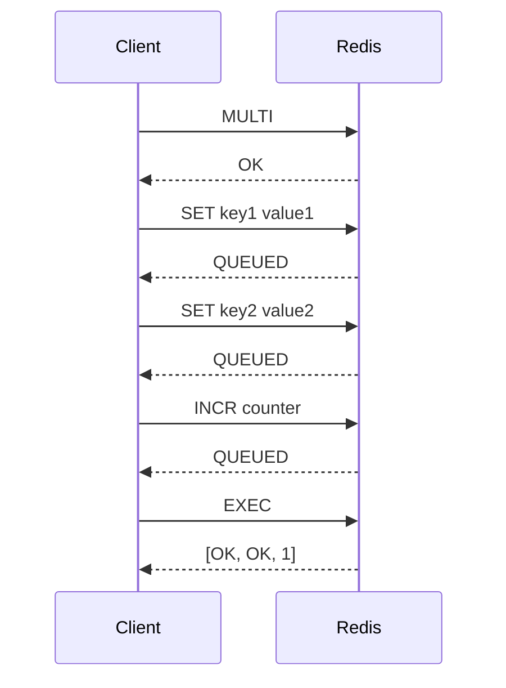

# Redis Transactions ve Lua Scripting

## 📋 Özet

Redis transactions (MULTI/EXEC) ve Lua scripting, atomik operasyonlar gerçekleştirmek için kullanılan güçlü özelliklerdir. Bu bölümde Redis'in ACID özelliklerini, transaction isolation'ı ve Lua script'leri ile complex logic implementasyonunu öğreneceksiniz.

## 🎯 Learning Objectives

Bu bölümü tamamladığında:

- ✅ Redis transaction kavramlarını anlayacaksın
- ✅ MULTI/EXEC/DISCARD komutlarını kullanabileceksin
- ✅ WATCH ile optimistic locking yapabileceksin
- ✅ Lua script yazabileceksin
- ✅ Atomic operations geliştirebileceksin
- ✅ Race condition problemlerini çözebileceksin

## 📋 Prerequisites

- Redis temelleri bilgisi
- ACID kavramları anlayışı
- Temel Lua programlama (opsiyonel)
- Concurrency ve race condition kavramları

## 🔄 Redis Transactions

### ACID Özellikleri

Redis transactions aşağıdaki özelliklere sahiptir:

**Atomicity (Atomiklik)**: ✅ Tüm komutlar çalışır ya da hiçbiri
**Consistency (Tutarlılık)**: ✅ Database tutarlı durumda kalır  
**Isolation (İzolasyon)**: ⚠️ Sınırlı (no concurrent access during execution)
**Durability (Kalıcılık)**: ⚠️ Persistence ayarlarına bağlı

### Temel Transaction Komutları

```bash
# Transaction başlat
MULTI

# Komutları queue'a ekle (henüz çalışmaz)
SET user:1:name "Alice"
SET user:1:email "alice@example.com"
INCR user:count
HSET user:1:profile age 25 city "Istanbul"

# Transaction'ı çalıştır
EXEC

# Veya transaction'ı iptal et
DISCARD
```

### Komut Sıralama



## 🔒 Optimistic Locking (WATCH)

### WATCH Komutu

```bash
# Key'leri izlemeye başla
WATCH user:1:balance

# Balance'ı oku
GET user:1:balance

# Transaction başlat
MULTI

# Yeni balance'ı set et
SET user:1:balance 150

# Çalıştır (sadece balance değişmemişse çalışır)
EXEC
```

### Race Condition Örneği

```python
# Problem: İki client aynı anda balance günceller
# Client A                 Client B
GET user:1:balance  100   GET user:1:balance  100
MULTI                     MULTI
SET user:1:balance  150   SET user:1:balance  120
EXEC                      EXEC

# Result: Son yazılan kazanır (race condition)
```

### WATCH ile Çözüm

```python
# Çözüm: WATCH ile optimistic locking
# Client A                 Client B
WATCH user:1:balance      WATCH user:1:balance
GET user:1:balance  100   GET user:1:balance  100
MULTI                     MULTI
SET user:1:balance  150   SET user:1:balance  120
EXEC  -> [OK]            EXEC  -> null (failed)

# Client B retry yapmalı
```

## 🐍 Python ile Transactions

### 1. Basit Transaction

```python
import redis

def basic_transaction_example():
    """
    Temel transaction örneği
    """
    r = redis.Redis(decode_responses=True)

    # Pipeline ile transaction
    pipe = r.pipeline()

    try:
        # Transaction başlat
        pipe.multi()

        # Komutları ekle
        pipe.set('user:1:name', 'Alice')
        pipe.set('user:1:email', 'alice@example.com')
        pipe.incr('user:count')
        pipe.hset('user:1:profile', mapping={
            'age': 25,
            'city': 'Istanbul',
            'status': 'active'
        })

        # Transaction'ı çalıştır
        results = pipe.execute()

        print("✅ Transaction başarılı:")
        for i, result in enumerate(results):
            print(f"   Komut {i+1}: {result}")

        return results

    except redis.WatchError:
        print("❌ Transaction başarısız (WATCH error)")
        return None
    except Exception as e:
        print(f"❌ Transaction hatası: {e}")
        return None
```

### 2. WATCH ile Optimistic Locking

```python
import redis
import time
import threading

class BankAccount:
    """
    Redis transaction ile güvenli banka hesabı
    """

    def __init__(self, account_id, initial_balance=0):
        self.redis_client = redis.Redis(decode_responses=True)
        self.account_id = account_id
        self.balance_key = f"account:{account_id}:balance"

        # İlk balance'ı set et
        if not self.redis_client.exists(self.balance_key):
            self.redis_client.set(self.balance_key, initial_balance)

    def get_balance(self):
        """
        Hesap bakiyesini oku
        """
        balance = self.redis_client.get(self.balance_key)
        return float(balance) if balance else 0.0

    def transfer_money(self, amount, retry_count=3):
        """
        Güvenli para transferi (optimistic locking ile)

        Args:
            amount: Transfer miktarı (negatif=çekim, pozitif=yatırma)
            retry_count: Retry sayısı
        """
        for attempt in range(retry_count):
            try:
                # Pipeline oluştur
                pipe = self.redis_client.pipeline()

                # Balance key'ini izle
                pipe.watch(self.balance_key)

                # Mevcut balance'ı oku
                current_balance = float(pipe.get(self.balance_key) or 0)

                # Yeterli bakiye kontrolü
                new_balance = current_balance + amount
                if new_balance < 0:
                    pipe.unwatch()
                    raise ValueError(f"Yetersiz bakiye! Mevcut: {current_balance}, İstenen: {amount}")

                # Transaction başlat
                pipe.multi()

                # Yeni balance'ı set et
                pipe.set(self.balance_key, new_balance)

                # Transaction log'u ekle
                log_key = f"account:{self.account_id}:transactions"
                transaction_data = {
                    'timestamp': time.time(),
                    'amount': amount,
                    'old_balance': current_balance,
                    'new_balance': new_balance,
                    'type': 'credit' if amount > 0 else 'debit'
                }
                pipe.lpush(log_key, str(transaction_data))
                pipe.ltrim(log_key, 0, 99)  # Son 100 transaction'ı tut

                # Transaction'ı çalıştır
                results = pipe.execute()

                print(f"✅ Transfer başarılı (Attempt {attempt + 1}):")
                print(f"   Hesap: {self.account_id}")
                print(f"   Miktar: {amount}")
                print(f"   Eski bakiye: {current_balance}")
                print(f"   Yeni bakiye: {new_balance}")

                return new_balance

            except redis.WatchError:
                print(f"⚠️  Race condition detected, retry {attempt + 1}/{retry_count}")
                if attempt == retry_count - 1:
                    raise Exception("Transfer başarısız - çok fazla retry")
                time.sleep(0.01)  # Kısa bekle

            except Exception as e:
                pipe.reset()
                raise e

        raise Exception("Transfer başarısız")

    def get_transaction_history(self, limit=10):
        """
        Transaction geçmişini getir
        """
        log_key = f"account:{self.account_id}:transactions"
        transactions = self.redis_client.lrange(log_key, 0, limit - 1)

        history = []
        for tx_str in transactions:
            try:
                # String'i dict'e çevir (eval kullanmadan güvenli parsing)
                tx_data = eval(tx_str)  # Production'da json kullanın
                history.append(tx_data)
            except:
                continue

        return history

def demo_concurrent_transfers():
    """
    Concurrent transfer'ları test et
    """
    print("💰 Concurrent Bank Transfer Demo")
    print("=" * 50)

    # Test hesabı oluştur
    account = BankAccount("ACC001", 1000)
    print(f"İlk bakiye: {account.get_balance()}")

    def make_transfers(account_obj, transfer_list, thread_name):
        """
        Bir thread'te birden fazla transfer yap
        """
        print(f"🔄 {thread_name} başlıyor...")

        for amount in transfer_list:
            try:
                new_balance = account_obj.transfer_money(amount)
                print(f"   {thread_name}: {amount} -> Yeni bakiye: {new_balance}")
                time.sleep(0.1)
            except Exception as e:
                print(f"   ❌ {thread_name} hatası: {e}")

    # Concurrent transfer'lar
    transfers_thread1 = [-100, -50, 200, -75]  # Net: -25
    transfers_thread2 = [300, -150, -100, 50]  # Net: 100

    # Thread'leri başlat
    thread1 = threading.Thread(
        target=make_transfers,
        args=(account, transfers_thread1, "Thread-1")
    )
    thread2 = threading.Thread(
        target=make_transfers,
        args=(account, transfers_thread2, "Thread-2")
    )

    thread1.start()
    thread2.start()

    # Thread'lerin bitmesini bekle
    thread1.join()
    thread2.join()

    # Final bakiye
    final_balance = account.get_balance()
    expected_balance = 1000 + (-25) + 100  # 1075

    print(f"\n📊 Sonuçlar:")
    print(f"   Final bakiye: {final_balance}")
    print(f"   Beklenen bakiye: {expected_balance}")
    print(f"   Tutarlılık: {'✅' if final_balance == expected_balance else '❌'}")

    # Transaction history
    history = account.get_transaction_history()
    print(f"\n📜 Son {len(history)} transaction:")
    for tx in history[:5]:
        print(f"   {tx}")
```

## 🌙 Lua Scripting

### Lua Script Temelleri

Redis Lua script'leri server-side'da atomik olarak çalışır:

```lua
-- Basit Lua script örneği
local key = KEYS[1]
local increment = ARGV[1]

local current = redis.call('GET', key)
if current == false then
    current = 0
else
    current = tonumber(current)
end

local new_value = current + tonumber(increment)
redis.call('SET', key, new_value)

return new_value
```

### Script Yükleme ve Çalıştırma

```bash
# Script'i yükle ve SHA hash'ini al
SCRIPT LOAD "return redis.call('GET', KEYS[1])"

# SHA ile çalıştır
EVALSHA <sha_hash> 1 mykey

# Direkt çalıştır
EVAL "return redis.call('GET', KEYS[1])" 1 mykey
```

### Advanced Lua Scripts

```python
class RedisLuaScripts:
    """
    Redis Lua script koleksiyonu
    """

    def __init__(self, redis_client):
        self.redis = redis_client
        self.scripts = {}
        self._load_scripts()

    def _load_scripts(self):
        """
        Tüm script'leri yükle
        """
        # Atomic increment with cap
        self.scripts['increment_with_cap'] = self.redis.register_script("""
        local key = KEYS[1]
        local increment = tonumber(ARGV[1])
        local max_value = tonumber(ARGV[2])

        local current = redis.call('GET', key)
        if current == false then
            current = 0
        else
            current = tonumber(current)
        end

        local new_value = current + increment
        if new_value > max_value then
            return {current, false, "Max value exceeded"}
        end

        redis.call('SET', key, new_value)
        return {new_value, true, "Success"}
        """)

        # Rate limiter
        self.scripts['rate_limiter'] = self.redis.register_script("""
        local key = KEYS[1]
        local window = tonumber(ARGV[1])
        local limit = tonumber(ARGV[2])
        local current_time = tonumber(ARGV[3])

        -- Remove old entries
        redis.call('ZREMRANGEBYSCORE', key, 0, current_time - window)

        -- Count current entries
        local current_count = redis.call('ZCARD', key)

        if current_count >= limit then
            local oldest_entry = redis.call('ZRANGE', key, 0, 0, 'WITHSCORES')
            local reset_time = 0
            if oldest_entry[2] then
                reset_time = tonumber(oldest_entry[2]) + window
            end
            return {false, current_count, reset_time}
        end

        -- Add current entry
        redis.call('ZADD', key, current_time, current_time)
        redis.call('EXPIRE', key, window)

        return {true, current_count + 1, 0}
        """)

        # Leaderboard update
        self.scripts['leaderboard_update'] = self.redis.register_script("""
        local leaderboard_key = KEYS[1]
        local user_key = KEYS[2]
        local user_id = ARGV[1]
        local score_increment = tonumber(ARGV[2])
        local max_entries = tonumber(ARGV[3])

        -- Get current user score
        local current_score = redis.call('HGET', user_key, 'score')
        if current_score == false then
            current_score = 0
        else
            current_score = tonumber(current_score)
        end

        -- Calculate new score
        local new_score = current_score + score_increment

        -- Update user score
        redis.call('HSET', user_key, 'score', new_score)
        redis.call('HSET', user_key, 'last_update', ARGV[4])

        -- Update leaderboard
        redis.call('ZADD', leaderboard_key, new_score, user_id)

        -- Trim leaderboard to max entries
        local count = redis.call('ZCARD', leaderboard_key)
        if count > max_entries then
            redis.call('ZREMRANGEBYRANK', leaderboard_key, 0, count - max_entries - 1)
        end

        -- Get user rank
        local rank = redis.call('ZREVRANK', leaderboard_key, user_id)

        return {new_score, rank}
        """)

    def increment_with_cap(self, key, increment, max_value):
        """
        Maximum değeri aşmayan increment
        """
        result = self.scripts['increment_with_cap'](keys=[key], args=[increment, max_value])
        return {
            'value': result[0],
            'success': result[1],
            'message': result[2]
        }

    def check_rate_limit(self, user_id, window_seconds=60, limit=10):
        """
        Rate limiting kontrolü
        """
        key = f"rate_limit:{user_id}"
        current_time = int(time.time())

        result = self.scripts['rate_limiter'](
            keys=[key],
            args=[window_seconds, limit, current_time]
        )

        return {
            'allowed': result[0],
            'current_count': result[1],
            'reset_time': result[2]
        }

    def update_leaderboard(self, leaderboard_name, user_id, score_increment, max_entries=100):
        """
        Leaderboard güncelleme
        """
        leaderboard_key = f"leaderboard:{leaderboard_name}"
        user_key = f"user:{user_id}"
        current_time = int(time.time())

        result = self.scripts['leaderboard_update'](
            keys=[leaderboard_key, user_key],
            args=[user_id, score_increment, max_entries, current_time]
        )

        return {
            'new_score': result[0],
            'rank': result[1]
        }

# Kullanım örnekleri
def demo_lua_scripts():
    """
    Lua script örnekleri
    """
    print("🌙 Lua Script Demo")
    print("=" * 50)

    redis_client = redis.Redis(decode_responses=True)
    scripts = RedisLuaScripts(redis_client)

    # 1. Rate limiting demo
    print("\n🚦 Rate Limiting:")
    user_id = "user123"

    for i in range(12):
        result = scripts.check_rate_limit(user_id, window_seconds=60, limit=10)
        status = "✅" if result['allowed'] else "❌"
        print(f"   Request {i+1}: {status} Count: {result['current_count']}")

        if not result['allowed']:
            reset_time = result['reset_time']
            print(f"   Rate limited! Reset at: {time.ctime(reset_time)}")
            break

    # 2. Increment with cap demo
    print("\n📈 Increment with Cap:")
    counter_key = "limited_counter"

    for increment in [10, 25, 30, 50]:
        result = scripts.increment_with_cap(counter_key, increment, max_value=100)
        status = "✅" if result['success'] else "❌"
        print(f"   +{increment}: {status} Value: {result['value']} ({result['message']})")

    # 3. Leaderboard demo
    print("\n🏆 Leaderboard Update:")
    players = [
        ("alice", 50),
        ("bob", 75),
        ("charlie", 25),
        ("alice", 30),  # Alice gets more points
        ("diana", 90)
    ]

    for player, score in players:
        result = scripts.update_leaderboard("global", player, score, max_entries=10)
        print(f"   {player}: +{score} pts -> Total: {result['new_score']}, Rank: {result['rank']}")
```

## 🧪 Hands-on Tasks

### Task 1: Shopping Cart System

Atomik shopping cart operasyonları:

- Add/remove items
- Calculate total
- Apply discounts
- Stock validation

### Task 2: Voting System

Real-time voting with:

- Duplicate vote prevention
- Vote count updates
- Result calculation
- Leaderboard maintenance

### Task 3: Inventory Management

Stock management system:

- Atomic stock updates
- Reservation system
- Expiring reservations
- Stock alerts

## ✅ Checklist

Bu bölümü tamamladıktan sonra:

- [ ] MULTI/EXEC/DISCARD kullanabilirim
- [ ] WATCH ile optimistic locking yapabilirim
- [ ] Race condition'ları çözebilirim
- [ ] Lua script yazabilirim
- [ ] Complex atomic operations geliştirebilirim
- [ ] Rate limiting implementasyonu yapabilirim
- [ ] Transaction error handling yapabilirim

## ⚠️ Common Mistakes

### 1. Transaction içinde blocking komutlar

**Yanlış**:

```python
pipe.multi()
pipe.blpop("queue", timeout=5)  # ❌ Blocking!
pipe.exec()
```

### 2. WATCH sonrası komut çalıştırma

**Yanlış**:

```python
pipe.watch("key")
pipe.get("other_key")  # ❌ WATCH sonrası direkt komut
pipe.multi()
```

### 3. Exception handling eksikliği

**Yanlış**:

```python
pipe.multi()
pipe.set("key", "value")
pipe.exec()  # ❌ Exception handling yok
```

## 🔗 İlgili Bölümler

- **Önceki**: [Pub/Sub Sistemi](02-pubsub.md)
- **Sonraki**: [Persistence ve Replication](04-persistence-replication.md)
- **İlgili**: [Redis Streams](05-streams.md)

---

**Sonraki Adım**: Redis'in persistence özelliklerini öğrenmek için [Persistence ve Replication](04-persistence-replication.md) bölümüne geçin! 🚀
