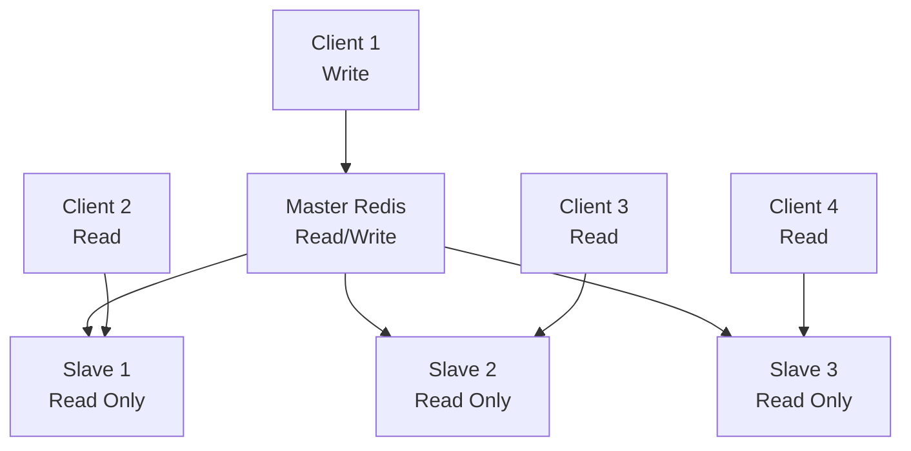

# Redis Persistence ve Replication

## 📋 Özet

Redis varsayılan olarak in-memory bir veri deposudur, ancak verilerinizin kalıcılığını sağlamak için RDB snapshots ve AOF (Append Only File) gibi persistence mekanizmaları sunar. Bu bölümde Redis'in data durability, backup/restore işlemleri ve master-slave replication mimarisini öğreneceksiniz.

## 🎯 Learning Objectives

Bu bölümü tamamladığında:

- ✅ RDB ve AOF persistence stratejilerini anlayacaksın
- ✅ Backup ve restore işlemlerini yapabileceksin
- ✅ Master-Slave replication kurabileceksin
- ✅ Redis Sentinel ile high availability sağlayabileceksin
- ✅ Performance vs durability trade-off'larını değerlendirebileceksin
- ✅ Production persistence strategies belirleyebileceksin

## 📋 Prerequisites

- Redis temelleri bilgisi
- Linux/Unix komut satırı deneyimi
- Database persistence kavramları
- Network ve sistem yönetimi temel bilgisi

## 💾 Redis Persistence Strategies

### 1. RDB (Redis Database) Snapshots

RDB, Redis'in belirli aralıklarla memory'deki tüm veri setinin binary snapshot'ını disk'e yazan persistence metodudur.

#### RDB Özellikleri

**Avantajlar:**

- ✅ Compact binary format
- ✅ Hızlı restart zamanları
- ✅ Backup için ideal
- ✅ Düşük I/O overhead

**Dezavantajlar:**

- ❌ Snapshot aralıkları arasında data loss riski
- ❌ Fork process büyük memory kullanımı
- ❌ CPU-intensive snapshot alma

#### RDB Konfigürasyonu

```bash
# redis.conf - RDB settings

# Snapshot alma koşulları (süre ve değişiklik sayısı)
save 900 1      # 900 saniyede en az 1 değişiklik
save 300 10     # 300 saniyede en az 10 değişiklik
save 60 10000   # 60 saniyede en az 10000 değişiklik

# RDB dosya adı
dbfilename dump.rdb

# RDB dosya yolu
dir /var/lib/redis

# Compression (varsayılan: yes)
rdbcompression yes

# Checksum kontrolü (varsayılan: yes)
rdbchecksum yes

# Background save hatası durumunda write'ları durdur
stop-writes-on-bgsave-error yes
```

#### Manuel RDB Operations

```bash
# Manuel snapshot alma
BGSAVE

# Senkron snapshot (blocking)
SAVE

# Son snapshot zamanı
LASTSAVE

# RDB save durumu kontrolü
LASTSAVE
```

### 2. AOF (Append Only File)

AOF, Redis'e gelen her write operation'ı log dosyasına kaydeden persistence metodudur.

#### AOF Özellikleri

**Avantajlar:**

- ✅ Minimal data loss (1 saniye max)
- ✅ Human readable log format
- ✅ Automatic log rewrite
- ✅ Recovery sırasında corruption kontrolü

**Dezavantajlar:**

- ❌ RDB'den daha büyük dosyalar
- ❌ Yavaş restart zamanları
- ❌ Yüksek I/O overhead

#### AOF Konfigürasyonu

```bash
# redis.conf - AOF settings

# AOF'u aktif et
appendonly yes

# AOF dosya adı
appendfilename "appendonly.aof"

# Sync policy
appendfsync everysec    # Her saniye sync (önerilen)
# appendfsync always    # Her komut sonrası (en güvenli, yavaş)
# appendfsync no        # OS'a bırak (hızlı, güvensiz)

# AOF rewrite sırasında sync'i durdurma
no-appendfsync-on-rewrite no

# Automatic rewrite koşulları
auto-aof-rewrite-percentage 100
auto-aof-rewrite-min-size 64mb

# AOF load sırasında truncated file'ı kabul et
aof-load-truncated yes

# Mixed persistence (RDB + AOF)
aof-use-rdb-preamble yes
```

#### AOF Operations

```bash
# Manuel AOF rewrite
BGREWRITEAOF

# AOF rewrite durumu
INFO replication

# AOF durumu kontrolü
INFO persistence
```

## 🔧 Python ile Persistence Management

### Persistence Configuration Manager

```python
import redis
import time
import os
import json
from datetime import datetime
from typing import Dict, List, Optional

class RedisPersistenceManager:
    """
    Redis persistence yönetimi için kapsamlı sınıf
    """

    def __init__(self, host='localhost', port=6379, db=0, password=None):
        """
        Redis persistence manager başlat

        Args:
            host: Redis host
            port: Redis port
            db: Database numarası
            password: Redis password
        """
        self.redis_client = redis.Redis(
            host=host,
            port=port,
            db=db,
            password=password,
            decode_responses=True
        )

        try:
            self.redis_client.ping()
            print(f"✅ Redis'e bağlanıldı: {host}:{port}")
        except redis.ConnectionError:
            print(f"❌ Redis bağlantı hatası: {host}:{port}")
            raise

    def get_persistence_info(self) -> Dict:
        """
        Persistence bilgilerini al
        """
        info = self.redis_client.info('persistence')

        persistence_info = {
            'rdb_enabled': info.get('rdb_bgsave_in_progress', 0) >= 0,
            'rdb_last_save_time': info.get('rdb_last_save_time', 0),
            'rdb_last_bgsave_status': info.get('rdb_last_bgsave_status', 'unknown'),
            'rdb_last_bgsave_time_sec': info.get('rdb_last_bgsave_time_sec', -1),
            'rdb_current_bgsave_time_sec': info.get('rdb_current_bgsave_time_sec', -1),
            'rdb_saves': info.get('rdb_saves', 0),
            'aof_enabled': info.get('aof_enabled', 0) == 1,
            'aof_rewrite_in_progress': info.get('aof_rewrite_in_progress', 0) == 1,
            'aof_rewrite_scheduled': info.get('aof_rewrite_scheduled', 0) == 1,
            'aof_last_rewrite_time_sec': info.get('aof_last_rewrite_time_sec', -1),
            'aof_current_rewrite_time_sec': info.get('aof_current_rewrite_time_sec', -1),
            'aof_last_bgrewrite_status': info.get('aof_last_bgrewrite_status', 'unknown'),
            'aof_last_write_status': info.get('aof_last_write_status', 'unknown'),
            'aof_current_size': info.get('aof_current_size', 0),
            'aof_base_size': info.get('aof_base_size', 0)
        }

        return persistence_info

    def print_persistence_status(self):
        """
        Persistence durumunu detaylı göster
        """
        info = self.get_persistence_info()

        print("📊 Redis Persistence Durumu")
        print("=" * 50)

        # RDB Status
        print(f"💾 RDB Status:")
        print(f"   Son backup: {datetime.fromtimestamp(info['rdb_last_save_time'])}")
        print(f"   Son backup durumu: {info['rdb_last_bgsave_status']}")
        print(f"   Toplam backup sayısı: {info['rdb_saves']}")

        if info['rdb_current_bgsave_time_sec'] > 0:
            print(f"   🔄 Şu anda backup alınıyor ({info['rdb_current_bgsave_time_sec']}s)")

        # AOF Status
        print(f"\n📝 AOF Status:")
        print(f"   AOF aktif: {'✅' if info['aof_enabled'] else '❌'}")

        if info['aof_enabled']:
            print(f"   Mevcut AOF boyutu: {info['aof_current_size']} bytes")
            print(f"   Base AOF boyutu: {info['aof_base_size']} bytes")
            print(f"   Son rewrite durumu: {info['aof_last_bgrewrite_status']}")

            if info['aof_rewrite_in_progress']:
                print(f"   🔄 AOF rewrite devam ediyor ({info['aof_current_rewrite_time_sec']}s)")

    def create_rdb_backup(self, background=True) -> bool:
        """
        RDB backup oluştur

        Args:
            background: Background'da mı çalışsın
        """
        try:
            if background:
                result = self.redis_client.bgsave()
                print("🔄 Background RDB backup başlatıldı")

                # Backup completion bekle
                while True:
                    info = self.get_persistence_info()
                    if info['rdb_current_bgsave_time_sec'] == -1:
                        break
                    print(f"   Backup devam ediyor... ({info['rdb_current_bgsave_time_sec']}s)")
                    time.sleep(1)

                print("✅ RDB backup tamamlandı")
            else:
                # Blocking save
                print("⚠️  Senkron backup başlıyor (Redis bloklanacak)")
                result = self.redis_client.save()
                print("✅ Senkron RDB backup tamamlandı")

            return True

        except Exception as e:
            print(f"❌ RDB backup hatası: {e}")
            return False

    def trigger_aof_rewrite(self) -> bool:
        """
        AOF rewrite tetikle
        """
        try:
            result = self.redis_client.bgrewriteaof()
            print("🔄 AOF rewrite başlatıldı")

            # Rewrite completion bekle
            while True:
                info = self.get_persistence_info()
                if not info['aof_rewrite_in_progress']:
                    break
                print(f"   AOF rewrite devam ediyor... ({info['aof_current_rewrite_time_sec']}s)")
                time.sleep(1)

            print("✅ AOF rewrite tamamlandı")
            return True

        except Exception as e:
            print(f"❌ AOF rewrite hatası: {e}")
            return False

    def configure_persistence(self,
                            rdb_enabled=True,
                            rdb_save_points=None,
                            aof_enabled=True,
                            aof_sync_policy='everysec'):
        """
        Persistence ayarlarını dinamik olarak değiştir

        Args:
            rdb_enabled: RDB'yi aktif et/kapat
            rdb_save_points: RDB save point'leri [(seconds, changes), ...]
            aof_enabled: AOF'u aktif et/kapat
            aof_sync_policy: AOF sync policy (always, everysec, no)
        """
        try:
            # RDB configuration
            if rdb_save_points:
                # Mevcut save point'leri temizle
                self.redis_client.config_set('save', '')

                # Yeni save point'leri ekle
                save_config = ' '.join([f"{seconds} {changes}" for seconds, changes in rdb_save_points])
                self.redis_client.config_set('save', save_config)
                print(f"✅ RDB save points güncellendi: {save_config}")

            # AOF configuration
            current_aof = self.redis_client.config_get('appendonly')['appendonly'] == 'yes'

            if aof_enabled != current_aof:
                self.redis_client.config_set('appendonly', 'yes' if aof_enabled else 'no')
                print(f"✅ AOF {'aktif edildi' if aof_enabled else 'deaktif edildi'}")

            if aof_enabled:
                self.redis_client.config_set('appendfsync', aof_sync_policy)
                print(f"✅ AOF sync policy: {aof_sync_policy}")

            # Ayarları kaydet
            self.redis_client.config_rewrite()
            print("✅ Konfigürasyon dosyası güncellendi")

        except Exception as e:
            print(f"❌ Konfigürasyon hatası: {e}")

    def backup_with_metadata(self, backup_name: str) -> Dict:
        """
        Metadata ile birlikte backup al

        Args:
            backup_name: Backup adı

        Returns:
            Backup metadata
        """
        try:
            # Pre-backup info
            start_time = time.time()
            pre_info = self.redis_client.info()

            # RDB backup al
            backup_success = self.create_rdb_backup(background=True)

            if not backup_success:
                return {'success': False, 'error': 'Backup failed'}

            # Post-backup info
            end_time = time.time()
            post_info = self.redis_client.info()

            # Metadata oluştur
            metadata = {
                'backup_name': backup_name,
                'timestamp': datetime.now().isoformat(),
                'duration_seconds': round(end_time - start_time, 2),
                'redis_version': pre_info['redis_version'],
                'used_memory': pre_info['used_memory'],
                'used_memory_human': pre_info['used_memory_human'],
                'connected_clients': pre_info['connected_clients'],
                'total_keys': sum([pre_info.get(f'db{i}', {}).get('keys', 0) for i in range(16)]),
                'rdb_last_save_time': post_info['rdb_last_save_time'],
                'success': True
            }

            # Metadata'yı dosyaya kaydet
            metadata_file = f"{backup_name}_metadata.json"
            with open(metadata_file, 'w') as f:
                json.dump(metadata, f, indent=2)

            print(f"✅ Backup completed: {backup_name}")
            print(f"📊 Duration: {metadata['duration_seconds']}s")
            print(f"💾 Memory used: {metadata['used_memory_human']}")
            print(f"🔑 Total keys: {metadata['total_keys']}")
            print(f"📄 Metadata saved: {metadata_file}")

            return metadata

        except Exception as e:
            print(f"❌ Backup with metadata hatası: {e}")
            return {'success': False, 'error': str(e)}

def demo_persistence_operations():
    """
    Persistence operations demo
    """
    print("💾 Redis Persistence Operations Demo")
    print("=" * 50)

    # Persistence manager oluştur
    manager = RedisPersistenceManager()

    # İlk durum kontrolü
    print("\n1️⃣ İlk Persistence Durumu:")
    manager.print_persistence_status()

    # Test verileri ekle
    print("\n2️⃣ Test Verileri Ekleniyor:")
    redis_client = manager.redis_client

    # Büyük dataset oluştur
    for i in range(10000):
        redis_client.set(f"test:key:{i}", f"value_{i}")
        redis_client.hset(f"test:hash:{i}", mapping={
            'field1': f'value1_{i}',
            'field2': f'value2_{i}',
            'timestamp': time.time()
        })

    print("✅ 20,000 key eklendi (10k string + 10k hash)")

    # Memory bilgisi
    info = redis_client.info('memory')
    print(f"💾 Memory kullanımı: {info['used_memory_human']}")

    # RDB backup al
    print("\n3️⃣ RDB Backup Alınıyor:")
    backup_metadata = manager.backup_with_metadata("demo_backup")

    # AOF rewrite tetikle
    print("\n4️⃣ AOF Rewrite:")
    if manager.get_persistence_info()['aof_enabled']:
        manager.trigger_aof_rewrite()
    else:
        print("⚠️  AOF aktif değil, rewrite atlanıyor")

    # Persistence ayarları değiştir
    print("\n5️⃣ Persistence Ayarları Güncelleniyor:")
    manager.configure_persistence(
        rdb_save_points=[(300, 10), (60, 1000)],  # 5 dakikada 10, 1 dakikada 1000
        aof_enabled=True,
        aof_sync_policy='everysec'
    )

    # Final durum
    print("\n6️⃣ Final Persistence Durumu:")
    manager.print_persistence_status()

    # Cleanup
    print("\n🧹 Test Verileri Temizleniyor:")
    redis_client.flushdb()
    print("✅ Database temizlendi")

if __name__ == "__main__":
    demo_persistence_operations()
```

## 🔄 Redis Replication

### Master-Slave Architecture

Redis replication, bir master Redis instance'ın verilerinin bir veya birden fazla slave instance'a kopyalanması işlemidir.



### Replication Konfigürasyonu

#### Master Configuration (redis-master.conf)

```bash
# Master Redis configuration
port 6379
bind 0.0.0.0

# Master için özel ayarlar
# Minimum 1 slave bağlı olması gerek
min-replicas-to-write 1
min-replicas-max-lag 10

# Replication için security
requirepass master_password
masterauth master_password

# Persistence
save 900 1
save 300 10
save 60 10000

appendonly yes
appendfsync everysec
```

#### Slave Configuration (redis-slave.conf)

```bash
# Slave Redis configuration
port 6380
bind 0.0.0.0

# Master'a bağlantı
replicaof 127.0.0.1 6379
masterauth master_password

# Slave read-only (varsayılan)
replica-read-only yes

# Slave priority (failover için)
replica-priority 100

# Persistence (slave'de genelde kapalı)
save ""
appendonly no
```

### Docker Compose ile Replication

```yaml
# docker-compose-replication.yml
version: "3.8"

services:
  redis-master:
    image: redis:7-alpine
    container_name: redis-master
    ports:
      - "6379:6379"
    volumes:
      - ./redis-master.conf:/usr/local/etc/redis/redis.conf
      - redis-master-data:/data
    command: redis-server /usr/local/etc/redis/redis.conf
    networks:
      - redis-network

  redis-slave1:
    image: redis:7-alpine
    container_name: redis-slave1
    ports:
      - "6380:6379"
    volumes:
      - ./redis-slave1.conf:/usr/local/etc/redis/redis.conf
      - redis-slave1-data:/data
    command: redis-server /usr/local/etc/redis/redis.conf
    depends_on:
      - redis-master
    networks:
      - redis-network

  redis-slave2:
    image: redis:7-alpine
    container_name: redis-slave2
    ports:
      - "6381:6379"
    volumes:
      - ./redis-slave2.conf:/usr/local/etc/redis/redis.conf
      - redis-slave2-data:/data
    command: redis-server /usr/local/etc/redis/redis.conf
    depends_on:
      - redis-master
    networks:
      - redis-network

volumes:
  redis-master-data:
  redis-slave1-data:
  redis-slave2-data:

networks:
  redis-network:
    driver: bridge
```

## 🛡️ Redis Sentinel

Redis Sentinel, Redis replication setup'ları için high availability çözümüdür.

### Sentinel Özellikleri

- **Monitoring**: Master ve slave'leri izler
- **Notification**: Sorun durumunda alert gönderir
- **Automatic Failover**: Master çöktüğünde slave'i master yapar
- **Configuration Provider**: Client'lara güncel master bilgisi verir

### Sentinel Configuration

```bash
# sentinel.conf
port 26379
bind 0.0.0.0

# Monitor edilecek master
sentinel monitor mymaster 127.0.0.1 6379 2

# Master authentication
sentinel auth-pass mymaster master_password

# Timeouts ve thresholds
sentinel down-after-milliseconds mymaster 5000
sentinel parallel-syncs mymaster 1
sentinel failover-timeout mymaster 10000

# Notification scripts
sentinel notification-script mymaster /path/to/notify.sh
sentinel client-reconfig-script mymaster /path/to/reconfig.sh
```

### Python ile Sentinel Management

```python
import redis
from redis.sentinel import Sentinel
import time
from typing import List, Dict

class RedisSentinelManager:
    """
    Redis Sentinel yönetimi için sınıf
    """

    def __init__(self, sentinel_hosts: List[tuple], service_name='mymaster'):
        """
        Sentinel manager başlat

        Args:
            sentinel_hosts: [(host, port), ...] sentinel listesi
            service_name: Monitör edilen service adı
        """
        self.sentinel_hosts = sentinel_hosts
        self.service_name = service_name

        # Sentinel bağlantısı
        self.sentinel = Sentinel(sentinel_hosts)

        try:
            # Master discovery
            master_info = self.sentinel.discover_master(service_name)
            print(f"✅ Sentinel bağlantısı başarılı")
            print(f"📍 Master: {master_info[0]}:{master_info[1]}")
        except Exception as e:
            print(f"❌ Sentinel bağlantı hatası: {e}")
            raise

    def get_master_client(self):
        """
        Master Redis client al
        """
        return self.sentinel.master_for(
            self.service_name,
            socket_timeout=0.1,
            password='master_password',
            decode_responses=True
        )

    def get_slave_client(self):
        """
        Slave Redis client al (read-only)
        """
        return self.sentinel.slave_for(
            self.service_name,
            socket_timeout=0.1,
            password='master_password',
            decode_responses=True
        )

    def get_sentinel_info(self) -> Dict:
        """
        Sentinel ve master/slave bilgilerini al
        """
        try:
            # Master info
            master_info = self.sentinel.discover_master(self.service_name)

            # Slave info
            slaves_info = self.sentinel.discover_slaves(self.service_name)

            # Sentinel info
            sentinels_info = []
            for host, port in self.sentinel_hosts:
                try:
                    sentinel_client = redis.Redis(host=host, port=port, decode_responses=True)
                    info = sentinel_client.info()
                    sentinels_info.append({
                        'host': host,
                        'port': port,
                        'status': 'online',
                        'uptime': info.get('uptime_in_seconds', 0)
                    })
                except:
                    sentinels_info.append({
                        'host': host,
                        'port': port,
                        'status': 'offline',
                        'uptime': 0
                    })

            return {
                'service_name': self.service_name,
                'master': {
                    'host': master_info[0],
                    'port': master_info[1]
                },
                'slaves': [
                    {'host': slave[0], 'port': slave[1]}
                    for slave in slaves_info
                ],
                'sentinels': sentinels_info
            }

        except Exception as e:
            print(f"❌ Sentinel info hatası: {e}")
            return {}

    def print_cluster_status(self):
        """
        Cluster durumunu göster
        """
        info = self.get_sentinel_info()

        if not info:
            print("❌ Cluster bilgisi alınamadı")
            return

        print(f"🏛️  Redis Cluster Status: {info['service_name']}")
        print("=" * 50)

        # Master status
        master = info['master']
        print(f"👑 Master: {master['host']}:{master['port']}")

        # Slaves status
        slaves = info['slaves']
        print(f"👥 Slaves ({len(slaves)}):")
        for i, slave in enumerate(slaves, 1):
            print(f"   {i}. {slave['host']}:{slave['port']}")

        # Sentinels status
        sentinels = info['sentinels']
        print(f"🛡️  Sentinels ({len(sentinels)}):")
        for i, sentinel in enumerate(sentinels, 1):
            status_icon = "✅" if sentinel['status'] == 'online' else "❌"
            uptime_hours = sentinel['uptime'] // 3600
            print(f"   {i}. {sentinel['host']}:{sentinel['port']} {status_icon} (Uptime: {uptime_hours}h)")

    def test_failover_scenario(self):
        """
        Failover senaryosunu test et
        """
        print("🧪 Failover Test Başlıyor...")
        print("-" * 40)

        # Initial state
        self.print_cluster_status()

        # Master client al
        master_client = self.get_master_client()

        # Test data yaz
        test_key = "failover:test"
        test_value = f"test_value_{int(time.time())}"

        print(f"\n📝 Test data yazılıyor: {test_key} = {test_value}")
        master_client.set(test_key, test_value)

        # Slave'den oku
        print("\n📖 Slave'den okuma testi:")
        slave_client = self.get_slave_client()

        # Replication gecikmesi için bekle
        time.sleep(1)

        read_value = slave_client.get(test_key)
        if read_value == test_value:
            print("✅ Slave replication çalışıyor")
        else:
            print(f"❌ Slave replication sorunu: beklenen='{test_value}', okunan='{read_value}'")

        print("\n💡 Manuel failover testi için:")
        print("1. Master Redis'i durdurun")
        print("2. Sentinel log'larını izleyin")
        print("3. Yeni master'ı kontrol edin")

def demo_replication_and_sentinel():
    """
    Replication ve Sentinel demo
    """
    print("🔄 Redis Replication & Sentinel Demo")
    print("=" * 50)

    # Sentinel hosts (örnek)
    sentinel_hosts = [
        ('localhost', 26379),
        ('localhost', 26380),
        ('localhost', 26381)
    ]

    try:
        # Sentinel manager oluştur
        sentinel_manager = RedisSentinelManager(sentinel_hosts)

        # Cluster status göster
        sentinel_manager.print_cluster_status()

        # Failover test
        sentinel_manager.test_failover_scenario()

    except Exception as e:
        print(f"❌ Demo hatası: {e}")
        print("\n💡 Bu demo çalışması için:")
        print("1. Redis master-slave cluster kurulu olmalı")
        print("2. Redis Sentinel çalışır durumda olmalı")
        print("3. Uygun network konfigürasyonu yapılmalı")

if __name__ == "__main__":
    # Persistence demo
    demo_persistence_operations()

    print("\n" + "="*60 + "\n")

    # Replication demo
    demo_replication_and_sentinel()
```

## 🧪 Hands-on Tasks

### Task 1: Backup Strategy Implementation

**Hedef**: Production-ready backup stratejisi oluştur

**Gereksinimler**:

- Günlük RDB backup'lar
- Hourly AOF snapshots
- Backup retention policy (30 gün)
- Backup verification
- Recovery testing

### Task 2: Master-Slave Setup

**Hedef**: 1 master + 2 slave Redis cluster kur

**Gereksinimler**:

- Docker Compose ile setup
- Load balancing (writes master, reads slaves)
- Replication lag monitoring
- Failover testing

### Task 3: High Availability with Sentinel

**Hedef**: Sentinel ile HA cluster kur

**Gereksinimler**:

- 3 Sentinel instance
- Automatic failover
- Client-side failover handling
- Monitoring ve alerting

## ✅ Checklist

Bu bölümü tamamladıktan sonra:

- [ ] RDB ve AOF arasındaki farkları biliyorum
- [ ] Persistence ayarlarını yapabiliyorum
- [ ] Backup ve restore işlemleri yapabiliyorum
- [ ] Master-slave replication kurabiliyorum
- [ ] Redis Sentinel kullanabiliyorum
- [ ] Failover senaryolarını yönetebiliyorum
- [ ] Performance vs durability trade-off'larını değerlendirebiliyorum
- [ ] Production persistence strategy belirleyebiliyorum

## ⚠️ Common Mistakes

### 1. Memory Usage During RDB

**Problem**: RDB sırasında memory kullanımı ikiye katlanır
**Çözüm**: Yeterli memory planlaması, monitoring

### 2. AOF File Growth

**Problem**: AOF dosyası çok büyüyor
**Çözüm**: Otomatik rewrite konfigürasyonu

### 3. Replication Breaking

**Problem**: Network kesintisi sonrası replication durur
**Çözüm**: Proper timeout ayarları, monitoring

## 🔗 İlgili Bölümler

- **Önceki**: [Transactions ve Scripting](03-transactions-scripting.md)
- **Sonraki**: [Redis Streams](05-streams.md)
- **İlgili**: [Production Best Practices](06-production.md)

---

**Sonraki Adım**: Redis'in event streaming özelliklerini öğrenmek için [Redis Streams](05-streams.md) bölümüne geçin! 🚀
