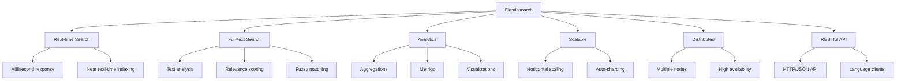

# Elasticsearch Temelleri

## 📖 Özet

Bu bölümde Elasticsearch'ın temel kavramlarını, mimarisini ve kurulum sürecini öğreneceksiniz. Elasticsearch'ın ne olduğunu, nasıl çalıştığını ve temel kullanım senaryolarını anlayacaksınız.

## 🎯 Learning Objectives

Bu bölümü tamamladığınızda:

- ✅ Elasticsearch'ın ne olduğunu ve temel özelliklerini anlayacaksınız
- ✅ Cluster, node, index, document kavramlarını öğreneceksiniz
- ✅ REST API ile temel operasyonları yapabileceksiniz
- ✅ Docker ile Elasticsearch + Kibana kurabileceksiniz
- ✅ İlk index'inizi oluşturup document ekleyebileceksiniz

## 📋 Prerequisites

- REST API temel bilgisi
- JSON format bilgisi
- Docker temel kullanımı
- HTTP methods (GET, POST, PUT, DELETE)

---

## 🔍 Elasticsearch Nedir?

**Elasticsearch**, açık kaynaklı, **dağıtık**, **RESTful** arama ve analitik motorudur. **Apache Lucene** üzerine kurulmuş olup, **real-time** arama, **full-text search** ve **analytics** için kullanılır.

### Ana Özellikler



### Elasticsearch vs Diğer Arama Motorları

| Özellik              | Elasticsearch | Solr          | MongoDB     | MySQL         |
| -------------------- | ------------- | ------------- | ----------- | ------------- |
| **Tip**              | Search Engine | Search Engine | Document DB | Relational    |
| **Storage**          | Distributed   | Distributed   | Distributed | Single/Master |
| **Query Language**   | JSON DSL      | XML/JSON      | MongoDB QL  | SQL           |
| **Real-time**        | Near RT       | Near RT       | RT          | RT            |
| **Full-text Search** | Excellent     | Excellent     | Basic       | Limited       |
| **Analytics**        | Excellent     | Good          | Good        | Limited       |
| **Scalability**      | Horizontal    | Horizontal    | Horizontal  | Vertical      |

---

## 🏗️ Elasticsearch Mimarisi

### Cluster Yapısı

```
┌─────────────────────────────────────────────────────────┐
│                    Elasticsearch Cluster               │
├─────────────────────────────────────────────────────────┤
│  ┌─────────────┐  ┌─────────────┐  ┌─────────────┐      │
│  │   Node 1    │  │   Node 2    │  │   Node 3    │      │
│  │ (Master)    │  │   (Data)    │  │   (Data)    │      │
│  └─────────────┘  └─────────────┘  └─────────────┘      │
├─────────────────────────────────────────────────────────┤
│  ┌─────────────────────────────────────────────────────┐ │
│  │                   Indices                           │ │
│  │  ┌─────────┐  ┌─────────┐  ┌─────────┐             │ │
│  │  │ Index 1 │  │ Index 2 │  │ Index 3 │             │ │
│  │  └─────────┘  └─────────┘  └─────────┘             │ │
│  └─────────────────────────────────────────────────────┘ │
├─────────────────────────────────────────────────────────┤
│  ┌─────────────────────────────────────────────────────┐ │
│  │                    Shards                           │ │
│  │  Primary: P0, P1, P2    Replica: R0, R1, R2        │ │
│  └─────────────────────────────────────────────────────┘ │
└─────────────────────────────────────────────────────────┘
```

### Temel Kavramlar

#### 1. **Cluster** (Küme)

- Bir veya daha fazla node'dan oluşan grup
- Unique cluster name ile tanımlanır
- Veriler cluster'da dağıtılır

#### 2. **Node** (Düğüm)

- Cluster'ın bir parçası olan tek server
- Veri saklar ve indexing/search işlemlerine katılır
- Node türleri: Master, Data, Ingest, Coordinating

#### 3. **Index** (İndeks)

- İlişkili document'ların koleksiyonu
- Database'deki table benzeri
- Örnek: `users`, `products`, `logs`

#### 4. **Document** (Doküman)

- JSON formatında temel bilgi birimi
- Database'deki row benzeri
- Unique `_id` ile tanımlanır

#### 5. **Shard** (Parça)

- Index'in horizontal olarak bölünmüş parçası
- Primary shard: Orijinal veri
- Replica shard: Primary'nin kopyası

### Document Yapısı

```json
{
  "_index": "users", // Hangi index'de
  "_id": "1", // Document ID'si
  "_version": 1, // Version numarası
  "_source": {
    // Gerçek veri
    "name": "Ahmet Yılmaz",
    "email": "ahmet@example.com",
    "age": 25,
    "city": "Istanbul",
    "joined": "2025-01-15T10:30:00Z"
  }
}
```

---

## 🐳 Elasticsearch Kurulumu (Docker)

### Docker Compose Konfigürasyonu

```yaml
# deployment/docker-compose/elasticsearch.yml
version: "3.8"

services:
  elasticsearch:
    image: docker.elastic.co/elasticsearch/elasticsearch:8.11.0
    container_name: elasticsearch
    restart: unless-stopped

    environment:
      # Cluster settings
      - cluster.name=docker-cluster
      - node.name=elasticsearch-node-1
      - discovery.type=single-node

      # Memory settings
      - "ES_JAVA_OPTS=-Xms512m -Xmx512m"

      # Security (development only)
      - xpack.security.enabled=false
      - xpack.security.enrollment.enabled=false
      - xpack.security.http.ssl.enabled=false
      - xpack.security.transport.ssl.enabled=false

      # Network
      - network.host=0.0.0.0
      - http.port=9200

    ports:
      - "9200:9200"
      - "9300:9300"

    volumes:
      - elasticsearch_data:/usr/share/elasticsearch/data
      - ./elasticsearch.yml:/usr/share/elasticsearch/config/elasticsearch.yml

    # Resource limits
    deploy:
      resources:
        limits:
          memory: 1g
          cpus: "0.5"

    # Health check
    healthcheck:
      test:
        ["CMD-SHELL", "curl -f http://localhost:9200/_cluster/health || exit 1"]
      interval: 30s
      timeout: 10s
      retries: 3
      start_period: 30s

  kibana:
    image: docker.elastic.co/kibana/kibana:8.11.0
    container_name: kibana
    restart: unless-stopped

    environment:
      - ELASTICSEARCH_HOSTS=http://elasticsearch:9200
      - SERVER_NAME=kibana
      - SERVER_HOST=0.0.0.0

      # Security disabled for development
      - XPACK_SECURITY_ENABLED=false
      - XPACK_ENCRYPTEDSAVEDOBJECTS_ENCRYPTIONKEY=something_at_least_32_characters

    ports:
      - "5601:5601"

    depends_on:
      elasticsearch:
        condition: service_healthy

    # Health check
    healthcheck:
      test: ["CMD-SHELL", "curl -f http://localhost:5601/api/status || exit 1"]
      interval: 30s
      timeout: 10s
      retries: 3
      start_period: 60s

volumes:
  elasticsearch_data:
    driver: local
```

### Elasticsearch Konfigürasyon

```yaml
# deployment/docker-compose/elasticsearch.yml

# Cluster
cluster.name: "docker-cluster"
node.name: "elasticsearch-node-1"

# Network
network.host: 0.0.0.0
http.port: 9200
transport.port: 9300

# Discovery
discovery.type: single-node

# Path settings
path.data: /usr/share/elasticsearch/data
path.logs: /usr/share/elasticsearch/logs

# Memory
bootstrap.memory_lock: false

# Security (development only)
xpack.security.enabled: false
xpack.security.enrollment.enabled: false

# Monitoring
xpack.monitoring.collection.enabled: true

# Index settings
action.auto_create_index: true
action.destructive_requires_name: false

# Performance
indices.memory.index_buffer_size: 30%
indices.memory.min_index_buffer_size: 96mb
```

### Kurulum Scripti

```bash
#!/bin/bash
# scripts/setup_elasticsearch.sh

echo "🔍 Elasticsearch kurulumu başlıyor..."

# Docker Compose ile Elasticsearch ve Kibana başlat
echo "📦 Elasticsearch ve Kibana containers başlatılıyor..."
docker-compose -f deployment/docker-compose/elasticsearch.yml up -d

# Servislerin başlamasını bekle
echo "⏳ Elasticsearch'ın başlamasını bekleniyor..."
timeout=120
counter=0

while [ $counter -lt $timeout ]; do
    if curl -s http://localhost:9200/_cluster/health > /dev/null 2>&1; then
        echo "✅ Elasticsearch hazır!"
        break
    fi
    sleep 2
    counter=$((counter + 2))
    echo "⏳ Bekleniyor... ($counter/$timeout saniye)"
done

if [ $counter -ge $timeout ]; then
    echo "❌ Elasticsearch başlatılamadı!"
    exit 1
fi

# Kibana'nın başlamasını bekle
echo "⏳ Kibana'nın başlamasını bekleniyor..."
timeout=180
counter=0

while [ $counter -lt $timeout ]; do
    if curl -s http://localhost:5601/api/status > /dev/null 2>&1; then
        echo "✅ Kibana hazır!"
        break
    fi
    sleep 3
    counter=$((counter + 3))
    echo "⏳ Kibana bekleniyor... ($counter/$timeout saniye)"
done

# Test verileri yükle
echo "📊 Test verileri yükleniyor..."

# Test index oluştur
curl -X PUT "http://localhost:9200/test-index" \
  -H "Content-Type: application/json" \
  -d '{
    "settings": {
      "number_of_shards": 1,
      "number_of_replicas": 0
    }
  }' > /dev/null 2>&1

# Test document ekle
curl -X POST "http://localhost:9200/test-index/_doc/1" \
  -H "Content-Type: application/json" \
  -d '{
    "title": "Test Document",
    "content": "Bu bir test dokümanıdır",
    "timestamp": "'$(date -u +%Y-%m-%dT%H:%M:%SZ)'"
  }' > /dev/null 2>&1

echo ""
echo "🎉 Elasticsearch kurulumu tamamlandı!"
echo ""
echo "📋 Bağlantı Bilgileri:"
echo "   Elasticsearch: http://localhost:9200"
echo "   Kibana: http://localhost:5601"
echo ""
echo "🔧 Test komutları:"
echo "   curl http://localhost:9200"
echo "   curl http://localhost:9200/_cluster/health"
echo "   curl http://localhost:9200/_cat/indices"
echo ""
echo "📊 Kibana Dev Tools:"
echo "   http://localhost:5601/app/dev_tools#/console"
```

---

## 🌐 REST API Temelleri

Elasticsearch tüm işlemleri **HTTP REST API** üzerinden yapar.

### Temel URL Yapısı

```
http://localhost:9200/{index}/{type}/{id}
```

- **index**: İndeks adı (örn: `users`, `products`)
- **type**: Document tipi (ES 7.0+ deprecated, `_doc` kullanılır)
- **id**: Document ID'si (opsiyonel, otomatik generate edilebilir)

### HTTP Methods

```bash
# Cluster bilgisi
GET /

# Cluster health
GET /_cluster/health

# Tüm indices listesi
GET /_cat/indices

# Index oluştur
PUT /my-index

# Document ekle
POST /my-index/_doc
PUT /my-index/_doc/1

# Document al
GET /my-index/_doc/1

# Document güncelle
PUT /my-index/_doc/1
POST /my-index/_update/1

# Document sil
DELETE /my-index/_doc/1

# Index sil
DELETE /my-index

# Arama yap
GET /my-index/_search
POST /my-index/_search
```

---

## 💻 Python ile Elasticsearch Kullanımı

### Client Kurulumu

```bash
# requirements.txt
elasticsearch==8.11.0
python-dotenv==1.0.0
```

### Temel Bağlantı ve Operasyonlar

```python
# examples/elasticsearch/python/basic_operations.py
from elasticsearch import Elasticsearch
import json
from datetime import datetime
from typing import Dict, List, Optional

class ElasticsearchBasics:
    def __init__(self):
        # Elasticsearch client oluştur
        self.es = Elasticsearch(
            [{'host': 'localhost', 'port': 9200, 'scheme': 'http'}],
            # Security disabled for development
            verify_certs=False,
            ssl_show_warn=False
        )

        # Bağlantı testi
        try:
            if self.es.ping():
                print("✅ Elasticsearch bağlantısı başarılı!")
                cluster_info = self.es.info()
                print(f"📊 Cluster: {cluster_info['cluster_name']}")
                print(f"📦 Version: {cluster_info['version']['number']}")
            else:
                raise ConnectionError("Elasticsearch'a bağlanılamadı")
        except Exception as e:
            print(f"❌ Elasticsearch bağlantı hatası: {str(e)}")
            raise

    def demo_index_operations(self):
        """Index operasyonları demo"""
        print("\n📚 INDEX OPERATIONS DEMO")
        print("=" * 40)

        index_name = "demo-users"

        # 1. Index oluştur
        if self.es.indices.exists(index=index_name):
            self.es.indices.delete(index=index_name)
            print(f"🗑️ Eski index silindi: {index_name}")

        # Index settings ve mappings ile oluştur
        index_body = {
            "settings": {
                "number_of_shards": 1,
                "number_of_replicas": 0,
                "analysis": {
                    "analyzer": {
                        "turkish_analyzer": {
                            "type": "standard",
                            "stopwords": "_turkish_"
                        }
                    }
                }
            },
            "mappings": {
                "properties": {
                    "name": {
                        "type": "text",
                        "analyzer": "turkish_analyzer"
                    },
                    "email": {
                        "type": "keyword"  # Exact match için
                    },
                    "age": {
                        "type": "integer"
                    },
                    "city": {
                        "type": "keyword"
                    },
                    "bio": {
                        "type": "text",
                        "analyzer": "turkish_analyzer"
                    },
                    "created_at": {
                        "type": "date"
                    },
                    "tags": {
                        "type": "keyword"
                    },
                    "score": {
                        "type": "float"
                    }
                }
            }
        }

        self.es.indices.create(index=index_name, body=index_body)
        print(f"✅ Index oluşturuldu: {index_name}")

        # 2. Index bilgilerini al
        index_info = self.es.indices.get(index=index_name)
        settings = index_info[index_name]['settings']
        print(f"🔧 Shards: {settings['index']['number_of_shards']}")
        print(f"🔧 Replicas: {settings['index']['number_of_replicas']}")

        return index_name

    def demo_document_operations(self, index_name: str):
        """Document operasyonları demo"""
        print("\n📄 DOCUMENT OPERATIONS DEMO")
        print("=" * 40)

        # 1. Tek document ekle (ID belirtili)
        user_doc = {
            "name": "Ahmet Yılmaz",
            "email": "ahmet@example.com",
            "age": 25,
            "city": "Istanbul",
            "bio": "Yazılım geliştirici ve teknoloji meraklısı",
            "created_at": datetime.now().isoformat(),
            "tags": ["developer", "python", "elasticsearch"],
            "score": 85.5
        }

        result = self.es.index(
            index=index_name,
            id="user_001",
            body=user_doc
        )

        print(f"✅ Document eklendi:")
        print(f"   ID: {result['_id']}")
        print(f"   Version: {result['_version']}")
        print(f"   Result: {result['result']}")

        # 2. Otomatik ID ile document ekle
        user_doc2 = {
            "name": "Fatma Kaya",
            "email": "fatma@example.com",
            "age": 30,
            "city": "Ankara",
            "bio": "UX tasarımcısı ve dijital pazarlama uzmanı",
            "created_at": datetime.now().isoformat(),
            "tags": ["designer", "ux", "marketing"],
            "score": 92.0
        }

        result2 = self.es.index(index=index_name, body=user_doc2)
        auto_id = result2['_id']
        print(f"✅ Otomatik ID ile document eklendi: {auto_id}")

        # 3. Bulk insert (birden fazla document)
        bulk_users = [
            {
                "name": "Mehmet Demir",
                "email": "mehmet@example.com",
                "age": 28,
                "city": "Izmir",
                "bio": "Backend developer ve sistem yöneticisi",
                "created_at": datetime.now().isoformat(),
                "tags": ["developer", "backend", "devops"],
                "score": 88.0
            },
            {
                "name": "Ayşe Şahin",
                "email": "ayse@example.com",
                "age": 22,
                "city": "Istanbul",
                "bio": "Frontend developer ve UI uzmanı",
                "created_at": datetime.now().isoformat(),
                "tags": ["developer", "frontend", "react"],
                "score": 90.5
            },
            {
                "name": "Can Öztürk",
                "email": "can@example.com",
                "age": 35,
                "city": "Bursa",
                "bio": "Proje yöneticisi ve agile coach",
                "created_at": datetime.now().isoformat(),
                "tags": ["manager", "agile", "scrum"],
                "score": 87.5
            }
        ]

        # Bulk API kullanımı
        bulk_body = []
        for i, user in enumerate(bulk_users, 3):
            bulk_body.extend([
                {"index": {"_index": index_name, "_id": f"user_{i:03d}"}},
                user
            ])

        bulk_result = self.es.bulk(body=bulk_body)

        successful = sum(1 for item in bulk_result['items'] if item['index']['status'] == 201)
        print(f"✅ Bulk insert: {successful} document eklendi")

        # 4. Document al
        doc_result = self.es.get(index=index_name, id="user_001")
        print(f"\n📄 Document detayları:")
        print(f"   Name: {doc_result['_source']['name']}")
        print(f"   Email: {doc_result['_source']['email']}")
        print(f"   City: {doc_result['_source']['city']}")

        # 5. Document güncelle
        update_body = {
            "doc": {
                "age": 26,  # Yaş güncelle
                "score": 87.0,  # Skor güncelle
                "updated_at": datetime.now().isoformat()
            }
        }

        update_result = self.es.update(
            index=index_name,
            id="user_001",
            body=update_body
        )

        print(f"✅ Document güncellendi:")
        print(f"   Version: {update_result['_version']}")
        print(f"   Result: {update_result['result']}")

        return auto_id

    def demo_search_operations(self, index_name: str):
        """Arama operasyonları demo"""
        print("\n🔍 SEARCH OPERATIONS DEMO")
        print("=" * 40)

        # Index'in refresh olmasını bekle
        self.es.indices.refresh(index=index_name)

        # 1. Match All Query (tüm document'ları al)
        search_body = {
            "query": {
                "match_all": {}
            }
        }

        result = self.es.search(index=index_name, body=search_body)
        total_docs = result['hits']['total']['value']
        print(f"📊 Toplam document sayısı: {total_docs}")

        # 2. Match Query (text arama)
        search_body = {
            "query": {
                "match": {
                    "bio": "developer"
                }
            }
        }

        result = self.es.search(index=index_name, body=search_body)
        print(f"\n🔍 'developer' araması:")
        print(f"   Bulunan: {result['hits']['total']['value']} document")

        for hit in result['hits']['hits']:
            source = hit['_source']
            print(f"   - {source['name']} ({source['city']})")

        # 3. Term Query (exact match)
        search_body = {
            "query": {
                "term": {
                    "city.keyword": "Istanbul"
                }
            }
        }

        result = self.es.search(index=index_name, body=search_body)
        print(f"\n🏙️ Istanbul'daki kullanıcılar:")
        for hit in result['hits']['hits']:
            source = hit['_source']
            print(f"   - {source['name']} (Score: {source['score']})")

        # 4. Range Query (aralık araması)
        search_body = {
            "query": {
                "range": {
                    "age": {
                        "gte": 25,  # 25 ve üzeri
                        "lte": 30   # 30 ve altı
                    }
                }
            },
            "sort": [
                {"age": {"order": "asc"}}
            ]
        }

        result = self.es.search(index=index_name, body=search_body)
        print(f"\n👥 25-30 yaş arası kullanıcılar:")
        for hit in result['hits']['hits']:
            source = hit['_source']
            print(f"   - {source['name']}: {source['age']} yaş")

        # 5. Bool Query (complex queries)
        search_body = {
            "query": {
                "bool": {
                    "must": [
                        {"match": {"bio": "developer"}}
                    ],
                    "filter": [
                        {"range": {"score": {"gte": 85}}}
                    ],
                    "must_not": [
                        {"term": {"city.keyword": "Bursa"}}
                    ]
                }
            },
            "sort": [
                {"score": {"order": "desc"}}
            ]
        }

        result = self.es.search(index=index_name, body=search_body)
        print(f"\n🎯 Complex query (developer + score >= 85 + not Bursa):")
        for hit in result['hits']['hits']:
            source = hit['_source']
            print(f"   - {source['name']}: {source['score']} ({source['city']})")

    def demo_aggregations(self, index_name: str):
        """Aggregation operasyonları demo"""
        print("\n📊 AGGREGATIONS DEMO")
        print("=" * 40)

        # 1. Terms Aggregation (şehire göre grupla)
        agg_body = {
            "size": 0,  # Sadece aggregation sonuçları
            "aggs": {
                "users_by_city": {
                    "terms": {
                        "field": "city.keyword"
                    }
                }
            }
        }

        result = self.es.search(index=index_name, body=agg_body)
        city_buckets = result['aggregations']['users_by_city']['buckets']

        print("🏙️ Şehire göre kullanıcı dağılımı:")
        for bucket in city_buckets:
            print(f"   {bucket['key']}: {bucket['doc_count']} kullanıcı")

        # 2. Stats Aggregation (yaş istatistikleri)
        agg_body = {
            "size": 0,
            "aggs": {
                "age_stats": {
                    "stats": {
                        "field": "age"
                    }
                }
            }
        }

        result = self.es.search(index=index_name, body=agg_body)
        age_stats = result['aggregations']['age_stats']

        print(f"\n📈 Yaş istatistikleri:")
        print(f"   Ortalama: {age_stats['avg']:.1f}")
        print(f"   Min: {age_stats['min']}")
        print(f"   Max: {age_stats['max']}")
        print(f"   Toplam: {age_stats['count']}")

        # 3. Histogram Aggregation (skor dağılımı)
        agg_body = {
            "size": 0,
            "aggs": {
                "score_histogram": {
                    "histogram": {
                        "field": "score",
                        "interval": 5
                    }
                }
            }
        }

        result = self.es.search(index=index_name, body=agg_body)
        score_buckets = result['aggregations']['score_histogram']['buckets']

        print(f"\n📊 Skor dağılımı (5'lik gruplar):")
        for bucket in score_buckets:
            if bucket['doc_count'] > 0:
                print(f"   {bucket['key']}-{bucket['key']+5}: {bucket['doc_count']} kullanıcı")

    def cleanup_demo_data(self, index_name: str):
        """Demo verilerini temizle"""
        print(f"\n🧹 CLEANUP DEMO DATA")
        print("=" * 40)

        if self.es.indices.exists(index=index_name):
            self.es.indices.delete(index=index_name)
            print(f"🗑️ Index silindi: {index_name}")
        else:
            print(f"ℹ️ Index bulunamadı: {index_name}")

    def run_all_demos(self):
        """Tüm demo'ları çalıştır"""
        print("🔍 Elasticsearch Basics Demo başlıyor...\n")

        try:
            # 1. Index operations
            index_name = self.demo_index_operations()

            # 2. Document operations
            auto_id = self.demo_document_operations(index_name)

            # 3. Search operations
            self.demo_search_operations(index_name)

            # 4. Aggregations
            self.demo_aggregations(index_name)

            print("\n✅ Tüm demo'lar başarıyla tamamlandı!")

            # Cleanup seçeneği
            cleanup = input(f"\n🧹 Demo index'ini silmek ister misiniz? (y/N): ")
            if cleanup.lower() == 'y':
                self.cleanup_demo_data(index_name)

        except Exception as e:
            print(f"❌ Demo sırasında hata: {str(e)}")
            raise

if __name__ == "__main__":
    es_demo = ElasticsearchBasics()
    es_demo.run_all_demos()
```

---

## 🛠️ Hands-on Lab: E-ticaret Ürün Arama

### Lab Senaryosu: Product Search System

Bu lab'da Elasticsearch'ı kullanarak bir e-ticaret ürün arama sistemi oluşturacağız.

```python
# examples/elasticsearch/python/product_search_lab.py
from elasticsearch import Elasticsearch
import json
from datetime import datetime
from typing import Dict, List, Optional
import random

class ProductSearchSystem:
    def __init__(self):
        self.es = Elasticsearch(
            [{'host': 'localhost', 'port': 9200, 'scheme': 'http'}],
            verify_certs=False,
            ssl_show_warn=False
        )

        self.index_name = "ecommerce-products"
        print("🛒 E-ticaret Ürün Arama Sistemi başlatıldı")

    def setup_product_index(self):
        """Ürün index'ini kur"""
        print("\n📚 Ürün index'i kuruluyor...")

        # Eski index'i sil
        if self.es.indices.exists(index=self.index_name):
            self.es.indices.delete(index=self.index_name)
            print(f"🗑️ Eski index silindi: {self.index_name}")

        # Product mapping
        index_body = {
            "settings": {
                "number_of_shards": 1,
                "number_of_replicas": 0,
                "analysis": {
                    "analyzer": {
                        "product_analyzer": {
                            "type": "custom",
                            "tokenizer": "standard",
                            "filter": [
                                "lowercase",
                                "stop",
                                "stemmer"
                            ]
                        }
                    }
                }
            },
            "mappings": {
                "properties": {
                    "name": {
                        "type": "text",
                        "analyzer": "product_analyzer",
                        "fields": {
                            "keyword": {
                                "type": "keyword"
                            }
                        }
                    },
                    "description": {
                        "type": "text",
                        "analyzer": "product_analyzer"
                    },
                    "category": {
                        "type": "keyword"
                    },
                    "brand": {
                        "type": "keyword"
                    },
                    "price": {
                        "type": "float"
                    },
                    "original_price": {
                        "type": "float"
                    },
                    "discount_percentage": {
                        "type": "float"
                    },
                    "rating": {
                        "type": "float"
                    },
                    "review_count": {
                        "type": "integer"
                    },
                    "stock_quantity": {
                        "type": "integer"
                    },
                    "tags": {
                        "type": "keyword"
                    },
                    "created_at": {
                        "type": "date"
                    },
                    "is_featured": {
                        "type": "boolean"
                    },
                    "is_available": {
                        "type": "boolean"
                    },
                    "colors": {
                        "type": "keyword"
                    },
                    "sizes": {
                        "type": "keyword"
                    }
                }
            }
        }

        self.es.indices.create(index=self.index_name, body=index_body)
        print(f"✅ Index oluşturuldu: {self.index_name}")

    def load_sample_products(self):
        """Örnek ürünleri yükle"""
        print("\n📦 Örnek ürünler yükleniyor...")

        products = [
            {
                "name": "iPhone 15 Pro Max",
                "description": "Apple'ın en gelişmiş akıllı telefonu. A17 Pro çip, 48MP kamera sistemi ve titanium tasarım.",
                "category": "electronics",
                "brand": "Apple",
                "price": 1299.99,
                "original_price": 1399.99,
                "discount_percentage": 7.14,
                "rating": 4.8,
                "review_count": 1250,
                "stock_quantity": 45,
                "tags": ["smartphone", "premium", "camera", "5g"],
                "is_featured": True,
                "is_available": True,
                "colors": ["black", "white", "blue", "natural"],
                "sizes": ["128GB", "256GB", "512GB", "1TB"]
            },
            {
                "name": "Samsung Galaxy S24 Ultra",
                "description": "Samsung'un amiral gemisi telefonu. S Pen desteği, gelişmiş kamera sistemi ve büyük ekran.",
                "category": "electronics",
                "brand": "Samsung",
                "price": 1199.99,
                "original_price": 1299.99,
                "discount_percentage": 7.69,
                "rating": 4.7,
                "review_count": 980,
                "stock_quantity": 32,
                "tags": ["smartphone", "stylus", "camera", "5g"],
                "is_featured": True,
                "is_available": True,
                "colors": ["black", "gray", "violet"],
                "sizes": ["256GB", "512GB", "1TB"]
            },
            {
                "name": "MacBook Pro 16-inch M3",
                "description": "Apple M3 çipli MacBook Pro. Profesyonel performans ve uzun pil ömrü.",
                "category": "computers",
                "brand": "Apple",
                "price": 2499.99,
                "original_price": 2499.99,
                "discount_percentage": 0,
                "rating": 4.9,
                "review_count": 756,
                "stock_quantity": 18,
                "tags": ["laptop", "professional", "m3", "retina"],
                "is_featured": True,
                "is_available": True,
                "colors": ["silver", "space_gray"],
                "sizes": ["16GB/512GB", "32GB/1TB", "64GB/2TB"]
            },
            {
                "name": "Nike Air Max 270",
                "description": "Konforlu ve şık spor ayakkabı. Air Max yastıklama teknolojisi ile tüm gün konfor.",
                "category": "shoes",
                "brand": "Nike",
                "price": 129.99,
                "original_price": 159.99,
                "discount_percentage": 18.75,
                "rating": 4.5,
                "review_count": 2340,
                "stock_quantity": 120,
                "tags": ["sneakers", "air_max", "comfort", "casual"],
                "is_featured": False,
                "is_available": True,
                "colors": ["white", "black", "red", "blue"],
                "sizes": ["38", "39", "40", "41", "42", "43", "44", "45"]
            },
            {
                "name": "Sony WH-1000XM5 Kulaklık",
                "description": "Sektörün en iyi gürültü önleme teknolojisi ile kablosuz kulaklık.",
                "category": "electronics",
                "brand": "Sony",
                "price": 349.99,
                "original_price": 399.99,
                "discount_percentage": 12.5,
                "rating": 4.6,
                "review_count": 1580,
                "stock_quantity": 67,
                "tags": ["headphones", "wireless", "noise_cancelling", "premium"],
                "is_featured": False,
                "is_available": True,
                "colors": ["black", "silver"],
                "sizes": ["one_size"]
            },
            {
                "name": "Levi's 501 Original Jeans",
                "description": "Klasik straight fit denim pantolon. %100 pamuk, vintage görünüm.",
                "category": "clothing",
                "brand": "Levi's",
                "price": 89.99,
                "original_price": 109.99,
                "discount_percentage": 18.18,
                "rating": 4.3,
                "review_count": 3450,
                "stock_quantity": 200,
                "tags": ["jeans", "denim", "classic", "cotton"],
                "is_featured": False,
                "is_available": True,
                "colors": ["blue", "black", "gray"],
                "sizes": ["28", "30", "32", "34", "36", "38", "40"]
            },
            {
                "name": "KitchenAid Stand Mixer",
                "description": "Profesyonel mutfak mikseri. 10 hız ayarı ve çeşitli aksesuarlar.",
                "category": "home",
                "brand": "KitchenAid",
                "price": 449.99,
                "original_price": 549.99,
                "discount_percentage": 18.18,
                "rating": 4.8,
                "review_count": 890,
                "stock_quantity": 25,
                "tags": ["kitchen", "mixer", "baking", "professional"],
                "is_featured": True,
                "is_available": True,
                "colors": ["red", "white", "black", "blue"],
                "sizes": ["5qt", "6qt", "7qt"]
            },
            {
                "name": "Dyson V15 Detect Vacuum",
                "description": "Lazer teknolojisi ile toz algılama özellikli kablosuz elektrikli süpürge.",
                "category": "home",
                "brand": "Dyson",
                "price": 649.99,
                "original_price": 749.99,
                "discount_percentage": 13.33,
                "rating": 4.7,
                "review_count": 1230,
                "stock_quantity": 34,
                "tags": ["vacuum", "cordless", "laser", "pet_hair"],
                "is_featured": True,
                "is_available": True,
                "colors": ["yellow", "purple"],
                "sizes": ["standard"]
            }
        ]

        # Bulk insert
        bulk_body = []
        for i, product in enumerate(products, 1):
            product['created_at'] = datetime.now().isoformat()
            bulk_body.extend([
                {"index": {"_index": self.index_name, "_id": f"prod_{i:03d}"}},
                product
            ])

        result = self.es.bulk(body=bulk_body)
        successful = sum(1 for item in result['items'] if item['index']['status'] == 201)
        print(f"✅ {successful} ürün eklendi")

        # Index refresh
        self.es.indices.refresh(index=self.index_name)

    def search_products(self, query: str, filters: Dict = None, sort_by: str = "relevance", size: int = 10):
        """Ürün arama"""
        search_body = {
            "size": size,
            "query": {},
            "highlight": {
                "fields": {
                    "name": {},
                    "description": {}
                }
            }
        }

        # Ana query
        if query:
            search_body["query"] = {
                "multi_match": {
                    "query": query,
                    "fields": ["name^2", "description", "brand", "tags"],
                    "type": "best_fields",
                    "fuzziness": "AUTO"
                }
            }
        else:
            search_body["query"] = {"match_all": {}}

        # Filters uygula
        if filters:
            bool_query = {
                "bool": {
                    "must": [search_body["query"]]
                }
            }

            if filters.get('category'):
                bool_query["bool"]["filter"] = [
                    {"term": {"category": filters['category']}}
                ]

            if filters.get('brand'):
                if "filter" not in bool_query["bool"]:
                    bool_query["bool"]["filter"] = []
                bool_query["bool"]["filter"].append(
                    {"term": {"brand": filters['brand']}}
                )

            if filters.get('price_min') or filters.get('price_max'):
                price_range = {}
                if filters.get('price_min'):
                    price_range["gte"] = filters['price_min']
                if filters.get('price_max'):
                    price_range["lte"] = filters['price_max']

                if "filter" not in bool_query["bool"]:
                    bool_query["bool"]["filter"] = []
                bool_query["bool"]["filter"].append(
                    {"range": {"price": price_range}}
                )

            if filters.get('min_rating'):
                if "filter" not in bool_query["bool"]:
                    bool_query["bool"]["filter"] = []
                bool_query["bool"]["filter"].append(
                    {"range": {"rating": {"gte": filters['min_rating']}}}
                )

            if filters.get('in_stock_only'):
                if "filter" not in bool_query["bool"]:
                    bool_query["bool"]["filter"] = []
                bool_query["bool"]["filter"].extend([
                    {"term": {"is_available": True}},
                    {"range": {"stock_quantity": {"gt": 0}}}
                ])

            search_body["query"] = bool_query

        # Sorting
        if sort_by == "price_asc":
            search_body["sort"] = [{"price": {"order": "asc"}}]
        elif sort_by == "price_desc":
            search_body["sort"] = [{"price": {"order": "desc"}}]
        elif sort_by == "rating":
            search_body["sort"] = [{"rating": {"order": "desc"}}]
        elif sort_by == "popularity":
            search_body["sort"] = [{"review_count": {"order": "desc"}}]
        elif sort_by == "newest":
            search_body["sort"] = [{"created_at": {"order": "desc"}}]
        # relevance için sort eklemeyelim (default scoring)

        return self.es.search(index=self.index_name, body=search_body)

    def get_search_suggestions(self, query: str, size: int = 5):
        """Arama önerileri"""
        search_body = {
            "size": 0,
            "suggest": {
                "product_suggestions": {
                    "text": query,
                    "term": {
                        "field": "name",
                        "size": size
                    }
                }
            }
        }

        return self.es.search(index=self.index_name, body=search_body)

    def get_product_analytics(self):
        """Ürün analitikleri"""
        agg_body = {
            "size": 0,
            "aggs": {
                "categories": {
                    "terms": {"field": "category"}
                },
                "brands": {
                    "terms": {"field": "brand", "size": 10}
                },
                "price_ranges": {
                    "range": {
                        "field": "price",
                        "ranges": [
                            {"to": 100},
                            {"from": 100, "to": 500},
                            {"from": 500, "to": 1000},
                            {"from": 1000}
                        ]
                    }
                },
                "avg_rating": {
                    "avg": {"field": "rating"}
                },
                "total_stock": {
                    "sum": {"field": "stock_quantity"}
                }
            }
        }

        return self.es.search(index=self.index_name, body=agg_body)

    def run_search_demo(self):
        """Arama demo'su çalıştır"""
        print("\n🔍 ÜRÜN ARAMA DEMO'SU")
        print("=" * 50)

        # 1. Basit text arama
        print("\n📱 'iPhone' araması:")
        result = self.search_products("iPhone")
        self.print_search_results(result)

        # 2. Category filter ile arama
        print("\n👔 Electronics kategorisinde 'wireless' araması:")
        result = self.search_products(
            "wireless",
            filters={"category": "electronics"}
        )
        self.print_search_results(result)

        # 3. Fiyat aralığı ile arama
        print("\n💰 100-500 TL arası ürünler:")
        result = self.search_products(
            "",
            filters={"price_min": 100, "price_max": 500},
            sort_by="price_asc"
        )
        self.print_search_results(result)

        # 4. Yüksek puanlı ürünler
        print("\n⭐ 4.5+ puan alan ürünler (popülerlik sırasına göre):")
        result = self.search_products(
            "",
            filters={"min_rating": 4.5},
            sort_by="popularity"
        )
        self.print_search_results(result)

        # 5. Analytics
        print("\n📊 ÜRÜN ANALİTİKLERİ:")
        analytics = self.get_product_analytics()
        self.print_analytics(analytics)

    def print_search_results(self, result):
        """Arama sonuçlarını yazdır"""
        hits = result['hits']
        total = hits['total']['value']

        if total == 0:
            print("   ❌ Sonuç bulunamadı")
            return

        print(f"   📊 {total} sonuç bulundu")

        for hit in hits['hits'][:5]:  # İlk 5 sonuç
            source = hit['_source']
            score = hit['_score']

            # Discount badge
            discount_badge = ""
            if source['discount_percentage'] > 0:
                discount_badge = f" 🏷️ %{source['discount_percentage']:.0f} indirim"

            # Stock status
            stock_status = "✅" if source['is_available'] and source['stock_quantity'] > 0 else "❌"

            print(f"   {stock_status} {source['name']}")
            print(f"      💰 {source['price']:.2f} TL{discount_badge}")
            print(f"      ⭐ {source['rating']}/5 ({source['review_count']} değerlendirme)")
            print(f"      📦 Stok: {source['stock_quantity']}")
            print(f"      🏷️ {source['brand']} - {source['category']}")

            # Highlight göster
            if 'highlight' in hit:
                for field, highlights in hit['highlight'].items():
                    print(f"      💡 {field}: {highlights[0]}")

            print()

    def print_analytics(self, analytics):
        """Analitik sonuçlarını yazdır"""
        aggs = analytics['aggregations']

        print("   📈 Kategorilere göre dağılım:")
        for bucket in aggs['categories']['buckets']:
            print(f"      {bucket['key']}: {bucket['doc_count']} ürün")

        print("\n   🏢 Markalara göre dağılım:")
        for bucket in aggs['brands']['buckets']:
            print(f"      {bucket['key']}: {bucket['doc_count']} ürün")

        print("\n   💰 Fiyat aralıkları:")
        for bucket in aggs['price_ranges']['buckets']:
            key = bucket['key']
            if 'from' in bucket and 'to' in bucket:
                range_str = f"{bucket['from']:.0f}-{bucket['to']:.0f} TL"
            elif 'from' in bucket:
                range_str = f"{bucket['from']:.0f}+ TL"
            else:
                range_str = f"0-{bucket['to']:.0f} TL"
            print(f"      {range_str}: {bucket['doc_count']} ürün")

        print(f"\n   ⭐ Ortalama rating: {aggs['avg_rating']['value']:.2f}")
        print(f"   📦 Toplam stok: {aggs['total_stock']['value']:.0f} adet")

if __name__ == "__main__":
    system = ProductSearchSystem()

    try:
        # Setup
        system.setup_product_index()
        system.load_sample_products()

        # Demo
        system.run_search_demo()

        print("\n✅ E-ticaret ürün arama sistemi demo'su tamamlandı!")

    except Exception as e:
        print(f"❌ Demo sırasında hata: {str(e)}")
        raise
```

---

## ✅ Checklist: Elasticsearch Temelleri

### Kavramsal Anlayış

- [ ] Elasticsearch'ın ne olduğunu ve temel özelliklerini anlıyorum
- [ ] Cluster, node, index, document kavramlarını kavradım
- [ ] Shard ve replica konseptlerini öğrendim
- [ ] REST API yapısını anlıyorum

### Teknik Beceriler

- [ ] Docker ile Elasticsearch + Kibana kurabiliyorum
- [ ] REST API ile temel operasyonları yapabiliyorum
- [ ] Python elasticsearch client'ı kullanabiliyorum
- [ ] Index oluşturabilir ve mapping tanımlayabiliyorum

### Pratik Uygulamalar

- [ ] Document CRUD operasyonları (Create, Read, Update, Delete)
- [ ] Temel search queries (match, term, range, bool)
- [ ] Aggregations (terms, stats, histogram)
- [ ] Bulk operations (birden fazla document işlemi)

### Lab Tamamlama

- [ ] Basic operations demo'sunu çalıştırdım
- [ ] Product search lab'ını tamamladım
- [ ] Kibana Dev Tools ile manual testler yaptım
- [ ] Search performance'ını gözlemledim

---

## 🚨 Common Mistakes ve Çözümleri

### 1. ❌ Mapping Hatası

```json
// YANLIŞ: Sonradan mapping değiştirmeye çalışmak
PUT /my-index/_mapping
{
  "properties": {
    "age": { "type": "keyword" }  // integer'dan keyword'e değişim
  }
}

// DOĞRU: Yeni index oluştur ve reindex et
PUT /my-index-v2
{
  "mappings": {
    "properties": {
      "age": { "type": "keyword" }
    }
  }
}
```

### 2. ❌ Resource Allocation

```yaml
# YANLIŞ: Yetersiz memory
services:
  elasticsearch:
    environment:
      - "ES_JAVA_OPTS=-Xms256m -Xmx256m"  # Çok az

# DOĞRU: Uygun memory allocation
services:
  elasticsearch:
    environment:
      - "ES_JAVA_OPTS=-Xms512m -Xmx512m"  # En az 512MB
```

### 3. ❌ Query Performance

```python
# YANLIŞ: Wildcard query kullanımı
query = {
    "query": {
        "wildcard": {
            "name": "*laptop*"  # Yavaş
        }
    }
}

# DOĞRU: Match query kullanımı
query = {
    "query": {
        "match": {
            "name": "laptop"  # Hızlı ve relevance scoring
        }
    }
}
```

### 4. ❌ Index Design

```python
# YANLIŞ: Tek büyük index
index_name = "all_data"  # Tüm veriler tek index'te

# DOĞRU: Time-based index'ler
index_name = f"logs-{datetime.now().strftime('%Y-%m')}"  # Aylık index'ler
```

---

## 🎯 Hands-on Tasks

### Task 1: Blog Search Engine

Elasticsearch'ı kullanarak bir blog arama motoru oluşturun:

- Blog post'larını index'leyin (title, content, author, tags, date)
- Full-text search implementasyonu
- Author ve tag'e göre filtreleme
- Date range queries

### Task 2: Log Analysis System

Log analiz sistemi geliştirin:

- Log entry'leri timestamp, level, message, source ile index'leyin
- Error/warning log'ları bulma
- Zaman bazlı aggregations
- Source'a göre grouping

### Task 3: Real-time Dashboard

Gerçek zamanlı dashboard için veri hazırlayın:

- Metrics data'sını index'leyin
- Time series aggregations
- Moving averages
- Alerting thresholds

---

## 📚 Sonraki Adım

Elasticsearch temelleri tamamlandı! Şimdi [CRUD Operasyonları](02-crud-operations.md) bölümüne geçerek daha detaylı document işlemlerini öğrenebilirsiniz.

**Öğrendikleriniz:**

- ✅ Elasticsearch mimarisi ve temel kavramlar
- ✅ Docker ile kurulum ve konfigürasyon
- ✅ REST API ile temel operasyonlar
- ✅ Python client kullanımı
- ✅ Index design ve mapping
- ✅ Basic search ve aggregations

**Sonraki bölümde:**

- Detaylı CRUD operasyonları
- Advanced mapping techniques
- Bulk operations optimization
- Error handling

---

💡 **Pro Tip:** Elasticsearch'ı öğrenirken Kibana Dev Tools'u aktif kullanın. Interactive query testing Elasticsearch'ı anlamanızı hızlandırır!
